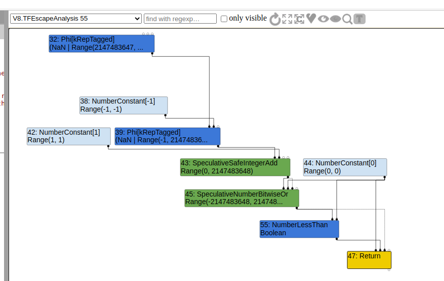
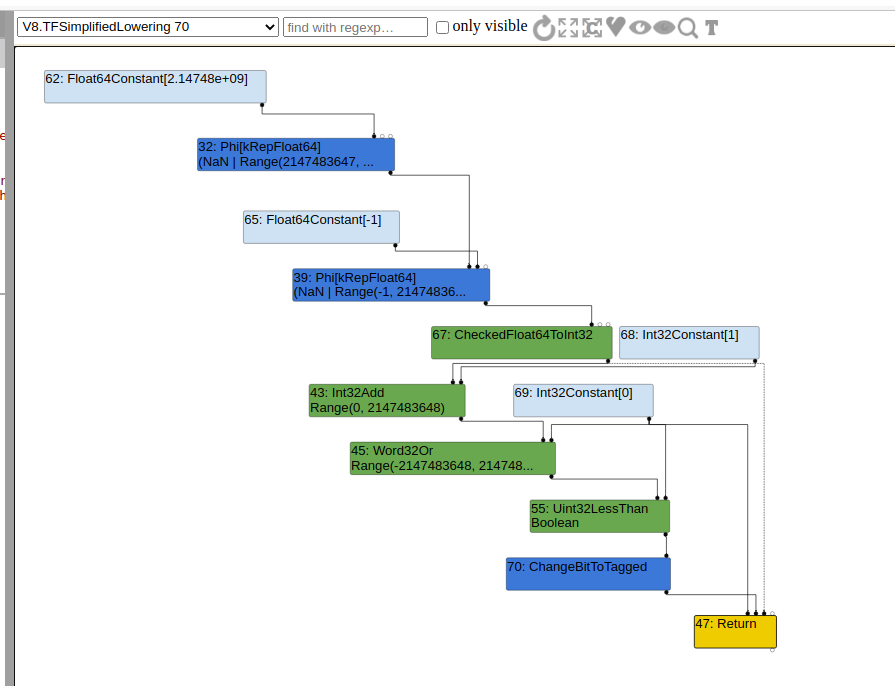
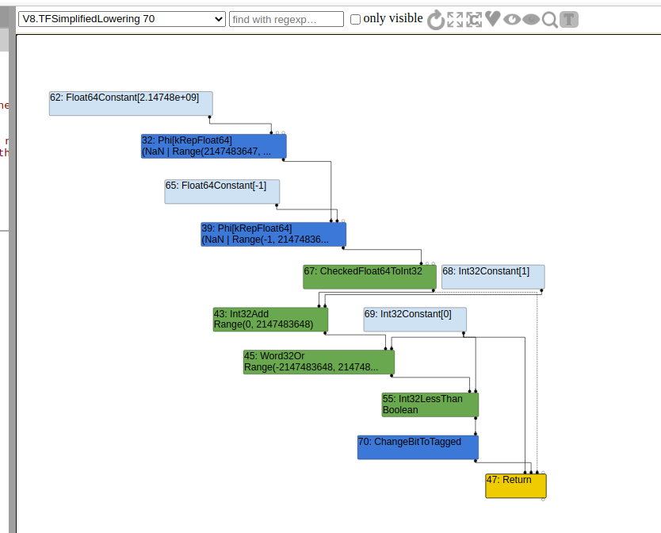
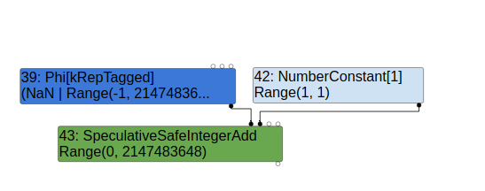
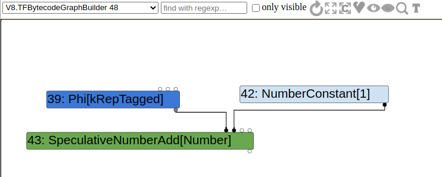
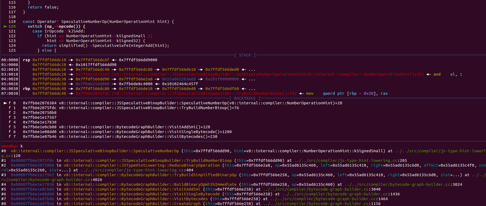
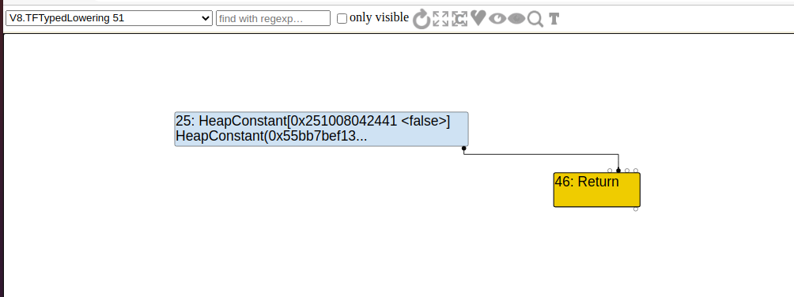
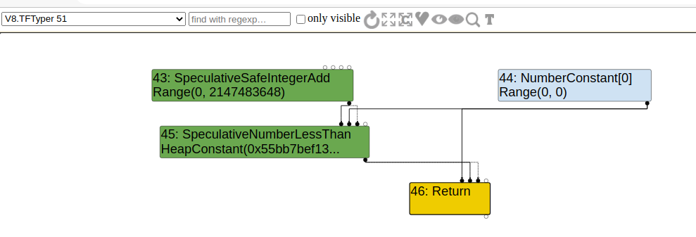

# CVE-2020-16040

## 前言

这篇文章是我翻译（有一些地方删了或加了点自己的话）的，原文章：https://faraz.faith/2021-01-07-cve-2020-16040-analysis/

由于本人水平有限，不能保证翻译的准确，有疑惑的地方可以折回去看原文章，作者写的是真的细致，orz

## 漏洞成因

### 对应issue

https://bugs.chromium.org/p/chromium/issues/detail?id=1150649

该issue也添加了相对应的regress.js：

https://chromium-review.googlesource.com/c/v8/v8/+/2557498/2/test/mjsunit/compiler/regress-1150649.js

### poc

Test on v8 version 8.6.405

```javascript
function foo(a) {
    var y = 0x7fffffff;  // 2^31 - 1
  
    // Widen the static type of y (this condition never holds).
    if (a == NaN) y = NaN;
  
    // The next condition holds only in the warmup run. It leads to Smi
    // (SignedSmall) feedback being collected for the addition below.
    if (a) y = -1;
  
    const z = (y + 1)|0;
    return z < 0;
}
console.log(foo(false));
%PrepareFunctionForOptimization(foo);
console.log(foo(true));
%OptimizeFunctionOnNextCall(foo);
console.log(foo(false));			// assertTrue(foo(false)); in regress-1150649.js
```

运行后结果：

```cpp
true
false
false
```

foo(false)在优化前后的值发生了变化

没有优化前，调用foo(false)，y会是0x7fffffff，z = (0x7fffffff + 1) | 0 即 -2147483648，z < 0 是true

优化后，从regress-1150649.js可以看到期望的值是true，但是我们输出出来的却是false，可以猜测是turbofan错误的认为`(y + 1)|0;`没有发生溢出，但是实际上溢出了

### patch

查看官方的补丁：

```cpp
diff --git a/src/compiler/simplified-lowering.cc b/src/compiler/simplified-lowering.cc
index a1f10f9..ef56d56 100644
--- a/src/compiler/simplified-lowering.cc
+++ b/src/compiler/simplified-lowering.cc
@@ -1409,7 +1409,6 @@
                 IsSomePositiveOrderedNumber(input1_type)
             ? CheckForMinusZeroMode::kDontCheckForMinusZero
             : CheckForMinusZeroMode::kCheckForMinusZero;
-
     NodeProperties::ChangeOp(node, simplified()->CheckedInt32Mul(mz_mode));
   }
 
@@ -1453,6 +1452,13 @@
 
     Type left_feedback_type = TypeOf(node->InputAt(0));
     Type right_feedback_type = TypeOf(node->InputAt(1));
+
+    // Using Signed32 as restriction type amounts to promising there won't be
+    // signed overflow. This is incompatible with relying on a Word32
+    // truncation in order to skip the overflow check.
+    Type const restriction =
+        truncation.IsUsedAsWord32() ? Type::Any() : Type::Signed32();
+
     // Handle the case when no int32 checks on inputs are necessary (but
     // an overflow check is needed on the output). Note that we do not
     // have to do any check if at most one side can be minus zero. For
@@ -1466,7 +1472,7 @@
         right_upper.Is(Type::Signed32OrMinusZero()) &&
         (left_upper.Is(Type::Signed32()) || right_upper.Is(Type::Signed32()))) {
       VisitBinop<T>(node, UseInfo::TruncatingWord32(),
-                    MachineRepresentation::kWord32, Type::Signed32());
+                    MachineRepresentation::kWord32, restriction);
     } else {
       // If the output's truncation is identify-zeros, we can pass it
       // along. Moreover, if the operation is addition and we know the
@@ -1486,8 +1492,9 @@
       UseInfo right_use = CheckedUseInfoAsWord32FromHint(hint, FeedbackSource(),
                                                          kIdentifyZeros);
       VisitBinop<T>(node, left_use, right_use, MachineRepresentation::kWord32,
-                    Type::Signed32());
+                    restriction);
     }
+
     if (lower<T>()) {
       if (truncation.IsUsedAsWord32() ||
           !CanOverflowSigned32(node->op(), left_feedback_type,
```

漏洞是发生在SimplifiedLowering阶段的`VisitSpeculativeIntegerAdditiveOp(Node* node, Truncation truncation,SimplifiedLowering* lowering) `函数，从patch代码中的注释里可以看出是溢出的问题

### 疑问

为了理解漏洞是如何触发的，我们需要弄清楚以下几个问题：

- 啥叫“static type”，为什么要在一开始widened变量y的“static type”，这是怎么实现的
- 为什么要在一开始要使得y的类型反馈是`SignedSmall`，这是咋收集的
- 为啥z要为(y+1) | 0，为啥会有一个或0的操作

### Unpatch vs Patch Turbolizer graphs

先来看看最直观的turbolizer graphs

在simplified lowering阶段前：



 

simplified lowering阶段后

unpatch：



patch：



最明显的就是Word32Or后的节点，未修补前是Uint32LessThan，修补后是Int32LessThan

生成Uint32LessThan说明TurboFan认为z<0是两个无符号整数的比较，并未注意到整数溢出的可能性

### The Simplified Lowering Phase

 Simplified Lowering Phase 的核心代码实现在src/compiler/simplified-lowering.cc，查看src/compiler/pipeline.cc里的`PipelineImpl::OptimizeGraph`函数，你可以看到`Simplified Lowering Phase`是在`Escape Analysis Phase`之后（从turbolizer的下拉框里也可看出来）：

```cpp
bool PipelineImpl::OptimizeGraph(Linkage* linkage) {
  // [ ... ]

  if (FLAG_turbo_escape) {
    Run<EscapeAnalysisPhase>();
    // [ ... ]
  }

  // Perform simplified lowering. This has to run w/o the Typer decorator,
  // because we cannot compute meaningful types anyways, and the computed types
  // might even conflict with the representation/truncation logic.
  Run<SimplifiedLoweringPhase>(linkage);

  // [ ... ]
}
struct SimplifiedLoweringPhase {
  DECL_PIPELINE_PHASE_CONSTANTS(SimplifiedLowering)

  void Run(PipelineData* data, Zone* temp_zone) {
    SimplifiedLowering lowering(data->jsgraph(), data->broker(), temp_zone,
                                data->source_positions(), data->node_origins(),
                                data->info()->GetPoisoningMitigationLevel(),
                                &data->info()->tick_counter());
    lowering.LowerAllNodes();
  }
};

void SimplifiedLowering::LowerAllNodes() {
  RepresentationChanger changer(jsgraph(), broker_);
  RepresentationSelector selector(jsgraph(), broker_, zone_, &changer,
                                  source_positions_, node_origins_,
                                  tick_counter_);
  selector.Run(this);
}
```

最后：

```cpp
void Run(SimplifiedLowering* lowering) {
    GenerateTraversal();
    RunPropagatePhase();
    RunRetypePhase();
    RunLowerPhase(lowering);
}
```

`GenerateTraversal`函数会从End节点开始前序遍历整个graph，把节点存放到traversal_nodes_成员里

接着，三个子阶段会被依此调用，在运行的命令行参数中加上`--trace-representation`对调试这三个子阶段有很大的帮助

#### RunPropagatePhase

在这个阶段，traversal_nodes_会被逆序遍历，也就是说我们会从`End`节点开始：

```cpp
for (auto it = traversal_nodes_.crbegin(); it != traversal_nodes_.crend();
         ++it) {
      PropagateTruncation(*it);

      while (!revisit_queue_.empty()) {
        Node* node = revisit_queue_.front();
        revisit_queue_.pop();
        PropagateTruncation(node);
      }
    }
```

“truncations” 会从`End`开始传播。

Truncations 可以认为是节点的一个标签，它的传播依赖于具体的条件（如节点的类型），所以有可能不会传播到其它节点。Truncations 代表着一个节点被限制为特定的”representation“ ，在UseInfo类的定义注释中，可以看到对truncations的解释：

```cpp
// src/compiler/representation-change.h
// The {UseInfo} class is used to describe a use of an input of a node.
//
// This information is used in two different ways, based on the phase:
//
// 1. During propagation, the use info is used to inform the input node
//    about what part of the input is used (we call this truncation) and what
//    is the preferred representation. For conversions that will require
//    checks, we also keep track of whether a minus zero check is needed.
```

以下是TruncationKind枚举定义的truncations：

```cpp
// src/compiler/representation-change.h
enum class TruncationKind : uint8_t {
    kNone,
    kBool,
    kWord32,
    kWord64,
    kOddballAndBigIntToNumber,
    kAny
  };
```

MachineRepresentation枚举定义了一系列的representation：

```cpp
// src/codegen/machine-type.h
enum class MachineRepresentation : uint8_t {
  kNone,
  kBit,
  kWord8,
  kWord16,
  kWord32,
  kWord64,
  kTaggedSigned,       // (uncompressed) Smi
  kTaggedPointer,      // (uncompressed) HeapObject
  kTagged,             // (uncompressed) Object (Smi or HeapObject)
  kCompressedPointer,  // (compressed) HeapObject
  kCompressed,         // (compressed) Object (Smi or HeapObject)
  // FP representations must be last, and in order of increasing size.
  kFloat32,
  kFloat64,
  kSimd128,
  kFirstFPRepresentation = kFloat32,
  kLastRepresentation = kSimd128
};
```

`NodeInfo`对象存放了一个节点的representation，truncation和其它一些必要的信息。每个节点都有一个NodeInfo对象与它相关联，可以通过GetInfo(node)来得到与node相关联的NodeInfo对象

```cpp
// src/compiler/simplified-lowering.cc
class RepresentationSelector {
 public:
// Information for each node tracked during the fixpoint.
  class NodeInfo final {
   public:
	// [..............................]
   private:
    enum State : uint8_t { kUnvisited, kPushed, kVisited, kQueued };
    State state_ = kUnvisited;
    MachineRepresentation representation_ =
        MachineRepresentation::kNone;             // Output representation.
    Truncation truncation_ = Truncation::None();  // Information about uses.

    Type restriction_type_ = Type::Any();
    Type feedback_type_;
    bool weakened_ = false;
  };
```

在Simplified Lowering 阶段开始前，graph中的所有节点的NodeInfo里的成员变量都会被初始化为默认值（在RepresentationSelector的构造函数中），这些字段在每个子阶段完成时会被更新。

我们跟着poc中的代码来跟踪`SpeculativeSafeIntegerAdd`节点（bug出现的节点），添加`--trace-representation`到d8的命令行参数中，可以清楚的看到truncation的传播：

```cpp
--{Propagate phase}--
 // [....................]
 visit #55: NumberLessThan (trunc: no-truncation (but distinguish zeros))
  initial #45: truncate-to-word32
  initial #44: truncate-to-word32
 visit #45: SpeculativeNumberBitwiseOr (trunc: truncate-to-word32)
  initial #43: truncate-to-word32
  initial #44: truncate-to-word32
  initial #43: truncate-to-word32
  initial #36: no-value-use
 visit #43: SpeculativeSafeIntegerAdd (trunc: truncate-to-word32)
  initial #39: no-truncation (but identify zeros)
  initial #42: no-truncation (but identify zeros)
  initial #22: no-value-use
  initial #36: no-value-use
 visit #42: NumberConstant (trunc: no-truncation (but identify zeros))
 visit #39: Phi (trunc: no-truncation (but identify zeros))
  initial #32: no-truncation (but identify zeros)
  initial #38: no-truncation (but identify zeros)
  initial #36: no-value-use
 // [....................]
```

可以看到`SpeculativeNumberBitwiseOr` 传播了 `Word32 truncation`给它的前两个输入， 其中一个就是`SpeculativeSafeIntegerAdd`节点

`RunPropagatePhase`函数会从末尾开始遍历traversal_nodes_，并对每个节点调用PropagateTruncation，而PropagateTruncation最终又会调用到`VisitNode<PROPAGATE>`：

```cpp
// Backward propagation of truncations to a fixpoint.
  void RunPropagatePhase() {
    TRACE("--{Propagate phase}--\n");
    ResetNodeInfoState();
    DCHECK(revisit_queue_.empty());

    // Process nodes in reverse post order, with End as the root.
    for (auto it = traversal_nodes_.crbegin(); it != traversal_nodes_.crend();
         ++it) {
      PropagateTruncation(*it);

      while (!revisit_queue_.empty()) {
        Node* node = revisit_queue_.front();
        revisit_queue_.pop();
        PropagateTruncation(node);
      }
    }
  }

// Visits the node and marks it as visited. Inside of VisitNode, we might
  // change the truncation of one of our inputs (see EnqueueInput<PROPAGATE> for
  // this). If we change the truncation of an already visited node, we will add
  // it to the revisit queue.
  void PropagateTruncation(Node* node) {
    NodeInfo* info = GetInfo(node);
    info->set_visited();
    TRACE(" visit #%d: %s (trunc: %s)\n", node->id(), node->op()->mnemonic(),
          info->truncation().description());
    VisitNode<PROPAGATE>(node, info->truncation(), nullptr);
  }
```

##### VisitSpeculativeIntegerAdditiveOp

对于SpeculativeSafeIntegerAdd节点，`VisitNode<PROPAGATE>(node, info->truncation(), nullptr);`会调用到`VisitSpeculativeIntegerAdditiveOp`：

```cpp
case IrOpcode::kSpeculativeSafeIntegerAdd:	
case IrOpcode::kSpeculativeSafeIntegerSubtract:
	return VisitSpeculativeIntegerAdditiveOp<T>(node, truncation, lowering);

// [----------------------------------]
template <Phase T>
  void VisitSpeculativeIntegerAdditiveOp(Node* node, Truncation truncation,
                                         SimplifiedLowering* lowering) {
    Type left_upper = GetUpperBound(node->InputAt(0));
    Type right_upper = GetUpperBound(node->InputAt(1));
	// [1]
    if (left_upper.Is(type_cache_->kAdditiveSafeIntegerOrMinusZero) &&
        right_upper.Is(type_cache_->kAdditiveSafeIntegerOrMinusZero)) {
      // [ ... ]
    }

   // [ ... ]
    return;
  }
```

left_upper和right_upper是`SpeculativeSafeIntegerAdd`节点两个输入的type，我们可以直接在turbolizer中看他们的type：



- left_upper，Phi节点的Type为UnionType，值为NaN | Range(-1, 2147483647)
- right_upper，NumberConstant[1]节点Type为RangeType，值为Range(1, 1)

由于[1]处的判断需要left_upper和right_upper是type_cache_->kAdditiveSafeIntegerOrMinusZero（UnionType Type::MinusZero() | Range(-4503599627370496, 4503599627370496)）,但是很明显left_upper也就是Phi节点的Type不符合要求，因为它的Type里包含了一个NaN

这里第一个疑问就得到了解答，如果不对变量y的static type进行widen，流程就会进入到[1]处，这样就不能触发漏洞代码了。也可以推测出static type应该表示的是节点的Type（在Typer阶段进行typed）。

接下来，流程会来到：

```cpp
template <Phase T>
  void VisitSpeculativeIntegerAdditiveOp(Node* node, Truncation truncation,
                                         SimplifiedLowering* lowering) {
    Type left_upper = GetUpperBound(node->InputAt(0));
    Type right_upper = GetUpperBound(node->InputAt(1));

	// [............]
    // Try to use type feedback.
    NumberOperationHint hint = NumberOperationHintOf(node->op());
    DCHECK(hint == NumberOperationHint::kSignedSmall ||
           hint == NumberOperationHint::kSigned32);

    // [............]
    return;
  }
```

hint存放着SpeculativeSafeIntegerAdd节点的NumberOperationHint，紧接着的DCHECK告诉了我们如果要到达这里，我们需要kSignedSmall或者kSigned32的type feedback，这也就是问题2（为啥一开始要使得y的类型反馈是`SignedSmall`）的答案。

如果我们把poc中的收集`SignedSmall`类型反馈的代码去掉，并跟踪生成的turbolizer图：



可以看到生成的是SpeculativeNumberAdd而不是SpeculativeSafeIntegerAdd，这样我们就无法触发漏洞啦

所以在一开始收集`SignedSmall`类型反馈很重要，决定是使用SpeculativeNumberAdd节点还是SpeculativeSafeIntegerAdd节点的代码在src/compiler/js-type-hint-lowering.cc下的：

```cpp
const Operator* SpeculativeNumberOp(NumberOperationHint hint) {
    switch (op_->opcode()) {
      case IrOpcode::kJSAdd:
        if (hint == NumberOperationHint::kSignedSmall ||
            hint == NumberOperationHint::kSigned32) {
          return simplified()->SpeculativeSafeIntegerAdd(hint);
        } else {
          return simplified()->SpeculativeNumberAdd(hint);
        }
      // [...................]
    UNREACHABLE();
  }
```

该函数是在BytecodeGraphBuilder阶段visit AddSmi字节码的时候调用的，以下是栈回溯：



feedback是在Ignition 执行AddSmi字节码的时候收集的：

```cpp
TNode<Object> BinaryOpAssembler::Generate_AddWithFeedback(
    TNode<Context> context, TNode<Object> lhs, TNode<Object> rhs,
    TNode<UintPtrT> slot_id, TNode<HeapObject> maybe_feedback_vector,
    bool rhs_known_smi) {
  // [ ... ]

    {
      // [ ... ]
      {
        var_type_feedback = SmiConstant(BinaryOperationFeedback::kSignedSmall); // This
        UpdateFeedback(var_type_feedback.value(), maybe_feedback_vector,
                       slot_id);
        var_result = smi_result;
        Goto(&end);
      }

      // [ ... ]
    }
  }
  // [ ... ]
```

这个函数应该是来自AddSmi的handler：

```cpp
// AddSmi <imm>
//
// Adds an immediate value <imm> to the value in the accumulator.
IGNITION_HANDLER(AddSmi, InterpreterBinaryOpAssembler) {
  BinaryOpSmiWithFeedback(&BinaryOpAssembler::Generate_AddWithFeedback);
}

void BinaryOpSmiWithFeedback(BinaryOpGenerator generator) {
    TNode<Object> lhs = GetAccumulator();
    TNode<Smi> rhs = BytecodeOperandImmSmi(0);
    TNode<Context> context = GetContext();
    TNode<UintPtrT> slot_index = BytecodeOperandIdx(1);
    TNode<HeapObject> maybe_feedback_vector = LoadFeedbackVector();

    BinaryOpAssembler binop_asm(state());
    TNode<Object> result = (binop_asm.*generator)(context, lhs, rhs, slot_index,	
                                                  maybe_feedback_vector, true);
    SetAccumulator(result);
    Dispatch();
}
// (binop_asm.*generator) -->   TNode<Object> Generate_AddWithFeedback
```

总结一下就是，为了插入SpeculativeSafeIntegerAdd节点，所以需要在一开始收集SignedSmall的类型反馈，该节点用于在Simplified Lowering阶段的VisitSpeculativeIntegerAdditiveOp函数触发漏洞

在此基础上，来看VisitSpeculativeIntegerAdditiveOp函数的剩下部分：

```cpp
template <Phase T>
  void VisitSpeculativeIntegerAdditiveOp(Node* node, Truncation truncation,
                                         SimplifiedLowering* lowering) {
    Type left_upper = GetUpperBound(node->InputAt(0));
    Type right_upper = GetUpperBound(node->InputAt(1));

    Type left_feedback_type = TypeOf(node->InputAt(0));
    Type right_feedback_type = TypeOf(node->InputAt(1));
    // Handle the case when no int32 checks on inputs are necessary (but
    // an overflow check is needed on the output). Note that we do not
    // have to do any check if at most one side can be minus zero. For
    // subtraction we need to handle the case of -0 - 0 properly, since
    // that can produce -0.
    Type left_constraint_type =
        node->opcode() == IrOpcode::kSpeculativeSafeIntegerAdd
            ? Type::Signed32OrMinusZero()
            : Type::Signed32();
    if (left_upper.Is(left_constraint_type) && /*[.....]*/) {		// [2]
     	// [..........................]
    } else {
      // If the output's truncation is identify-zeros, we can pass it
      // along. Moreover, if the operation is addition and we know the
      // right-hand side is not minus zero, we do not have to distinguish
      // between 0 and -0.
      IdentifyZeros left_identify_zeros = truncation.identify_zeros();
      if (node->opcode() == IrOpcode::kSpeculativeSafeIntegerAdd &&
          !right_feedback_type.Maybe(Type::MinusZero())) {
        left_identify_zeros = kIdentifyZeros;
      }
      UseInfo left_use = CheckedUseInfoAsWord32FromHint(hint, FeedbackSource(),
                                                        left_identify_zeros);
      // For CheckedInt32Add and CheckedInt32Sub, we don't need to do
      // a minus zero check for the right hand side, since we already
      // know that the left hand side is a proper Signed32 value,
      // potentially guarded by a check.
      UseInfo right_use = CheckedUseInfoAsWord32FromHint(hint, FeedbackSource(),
                                                         kIdentifyZeros);
      VisitBinop<T>(node, left_use, right_use, MachineRepresentation::kWord32,
                    Type::Signed32());
    }
    // [...................]
    return;
  }
```

[2]处的判断会因为left_upper存在NaN而是失败，故不会进入该分支

在继续之前，需要解释一下什么是“identifying zeros”和“distinguishing zeros”和它们的区别

- identifying zeros，这是大多数truncations的默认值
- distinguishing zeros，这个选项似乎是在对一个节点进行截断时使用的，因为有些操作需要区分0和-0

接下来对left_identify_zeros进行赋值，因为我们是第一次visit该节点，所以`truncation.identify_zeros();`返回的是默认的值，也就是kIdentifyZeros。紧接着创建两个输入节点的UseInfo，第一个参数hint是SignedSmall：

```cpp
UseInfo CheckedUseInfoAsWord32FromHint(
    NumberOperationHint hint, const FeedbackSource& feedback = FeedbackSource(),
    IdentifyZeros identify_zeros = kDistinguishZeros) {
  switch (hint) {
    case NumberOperationHint::kSignedSmall:
    case NumberOperationHint::kSignedSmallInputs:
      return UseInfo::CheckedSignedSmallAsWord32(identify_zeros, feedback);
    // [..............]
  }
  UNREACHABLE();
}
static UseInfo CheckedSignedSmallAsWord32(IdentifyZeros identify_zeros,
                                            const FeedbackSource& feedback) {
    return UseInfo(MachineRepresentation::kWord32,
                   Truncation::Any(identify_zeros), TypeCheckKind::kSignedSmall,
                   feedback);
}
```

Truncation::Any(identify_zeros)代表SpeculativeSafeIntegerAdd节点并未传播truncation给它的两个输入节点，这与`--trace-representation`的输出一致：

```cpp
 visit #43: SpeculativeSafeIntegerAdd (trunc: truncate-to-word32)
  initial #39: no-truncation (but identify zeros)
  initial #42: no-truncation (but identify zeros)
  initial #22: no-value-use
  initial #36: no-value-use
//
const char* Truncation::description() const {
  switch (kind()) {
   	// [.......................]
    case TruncationKind::kAny:
      switch (identify_zeros()) {
        case kIdentifyZeros:
          return "no-truncation (but identify zeros)";
        case kDistinguishZeros:
          return "no-truncation (but distinguish zeros)";
      }
  }
  UNREACHABLE();
}
```

##### VisitBinop

最后调用VisitBinop函数：

```cpp
// Helper for binops of the R x L -> O variety.
  template <Phase T>
  void VisitBinop(Node* node, UseInfo left_use, UseInfo right_use,
                  MachineRepresentation output,
                  Type restriction_type = Type::Any()) {
    DCHECK_EQ(2, node->op()->ValueInputCount());
    ProcessInput<T>(node, 0, left_use);
    ProcessInput<T>(node, 1, right_use);
    for (int i = 2; i < node->InputCount(); i++) {
      EnqueueInput<T>(node, i);
    }
    SetOutput<T>(node, output, restriction_type);
  }

template <>
void RepresentationSelector::ProcessInput<PROPAGATE>(Node* node, int index,
                                                     UseInfo use) {
	// [,,,,,,,,,,,,,,,,,,,,,,,,,,]
  EnqueueInput<PROPAGATE>(node, index, use);
}

// Enqueue {use_node}'s {index} input if the {use_info} contains new information
// for that input node.
template <>
void RepresentationSelector::EnqueueInput<PROPAGATE>(Node* use_node, int index,
                                                     UseInfo use_info) {
  Node* node = use_node->InputAt(index);
  NodeInfo* info = GetInfo(node);
	// [....................]
  if (info->unvisited()) {
    info->AddUse(use_info);
    TRACE("  initial #%i: %s\n", node->id(), info->truncation().description());
    return;
  }
  TRACE("   queue #%i?: %s\n", node->id(), info->truncation().description());
  if (info->AddUse(use_info)) {
    // New usage information for the node is available.
    if (!info->queued()) {
      DCHECK(info->visited());
      revisit_queue_.push(node);
      info->set_queued();
      TRACE("   added: %s\n", info->truncation().description());
    } else {
      TRACE(" inqueue: %s\n", info->truncation().description());
    }
  }
}
```

EnqueueInput函数主要更新节点的use_info，并检查节点是否已经被visit过了，如果已经visit过了，就会加入到`revisit_queue_`，加入到`revisit_queue_`的节点后续还会再visit一次

VisitBinop函数最后调用SetOutput函数来设置SpeculativeSafeIntegerAdd节点的restriction_type为`Type::Signed32()`，这里值得注意的是patch后的代码会将SpeculativeSafeIntegerAdd节点的restriction_type设置为`Type::Any()`

这个阶段对每个节点都会进行visit，并对truncation进行传播，如果`revisit_queue_`不为空，就再次对`revisit_queue_`里的节点进行一次visit，直到`revisit_queue_`为空，这样PropagatePhase就结束了，进入到下一个子阶段`Retype phase`

#### RunRetypePhase

该阶段，会从头开始遍历`traversal_nodes_`里的节点，并且会更新每一个节点的FeedbackType。

让我们来跟踪SpeculativeSafeIntegerAdd节点的执行，首先查看这个阶段`--trace-representation`的输出：

```cpp
--{Retype phase}--
// [........................]
#39:Phi[kRepTagged](#32:Phi, #38:NumberConstant, #36:Merge)  [Static type: (NaN | Range(-1, 2147483647))]
 visit #39: Phi
  ==> output kRepFloat64
 visit #42: NumberConstant
  ==> output kRepTaggedSigned
#43:SpeculativeSafeIntegerAdd[SignedSmall](#39:Phi, #42:NumberConstant, #22:SpeculativeNumberEqual, #36:Merge)  [Static type: Range(0, 2147483648), Feedback type: Range(0, 2147483647)]
 visit #43: SpeculativeSafeIntegerAdd
  ==> output kRepWord32
#45:SpeculativeNumberBitwiseOr[SignedSmall](#43:SpeculativeSafeIntegerAdd, #44:NumberConstant, #43:SpeculativeSafeIntegerAdd, #36:Merge)  [Static type: Range(-2147483648, 2147483647), Feedback type: Range(0, 2147483647)]
 visit #45: SpeculativeNumberBitwiseOr
  ==> output kRepWord32
// [........................]
```

在visit SpeculativeSafeIntegerAdd节点前，它的两个输入Phi节点和NumberConstant已经被retype了，并且我们可以注意到它的Static type和Feedback type不一致（这个Feedback type是在Retype阶段更新的）

我们也可以注意到Phi节点的output representation被设置成了kRepFloat64（这是因为NaN type的缘故），NumberConstant节点的output representation被设置成了kRepTaggedSigned（它被当作是uncompressed Smi）

在Retype SpeculativeSafeIntegerAdd前，需要注意的是它的restriction type 是`Type::Signed32()`(见Propagate阶段最后的VisitBinop)，它的output representation是`kWord32`

以下是RunRetypePhase的代码：

```cpp
// Forward propagation of types from type feedback to a fixpoint.
  void RunRetypePhase() {
    TRACE("--{Retype phase}--\n");
    ResetNodeInfoState();
    DCHECK(revisit_queue_.empty());

    for (auto it = traversal_nodes_.cbegin(); it != traversal_nodes_.cend();
         ++it) {
      Node* node = *it;
      if (!RetypeNode(node)) continue;

      // revisit nodes
      // [........................]
    }
  }

  // Tries to update the feedback type of the node, as well as setting its
  // machine representation (in VisitNode). Returns true iff updating the
  // feedback type is successful.
  bool RetypeNode(Node* node) {
    NodeInfo* info = GetInfo(node);
    info->set_visited();
    bool updated = UpdateFeedbackType(node);
    TRACE(" visit #%d: %s\n", node->id(), node->op()->mnemonic());
    VisitNode<RETYPE>(node, info->truncation(), nullptr);
    TRACE("  ==> output %s\n", MachineReprToString(info->representation()));
    return updated;
  }
```

RetypeNode函数首先会标记该节点已经visited了，接着调用UpdateFeedbackType函数来更新其feedback type：

##### UpdateFeedbackType

```cpp
  bool UpdateFeedbackType(Node* node) {
    if (node->op()->ValueOutputCount() == 0) return false;

    // For any non-phi node just wait until we get all inputs typed. We only
    // allow untyped inputs for phi nodes because phis are the only places
    // where cycles need to be broken.
    if (node->opcode() != IrOpcode::kPhi) {				// [2]
      for (int i = 0; i < node->op()->ValueInputCount(); i++) {
        if (GetInfo(node->InputAt(i))->feedback_type().IsInvalid()) {
          return false;
        }
      }
    }

    NodeInfo* info = GetInfo(node);
    Type type = info->feedback_type();
    Type new_type = NodeProperties::GetType(node);

    // We preload these values here to avoid increasing the binary size too
    // much, which happens if we inline the calls into the macros below.
    Type input0_type;
    if (node->InputCount() > 0) input0_type = FeedbackTypeOf(node->InputAt(0));
    Type input1_type;
    if (node->InputCount() > 1) input1_type = FeedbackTypeOf(node->InputAt(1));

    switch (node->opcode()) {
	// [......................]
#define DECLARE_CASE(Name)                                               \
  case IrOpcode::k##Name: {                                              \
    new_type = Type::Intersect(op_typer_.Name(input0_type, input1_type), \
                               info->restriction_type(), graph_zone());  \
    break;                                                               \
  }
      SIMPLIFIED_SPECULATIVE_NUMBER_BINOP_LIST(DECLARE_CASE)
      SIMPLIFIED_SPECULATIVE_BIGINT_BINOP_LIST(DECLARE_CASE)
#undef DECLARE_CASE
	// [....................]
    }
    // We need to guarantee that the feedback type is a subtype of the upper
    // bound. Naively that should hold, but weakening can actually produce
    // a bigger type if we are unlucky with ordering of phi typing. To be
    // really sure, just intersect the upper bound with the feedback type.
    new_type = Type::Intersect(GetUpperBound(node), new_type, graph_zone());

    if (!type.IsInvalid() && new_type.Is(type)) return false;
    GetInfo(node)->set_feedback_type(new_type);
    if (FLAG_trace_representation) {
      PrintNodeFeedbackType(node);
    }
    return true;
  }

```

[2]处是判断节点（Phi节点除外）的输入节点是否都已经retype过了

接下来声明了两个Type类型的变量，type来自当前节点的feedback_type（由于这是我们第一次visit该节点，所以为none）,new_type来自当前节点的type，也就是我们在Turbolizer graph上看到的类型Range(0,2147483648)

再接着声明了input0_type和input1_type：

- input0_type：`NaN | Range(-1, 2147483647)` - `Phi`节点
- input1_type：`Range(1,1)` - `NumberConstant[1]`节点

 接着流程就来到了一个很大的switch case，上面只截取了我们会走到的部分，new_type的赋值：

```cpp
new_type =
    Type::Intersect(OperationTyper::SpeculativeSafeIntegerAdd(input0_type, input1_type), 
                    info->restriction_type(), graph_zone());
```

其中`OperationTyper::SpeculativeSafeIntegerAdd(input0_type, input1_type)`会返回`Range(0,2147483648)`

`info->restriction_type()`是`Type::Signd32()`，也就是`Range(-2147483648.2147483647)`

这两个范围的交集就是`Range(0,2147483647)`，所以最后new_type为`Range(0,2147483647)`

后续的`new_type = Type::Intersect(GetUpperBound(node), new_type, graph_zone());`并不影响new_type，因为`GetUpperBound(node)`返回的是`Range(0,2147483648)`

接着因为节点的static_type和feedback_type不一致，`--trace-representation`把它们都打印了出来：

```cpp
void PrintNodeFeedbackType(Node* n) {
    StdoutStream os;
    os << "#" << n->id() << ":" << *n->op() << "(";
    int j = 0;
    for (Node* const i : n->inputs()) {
      if (j++ > 0) os << ", ";
      os << "#" << i->id() << ":" << i->op()->mnemonic();
    }
    os << ")";
    if (NodeProperties::IsTyped(n)) {
      Type static_type = NodeProperties::GetType(n);
      os << "  [Static type: " << static_type;
      Type feedback_type = GetInfo(n)->feedback_type();
      if (!feedback_type.IsInvalid() && feedback_type != static_type) {
        os << ", Feedback type: " << feedback_type;
      }
      os << "]";
    }
    os << std::endl;
  }
// #43:SpeculativeSafeIntegerAdd[SignedSmall](#39:Phi, #42:NumberConstant, #22:SpeculativeNumberEqual, #36:Merge)  [Static type: Range(0, 2147483648), Feedback type: Range(0, 2147483647)]
```

可以看出，由于前面不正确的设置SpeculativeSafeIntegerAdd节点的restriction_type，导致后面计算Feedback type错误

#### RunLowerPhase

RunLowerPhase从头开始遍历`traversal_nodes_`里的节点，并对每个节点都调用`VisitNode<LOWER>`函数，该函数会基于前面两个子阶段收集到的信息将当前的节点lower成更lower level的节点（个人理解就是更接近机器表示）

例如SpeculativeSafeIntegerAdd节点会被lower成Int32Add节点（因为前面的bug），但是实际上是要被lower成`CheckedInt32Add`的

这里也解释了为什么`NumberLessThan`节点会被替换成`Uint32LessThan`。由于Turbofan认为不会有溢出会发生，所以它认为不需要去处理有符号整数的情况：

```cpp
// src/compiler/simplified-lowering.cc      
case IrOpcode::kNumberLessThan:
      case IrOpcode::kNumberLessThanOrEqual: {
        Type const lhs_type = TypeOf(node->InputAt(0));
        Type const rhs_type = TypeOf(node->InputAt(1));
        // Regular number comparisons in JavaScript generally identify zeros,
        // so we always pass kIdentifyZeros for the inputs, and in addition
        // we can truncate -0 to 0 for otherwise Unsigned32 or Signed32 inputs.
        if (lhs_type.Is(Type::Unsigned32OrMinusZero()) &&
            rhs_type.Is(Type::Unsigned32OrMinusZero())) {
          // => unsigned Int32Cmp
          VisitBinop<T>(node, UseInfo::TruncatingWord32(),
                        MachineRepresentation::kBit);
          if (lower<T>()) NodeProperties::ChangeOp(node, Uint32Op(node));
        } else if (/*[ ... ]*/) {
            // [ ... ]
        }
        return;
      }
```

- lhs_type是SpeculativeNumberBitwiseOr节点的feedback_type：`Range(0, 2147483647)`
- rhs_type是NumberConstant[0]节点：`Range(0,0)`

由于lhs_type和rhs_type都是unsigned，所以这里选择了`Uint32`的比较操作

你可能会注意到SpeculativeNumberBitwiseOr节点的 feedback type是`Range(0, 2147483647)`，而在turbolizer graph的Simplified Lowering阶段的表示中，Word32Or节点的type还是`Range(INT_MIN, INT_MAX)`。这是因为节点的static types并没有被更新为feedback type，所以在turbolizer graph的表示并没有变换，这进一步证明了在turbolizer graph中看到的就是节点的static types

### 最后一个问题

还有一个问题我们没有解决，就是为什么要在后面或0

首先我们先去掉这个或0的操作，在查看生成的turbolizer graph：



可以看到在TypedLowering阶段SpeculativeNumberLessThan节点被替换成了false节点

这是因为在TypedLowering阶段，turbofan认为SpeculativeNumberLessThan节点为false（从下图来说就是Range(0,INT_MAX)是不会小于0的）：



所以这个或0的操作应该是避免SpeculativeSafeIntegerAdd后续节点被常量折叠，使得SpeculativeSafeIntegerAdd节点错误的feedback type能继续影响后续的节点

但是去掉了这个或0的操作，在Simplified Lowering阶段漏洞还是触发了的，这个可以通过`--trace-representation`来看出：

```cpp
--{Retype phase}--
// [.......]
#39:Phi[kRepTagged](#32:Phi, #38:NumberConstant, #36:Merge)  [Static type: (NaN | Range(-1, 2147483647))]
 visit #39: Phi
  ==> output kRepFloat64
 visit #42: NumberConstant
  ==> output kRepTaggedSigned
#43:SpeculativeSafeIntegerAdd[SignedSmall](#39:Phi, #42:NumberConstant, #22:SpeculativeNumberEqual, #36:Merge)  [Static type: Range(0, 2147483648), Feedback type: Range(0, 2147483647)]
 visit #43: SpeculativeSafeIntegerAdd
  ==> output kRepWord32
 visit #45: Return
  ==> output kRepTagged
 visit #46: End
  ==> output kRepTagged
```

这里SpeculativeSafeIntegerAdd的Static type和 Feedback type还是不一致

## 参考链接

https://faraz.faith/2021-01-07-cve-2020-16040-analysis/

https://github.com/singularseclab/Slides/blob/main/2021/chrome_exploitation-zer0con2021.pdf

https://bugs.chromium.org/p/chromium/issues/detail?id=1150649
